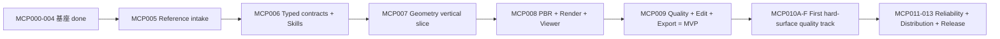

# ForgeCAD Codex-only MVP 执行计划

> 2026-08-28 执行点：`FPS-FORM-04BE-F` 已将 04BE-E 的失败从“继续试 Mesh 参数”升级为 closed typed evidence diagnosis。Runtime 从 durable parent/proposal GeometryProgram、CrossView 与 before/after FormArt 重新派生六顶点真实 delta、三 owner view delta、左右 trigger aperture、rear3q negative-space 和六视图 line-flow 状态；MCP 只接受 identity/hash，默认 read-only，不返回 AOV bytes，不启动 Worker。真实 D1/restart/zero-write PASS 后，下一 `FPS-FORM-04BE-G` 固定为 exact camera/crop/Part-ID/depth/silhouette attribution 与 side-aperture visibility calibration；在它给出唯一 screen-space cause 前，不注册新正/负 Y profile，也不进入 FormQualityV2、secondary 或 High→Low→UV→Bake。

> 2026-08-28 执行点：`FPS-FORM-04BE-E` 已把 04BE-D 登记的 rear-stock half-Y/flat-Z profile 物化为新 reviewable candidate，并用 original source、same-cohort fresh baseline 和批准六相机完成 54 AOV、CrossView、proposal FormArt、Runtime restart GET。真实结果否定了该修复方向：left owner overlap 538‰ 未改善、right 573→579‰ 轻微变差，rear3q owner region/adjacency 继续为 0；side trigger void 在 left/right 仍 sealed，多数 line-flow 仍 inferred/unknown。下一 `FPS-FORM-04BE-F` 必须先把 rear-stock source-local Y 与图像内空腔边界的方向语义、rear3q identity attribution 和 trigger aperture side visibility 分离校准，再只开放一个有证据的 Part 修复。FormArt ready 前 fresh FormQualityV2 不创建，secondary/High→Low→UV→Bake 保持锁定。

> 2026-08-28 执行点：`FPS-FORM-04BE-D` 已完成只读 evidence-bound typed repair plan 与真实 D1 restart/zero-logical-write 证据。下一原子 `FPS-FORM-04BE-E` 不再重新猜形体：只物化 Runtime 注册的 rear-stock half-Y/flat-Z 五站修复，保持 04BE-C original baseline、批准六相机、trigger aperture、rear-stock endpoints/lower beam/rear cap 和所有非 rear-stock Parts；随后重新生成 6×9 AOV、CrossView、FormArt 与 fresh FormQualityV2。未同时满足 left boundary 至少 baseline、六视图 no-regression、三 owner views strict void、negative-space/line-flow resolved 前，不创建 secondary 或进入正式 High→Low→UV→Bake。

> 2026-08-28 执行点：`FPS-FORM-04BE-C` 已完成 exact candidate 的 same-cohort 6×9 AOV、CrossView/FormArt sidecar 与 Runtime restart GET，但 no-regression 和 strict owner-void 真实失败，故结果是 `QUALITY_TARGET_NOT_MET`而非晋级。当前转入 `FPS-FORM-04BE-D`：只消费 CrossView=`c93ccb2c…02f4` 与 proposal FormArt=`e1240c5f…47e` 的精确持久证据，准备一个同时约束 left boundary 与 rear-stock owner-void 的 typed repair plan。不改相机、参考、original baseline 或 current base；重跑门未过前不创建 secondary、Formal High、Low、UV、Bake、confirm、version 或 export。

> 2026-08-28 执行点：`FPS-FORM-04BE-A` 已完成 typed composite source seam，original baseline/current base/ordered disjoint registered replacements 已分层，保留 prior rear-stock edit 并追加 trigger aperture 的 23-Part Worker compile 通过。当前进入 `FPS-FORM-04BE-B`：Runtime 从 Store/CAS exact 重验 04AZ baseline 和 04BB proposal evidence/program，持久化一个 composite link 与 CAS receipt，经 prepare/get/restart 生成 reviewable candidate，再以 original 04AZ 对最终 composite 跑六视图。视觉门未过前继续 `QUALITY_TARGET_NOT_MET`，不进入 secondary/High→Low→UV→Bake。

> 2026-08-28 执行点：`FPS-FORM-04BA` 已证明 `fresh baseline → typed rear-stock curve proposal → Geometry Worker/readback → six-view gate` 能真实闭合，也证明当前五站 18 mm Y / 9 mm Z bridge 过宽：平均改善 457 ppm不足以抵消 left/top 回归。下一步不复跑同参数，不改已批准 camera；只读取本次 proposal 的 left/top Part-ID、silhouette、depth 与 boundary AOV，缩小曲率影响域后执行一次新 typed repair。proposal FormArt ready 前不得调用 FormQualityV2 prepare。

> 2026-08-28 执行点：`FPS-FORM-04AZ` 已闭合 camera registration identity。现有 Runtime 从 04AY CameraLock 的 GeometryProgram-space 中间相机执行批准的 180° semantic orbit，得到精确 `9d8e590e…3abb`；durable lineage/RigV2 与 fresh 6×9 AOV baseline 均已持久化并重启回读。接下来不再改相机、不扫尺寸：先让现有 FormQualityV2 adapter 消费 baseline=`93a53f18…8860`，再对一个明确 owner 的 rear-stock/receiver 曲面流执行单次 bounded repair，并重跑 strict owner-void、line-flow、negative-space 与 six-view non-regression。所有视觉门通过前保持零晋级、零确认、零版本、零导出。

> 2026-08-28 执行点：`FPS-FORM-04AY` 已用 closed first-party reviewed-form profile 替代不可复用的临时 proposal，并在 fresh 隔离 Runtime 中完成 Session、camera-calibrated Stage、CameraLock、六视图 FormEvidence/FormArt 与 legacy structural quality 的持久化。下一步不继续盲扫枪托参数；先让 fresh candidate 的后 3/4 semantic camera 精确重派生为用户批准 hash `9d8e590e…3abb`，再依序创建 registration lineage/RigV2 → fresh baseline → owner-void/FormArt/FormQualityV2。任何失败均保持零晋级、零确认、零版本、零导出。

> 2026-08-27 `FPS-FORM-04AV` 已完成 source/compile：新的 Runtime-only 只读 owner-reviewed-void calibration 将三视图 `rear-stock` 身份/相机/深度绑定与 strict 零侵入验收分离。下一真实资产动作是重建同 cohort D1 fresh baseline 并调用默认只读 GET；只有三视图 calibration eligible 时才允许一个 bounded rear-stock rail-shape，然后重跑 strict owner-void、六视图 no-regression 和 FormArt。当前真实 D1 投影因历史一次性 Store/CAS 不在而 `NOT_RUN`；不得直接进入 AuthoringMesh 扩展、High/Low/UV/Bake。

> 2026-08-26 当前执行点：**528 schemas / 115 read + 87 write = 202 tools**。真实 D1 已完成 `MoveVertices → durable child → one-node lower → strict GLB readback → six-view replay → proposal FormArt durable receipt/replay/restart readback`。最佳方案仍只是局部有回退的 `REVIEWABLE_TRADEOFF`；04AG durable seam 已通过，但真实证据因 owner/open-void、negative-space、line-flow 未达门而 `BLOCKED_PROPOSAL_FORM_ART_EVIDENCE`。下一真实资产动作仍在 04AG 内修复这些艺术证据失败项，未到 secondary approval。

> 04AG 的 Runtime-owned durable sidecar 已落地且不扩展公共工具家族：`ProductionWeaponFormArtProposalEvidence@1` 由 CAS receipt 与 SQLite Store identity/replay/restart readback 共同承载，prepare response 只返回引用和 projection。六视图 camera/reference/candidate/artifact 与 AOV 已绑定；当前 durable transport=`PASS`，内容 Gate=`BLOCKED_PROPOSAL_FORM_ART_EVIDENCE`，不改变 `REVIEWABLE_TRADEOFF`、`QUALITY_TARGET_NOT_MET`、Stage 或任何晋级状态。

> 2026-08-26 商业纵向优先级：`CameraLock V2 child → one rear-stock Form proposal → secondary-form-approved → AuthoringMesh@2 → one-Part High/Low/UV/Cage/Bake vertical slice → MaterialLayerGraph → FPS presentation → Unreal-first → Unity → Hero Art Review`。不得以更多工具、Schema、材质或 GLB smoke 越过前序 Gate；详细蓝图见 `FPS_HERO_WEAPON_PRODUCTION_RESEARCH_20260826.md`。

> 2026-08-26 `FPS-FORM-04AD` 权威增量：当前合同面为 **518 schemas / 111 read + 83 opt-in write = 194 tools**。新增 `ProductionWeaponSemanticLandmarkOrdering@1` 只表达 Runtime-derived 的 3D source/subject-axis 顺序，明确 `target_landmark_arrays_present=false / metrics=NOT_PRESENT`，不得冒充 2D landmark；`ProductionWeaponAuthoredViewOrientation@1` 将诊断变换与用户方向回执分开；`RegisteredCameraRigCalibration@2` 只有绑定 promotable authored rear3q receipt 才能物化。定向 Contracts/Runtime/MCP compile 与 518-schema checker PASS。真实 D1 尚无 orientation-specific user receipt，因此保持 `BLOCKED_AUTHORED_REAR_THREE_QUARTER_ORIENTATION`、Stage=`camera-calibrated`、secondary=`NOT_CREATED`、quality=`QUALITY_TARGET_NOT_MET`，不 confirm/version/export。旧 `@1` 保持历史真值；durable 落点采用 CameraLock 的 additive child lineage，不复制/自动升级整张旧记录。

> 2026-08-26 `FPS-FORM-04AC` 已完成 source-compile 子原子：产品自有 rear-stock Profile Reconstruction 只改 inner receiver/cap junction，用 centre station 表达深度节奏，外包络不变，exact source-node Gate 拒绝双节点 stock mutator和caller program bypass。紧接着的唯一执行顺序是：`durable rear3q authored orientation + semantic ordering → 一次 typed proposal → 六视图 same-camera render → owner trio strict gate → fresh FormArt/Codex review`。当前不允许进入 secondary/AuthoringMesh/High。

> 2026-08-26 当前唯一资产执行链更新为：`一个 rear-stock source-node bounded repair → left/right/rear-three-quarter strict owner-void → six-view no-regression → Codex visual review → user secondary approval`。04AB 已完成 semantic camera relock 和 durable evidence 重建，唯一最高影响源为 `rear-stock/548px`。AuthoringMeshRevision genesis 继续排在 secondary approval 之后，High/Low/UV/Bake/Material/FPS/Engine/Human 不得越级；商业晋级前另补 V2 durable semantic camera lineage。

> 04AC 禁止把旧 inner-lip scalar screen 直接当修复结果：同 cohort 既有 CAS 表明它虽将 left/right owner overlap 从 `548/921px` 降到 `281/382px`，却使 registered 三视图 silhouette IoU 退化。下一实现应是一个 bounded `rear-stock` profile reconstruction（仍只改一个 source node），联合求解 inner contour、receiver shoulder connection、rear-cap junction 与 depth station；接受函数必须同时满足 open-stock improvement、六视图 silhouette/landmark non-regression、stable Part/source identity 和零越权写入。

> 2026-08-26 执行原则纠偏：每个工程阶段先达到 compile，再立刻作用于同一 Hero candidate，取得 `PASS_ASSET`；source 横向能力不得无限积累。商业主链固定为 Art Direction/Form → Runtime-owned AuthoringMesh → evaluated High → editable Low → Hero UV → per-Part Cage/Bake（formal PASS 禁 nearest fallback）→ MaterialLayerGraph → FPS 表现 → LOD/package → Unreal-first/Unity validation → 独立 Hero Art Review。当前唯一资产动作仍是 D1 的一个 source-node repair。

2026-08-26 Form attribution 执行点：真实 durable D1 semantic-camera relock 与 live hash-bound attribution 已完成。唯一最高影响 source 为 `rear-stock/548px`，次高 `receiver-main/114px`，muzzle-shroud=0；repair gate 已解除为 `UNIQUE_HIGHEST_IMPACT_SOURCE_OBSERVED`。当前唯一资产动作是生成一个仅指向 `rear-stock` source node 的 bounded RepairIntent，重渲染三张开放枪托视图与全部六视图；任何回归都保留 baseline。

2026-08-26 文档同步后的执行点：Formal High public idempotency 与 MCP `get/prepare` 已接通，当前为 **518 schemas / 111 read + 83 opt-in write = 194 tools**。剩余顺序固定为 `合法 typed secondary-form-approved positive fixture → Formal High prepare/replay/conflict/tamper/cleanup/restart → raw current-cohort transport → Formal High human/visual gate → Low/UV/Cage/Bake`。任何缺失项不得用 raw SQL、伪造 Stage head、caller-supplied output hash 或 monolithic partial write 绕过。

2026-08-26 最新执行点：Form 三段晋级 policy、Formal High internal materialization seam 和独立 public `get/prepare` 已完成 source/compile/focused；下一原子是隔离 positive replay/conflict/tamper/cleanup/restart fixture 与 raw transport，不是再设计 public surface。真实 D1 因 FormQuality 未通过而保持 `camera-calibrated`，不得为取得 High receipt 伪造 secondary head，也不得接入 monolithic prepare 形成部分成功写入。证据：`docs/evidence/mcp010f/commercial-weapon-form-stage-policy-formal-high-source-gate-20260826.json`。

2026-08-26 Cage/Bake public seam 增量：Store 已提供七子表原子 commit、精确重放、CAS reachability/GC 与重启 get；固定 Worker 已收口 exact-topology Cage、8-map geometric Bake 和 8-texel dilation。High resolver、Formal High internal materializer 和独立 public `get/prepare` 已完成 source/compile/focused。下一原子必须复用正式 Form/Stage/NativeHigh producer，构造完整 source-lineage/CAS materialize→replay→drop/reopen→cleanup fixture 与 raw transport，无需新增重复 binding Schema 或 public surface。当前 D1 的 Form 前置未通过且没有 formal positive receipt，故 `production_weapon_high_low_bake_prepare` 仍报告 `FORMAL_HIGH_STAGE_SOURCE_LINEAGE_UNAVAILABLE`，整体 `PRODUCTION_WEAPON_HIGH_LOW_BAKE_PRODUCER_UNAVAILABLE` 且零写；只有 formal High positive receipt 通过后才允许构造 High→Low→Cage/Bake 正向 fixture。当前不提升任何 Stage、视觉、人评、引擎、分发或商业结论。证据：`docs/evidence/mcp010f/commercial-weapon-form-stage-policy-formal-high-source-gate-20260826.json` 与 `docs/evidence/mcp010f/commercial-weapon-cage-bake-public-seam-source-gate-20260826.json`。


> 2026-08-26 source synchronization: current public surface is **515 schemas / 28 operator entries / 111 read + 83 opt-in write = 194 MCP tools**. Low quad durable now reaches Runtime/Store/MCP with candidate-bound current provenance and remains `DRAFT_UNREVIEWED`, structural-only and unpromotable; prepare replay → Runtime drop/reopen → get is **1/1 PASS**, with six Low durable CAS roots linked/GC. Hero UV now reaches Store/Runtime/MCP public `hero_uv_durable_get/prepare`, with four Hero UV CAS roots linked/GC; artist UV review and packaged same-cohort remain `NOT_RUN`, while visual/human/engine/commercial remain `NOT_RUN/NOT_PROVEN`. This does not advance `Stage=camera-calibrated`, `secondary-form-approved=NOT_CREATED`, `FPS-HIGH-05=NOT_PASSED`, `QUALITY_TARGET_NOT_MET`, `HQ360=BLOCKED_REFERENCE_COVERAGE`, proposal `registered=false`, confirm/version/export, or the single `in_progress=FGC-MCP010F` gate. Evidence: `docs/evidence/mcp010f/commercial-weapon-hero-uv-durable-restart-source-gate-20260826.json`.

> 2026-08-25 历史实现面（当前口径见上方 2026-08-26 同步）：**499 schemas / 107 read + 79 opt-in write = 186 tools**。Native High 当前 cohort Runtime restart **1/1 PASS**；Low quad draft、Hero UV与 Art Director Viewer matrix是 source-only 增量。故执行顺序、唯一 `in_progress=FGC-MCP010F`、`FPS-HIGH-05=NOT_PASSED` 与先 Form 后生产作者链的门均不变。

> 2026-08-25 商业质量重排：MVP functional core 不等于商业游戏资产。当前唯一 `in_progress` 仍是 FGC-MCP010F；不新增并行 Runtime writer。下一执行顺序固定为 `FormQuality → secondary-form-approved → AuthoringMesh → High → Low/Retopo → Hero UV → Cage/Bake → Material Layer → FPS Presentation → LOD/collision/socket → commercial engine → human review → export/restart`。完整缺口、Gate 和外部评估队列见 `COMMERCIAL_GAME_WEAPON_QUALITY_PLAN.md`。

## 商业级 FPS 资产分阶段门（计划补充，不是当前 PASS）

MVP functional core、source/transport Gate 和工具数量都不能代表商业级武器资产。计划中的 Hero Weapon 必须沿同一 candidate/export hash 顺序闭合；任一前置门失败，后续结果只能记为诊断或 `NOT_PROVEN`，不得 confirm/version/export。

| 阶段 | 必须证明的真实差距 | 当前状态与退出门 |
|---|---|---|
| Art Direction / design language | `WeaponArtBrief`、style pillars、color/material hierarchy、第一/第三人称识别标记、授权/IP边界和目标预算 | 目标合同尚未完整落地；`NOT_PROVEN`，不能把单张参考或 Codex 自评当艺术决策 |
| Silhouette / primary form | front/back/left/right/rear-three-quarter reference coverage、CameraLock、比例、negative space、landmark 和固定相机不回退 | 当前 `camera-calibrated`，CrossView 与 FormQuality 仍 `QUALITY_TARGET_NOT_MET`，`secondary-form-approved=NOT_CREATED`、depth=`UNKNOWN`；先取得 approved form |
| Secondary / tertiary surface | panel/vent/groove/seam/fastener、二三级平面节奏、倒角/倒棱密度、高光连续性与 Part/source lineage；不得用三角数填充细节 | Operator/source slices 可执行，但商业视觉和艺术接受 `NOT_PROVEN`；需在 primary 通过后逐级验收 |
| Authoring topology / edge flow | Runtime-owned original/evaluated 分离、quad/loop/ring/crease/hard-edge 关系、可编辑局部修改和跨 revision 稳定 ID | split/collapse/dissolve 独立 durable/restart `3/3 PASS` 仅为结构切片；general correspondence、evaluated retarget、产品级 editor 与 edge flow `NOT_PROVEN` |
| Native High → Low/Retopo → Hero UV → Cage/Bake | High DetailGraph/High artifact、artist-authored editable Low、Hero UV texel density/seam/padding、topology-correspondent cage，以及 8-map bake 的 miss/fallback/cross-part/padding 证据 | Native High 仅 source-only；Low 与 Hero UV durable 仍 structural。Cage/Bake fixed Worker、七记录 Store/MCP seam 与 replay 已 source PASS，但 Runtime-owned producer 未闭合，new prepare 零写返回 `PRODUCTION_WEAPON_HIGH_LOW_BAKE_PRODUCER_UNAVAILABLE`；当前 D1 无 positive receipt，旧 bake 失败指标不得晋级 |
| Material Layer / PBR | 可编辑 Layer/Mask/Generator/Decal/Wear/Microdetail、roughness hierarchy、channel/color-space/provenance 和多视图材质一致性 | 当前 embedded PBR/2K 与 Three.js readback 只证明结构/consumer；fixed-formula preview，commercial PBR `NOT_PROVEN` |
| FPS / world presentation | hip/ADS/inspect/equip/reload/recoil 第一人称视图、第三人称/ground world model、socket/attachment/readability，不能靠 camera cheat | `NOT_RUN`；未同时证明 first-person 与 world-model readability |
| Engine / performance / delivery | 实际 commercial engine importer/shader/material、LOD0/1/2、collision/socket、draw-call/triangle/texture/memory/frame-time/streaming budgets | commercial engine 与性能预算 `NOT_RUN`；Three.js 回读不能替代 Unreal/Unity 等引擎往返 |
| Independent Art Director + export/restart | 独立真人 Art Director 盲审、修订清单/批准、同 export hash 的 confirm/version/export/restart readback | human=`NOT_RUN`、`PASS_HUMAN_ART_REVIEW` 不存在；export/restart 同 hash=`NOT_RUN`，总体仍 `QUALITY_TARGET_NOT_MET` |

### 11 阶段执行顺序（质量/交付权威拆分）

上表是早期工程合并摘要；商业 Hero Weapon 的执行与退出门必须拆成以下 11 阶段，且绑定同一 `candidate_hash → export_hash`。前门失败时，后门只能保留诊断，不得推进 Stage、confirm、version 或 export：

1. `Art Direction / ReferenceViewSet`：`WeaponArtBrief@1`、style/IP/预算、五个核心视图、CameraLock、silhouette/negative-space/landmark 分层；当前 `camera-calibrated` 但 CrossView=`QUALITY_TARGET_NOT_MET`、`secondary-form-approved=NOT_CREATED`、`HQ360=BLOCKED_REFERENCE_COVERAGE`。
2. `AuthoringMesh`：original/evaluated 分离、稳定 V/E/H/C/F 与 loop/ring/boundary ID、可编辑局部历史及 High↔Low correspondence；split/collapse/dissolve 为结构性 **3/3 PASS**，商业 correspondence/editor 仍 `NOT_PROVEN`。
3. `High`：非破坏 DetailGraph/HighMesh、布尔/倒角/support loop/weighted normal/Subdivision/floater、高光连续与严格回读；当前 source-only，`FPS-HIGH-05=NOT_PASSED`、proposal=`registered=false`。
4. `Low`：artist-authored editable quad、hard-edge/UV seam/Part 边界、High↔Low correspondence 和 bake-ready topology；当前 `DRAFT_UNREVIEWED / structural_only / promotion_eligible=false`，durable replay/drop/reopen/get **1/1 PASS** 不等于 commercial Low。
5. `UV`：Hero 2K/4K density、seam/stretch/overlap/OOB/padding、UV0/UV1、tangent/Mikk；7 contracts 与 public get/prepare 的 replay/drop/reopen/get **1/1 PASS**、4 CAS roots linked/GC 仍只是 structural/source，artist/package/engine `NOT_RUN/NOT_PROVEN`。
6. `Cage/Bake`：对应 Cage、per-Part rays、miss/fallback/cross-part/skew/penetration/dilation 与 8 类 maps；Formal High internal materializer 与 fixed Worker/public persistence seam 已 source/compile/focused，但完整 positive restart/public surface/current-D1 receipt 缺失，new prepare 保持零写；旧诊断指标只保留为失败证据，正式门=`NOT_PASSED`。
7. `Material`：`MaterialLayerGraph@1`、Layer/Mask/Generator/Decal/Wear/Microdetail、roughness hierarchy、色彩空间/provenance；当前只有 **4 MaterialZones / 6 formula textures**，fixed-formula preview，commercial PBR=`NOT_PROVEN`。
8. `LOD`：authored LOD0/1/2、collision/socket、误差与平台预算同 hash；当前商业 LOD/collision/socket/performance `NOT_RUN`。
9. `Viewer/animation/VFX/audio validation`：同 candidate read model、first/third-person 固定相机、动画/VFX/audio timing/readability/accessibility；Viewer/Three.js 只证明结构消费，animation/VFX/audio/VoiceOver/human viewing `NOT_RUN`。
10. `Engine`：Unreal 或 Unity importer/material/tangent/LOD/collision/socket/animation round-trip 与 draw-call/texture/memory/frame-time/streaming budget；**Unreal/Unity 均未运行**，Three.js 不能替代引擎验收。
11. `Independent Hero Art Review`：独立资深艺术家盲审与修订清单闭合，同 `export_hash` 的 confirm/version/export/restart readback；human=`NOT_RUN`，无 `PASS_HUMAN_ART_REVIEW`。

只有 1–11 全部通过，且同一 hash 仍一致，才能进入用户批准后的 confirm/version/export；不能把 source/transport、Three.js 或旧 bake 诊断写成商业质量 PASS。

Native High 的当前声明必须保持为 **source-only structural/durable slice**：Worker/GLB/Runtime CAS/Store/restart 与公共 MCP source-focused 证据通过。`packages/forgecad-skills/proposals/native-high/0.1.0` 继续 `registered=false`，不进入 active registry；packaged/candidate quality 链仍 pending/`NOT_RUN`。这条切片不解锁后续商业门，也不把 High 标为 active/PASS。当前 `FGC-MCP010F` 是唯一 `in_progress`；Stage=`camera-calibrated`、`secondary-form-approved=NOT_CREATED`、`FPS-HIGH-05=NOT_PASSED`、`QUALITY_TARGET_NOT_MET`、`HQ360=BLOCKED_REFERENCE_COVERAGE`，无 confirm/version/export。

版本：2026-08-17
状态：MCP005–MCP009 MVP host golden path 已收口；FGC-MCP010A done；FGC-MCP010B structural source Gate PASS 但 Darwin OS memory hard cap deferred/NOT_RUN；FGC-MCP010C source-focused PASS_WITH_UNRUN_VISUAL_GATES；FGC-MCP010D/E source-focused PASS；FGC-MCP010F source-focused in_progress（packaged/人评/360 子门 NOT_RUN/BLOCKED）。2026-08-17 最新 PDK v0 source Gate 与完整 `script/test_mcp010f.sh` source Gate PASS，源码已重建并安装 Dev.app cohort `6f00a58a2b71fd87a9e70844915ef33c3d640200f283ac6601c1da6ca553ed50`，package/probe PASS；当前真实授权参考隔离 RepairIntent 回归仍以既有 cohort receipt 为准，已走到 evaluate 后按 `QUALITY_TARGET_NOT_MET` blocked；无 confirm/version/export。Codex Desktop live restart 仍 `NOT_RUN`。ADR-0026 的 Agentic Design Runtime 已落地 projection、durable prepare/readback、独立 stage batch、带父程序哈希链校验的可选 cumulative-program composition merge prepare 和 `repair_apply_prepare` CAS-backed apply-intent boundary；正向 merge candidate、Repair 实际应用、用户批准后的晋级和视觉门仍未完成。

## 1. 产品策略

ForgeCAD 是 Codex 控制的本地 3D Runtime。MVP 优先证明一张真实参考图可以变成一个真实、可编辑、可验证、可回退的硬表面 GLB，而不是先建设生产级后台治理或插件市场。

ADR-0026 后续策略：不要继续把高质量问题理解为“多调用几个工具”或“替换为更强图生 3D 模型”。下一阶段要先把 Codex 的观察面和 Runtime 的设计状态机补齐：`SemanticSceneGraph`、`ReferenceCanvas`、`DesignSession`、stage gates、Visual Evidence Bundle、Critic/Repair loop 和 Parametric Design Kit。

固定架构：

```text
Codex Desktop/CLI
  → forgecad-mcp (stdio + lightweight Runtime start/connect)
  → forgecad-runtime (唯一 writer + SQLite/CAS)
  → typed geometry/render worker
  → optional read-only Viewer
```

MVP 使用 OS 文件锁，不使用 TTL lease/heartbeat；MCP initialize 不等待 Runtime；Runtime 崩溃最多一次简单重启；不保证 Codex 断线后未完成 Job 继续。

## 2. 两条完成线

### MVP 完成线

`MCP005 → MCP006 → MCP007 → MCP008 → MCP009`

- 真实参考字节进入 CAS；
- Codex 输出 typed 建模程序；
- Worker 生成真实多 Part mesh/GLB；
- UV/PBR/固定视图和明确 limited 质量投影有 evidence；像素级参考比较仍未运行；
- 一次局部修改、拒绝、批准、不可变版本、restore 和 GLB export 成功。

### 正式发布线

`MCP010A → MCP010B → MCP010C → MCP010D → MCP010E → MCP010F → MCP011 → MCP012 → MCP013`

- 首个硬表面参考的 V2 真值、固定参考比较、高细节几何、离线材质和完整 Viewer/爆炸图/无障碍；
- Job checkpoint/性能/GC/灾难恢复；
- 第三方 Skill/外部项目分发治理；
- Developer ID/notarization、clean install、升级回滚、packaged Desktop/CLI、跨类别真人门。

签名和公证是发布硬门，不是开发 3D vertical slice 的前置条件。

## 3. 阶段图



同一时刻只允许一个任务 `in_progress`。只读研究可以提前进行，但不能提前改共享合同、lockfile 或能力状态。

## 4. 已完成基座

- MCP000：文档权威和迁移路线；
- MCP001：可恢复硬切，新架构骨架；
- MCP002：contracts、SQLite/CAS、OS 文件锁单写者、authenticated IPC；
- MCP003：MCP stdio/resources/read-only tools，Codex Desktop/CLI P0 只读验收；
- MCP004：candidate/approval/version/restore/diagnostic export 事务、MCP 内置 Runtime supervisor、真实 Codex CLI diagnostic write、Viewer read model。

MCP004 原始 evidence 中的 signing、attachment、Geometry、GLB `BLOCKED/NOT_RUN` 保持不变；它们不是被“通过”，而是分配给后续正确任务。

## 5. MVP 实施顺序

### MCP005 — Reference

先完成真实字节和安全边界，不做视觉理解算法。P0 仅 PNG/JPEG；CAS 保存原始授权字节，ReferenceEvidence 保存 hash/尺寸/授权和派生引用，不保存路径。真实 Codex CLI receipt 是硬门。

### MCP006 — Typed design + first-party Skills（done）

Codex 是唯一视觉大脑；ForgeCAD 不调用模型。Codex 把参考理解成 `SubjectProfile`、`RepresentationPlan`、`AssemblyGraph`、`GeometryProgram` 和 `AppearanceProgram`。Skills 是声明式知识/Recipe/Validator，不是 prompt 插件或脚本。

MVP 已交付 10 个组合能力的历史声明式 Bundle profile，不建市场：reference intake、subject profile、semantic assembly、silhouette blockout、hard-surface detail、mesh integrity、UV/PBR、render evidence、reference compare、local edit/export。MCP010B 在此基础上新增 `primitive-blockout@0.2.0`，绑定当前 `primitive@2` consumer；所有 Bundle 仍不包含任意执行代码，MCP007/010B 的 Runtime/Worker 才是唯一 product-owned operator consumer。

### MCP007 — Geometry（done）

已把 MVP fixture 做成 14 个稳定语义 Part 的程序化硬表面资产；当前实现收口为 box/cylinder/sphere、有限 budget/finite/index/lineage 和 deterministic glTF 2.0 GLB/readback。profile/extrude/revolve、sweep/loft、boolean/bevel 等扩展不在本轮假装完成；每个输出保留 Part/source lineage，严格 GLB readback，focused evidence 见 `docs/evidence/mcp007/`。

### MCP008 — Appearance/Render/Viewer（done）

完成白色涂层金属、黑色机械内构和橙色 emissive 的 typed MaterialZone；实现 hash-bound UV/tangent/glTF metallic-roughness；Viewer 显示 Runtime 真实 GLB canvas；headless renderer 输出固定 beauty/silhouette/normal/part-ID。`npm run mcp008:test` 与证据 manifest PASS；真实 Codex appearance/readback 已在 MCP009 receipt 中 PASS；glTF-Validator 和真人评分仍未运行。

### MCP009 — Quality/Edit/Version/Export（MVP host golden path done）

`quality_get` 绑定 candidate/GLB/fixed-render checks，参考比较仅返回明确 limited aspect ratio；`change_prepare` 执行一次 stable Part ID 有界重编；拒绝不写、批准一次写一个版本；restore-as-new-version；`mvp-glb` 返回 CAS GLB + manifest/output hash receipt。`npm run mcp009:test` 的 24 Runtime + 16 MCP tests PASS；真实 Codex CLI 十二调用 full chain 已 PASS。pixel metrics、Viewer 同 hash、change/restore host 和人评仍是 open acceptance gates，不被 CAS receipt 替代。

## 6. 外部工具实施规则

`EXTERNAL_PROJECT_ADOPTION.md` 是唯一清单。MVP 优先评估 `image-rs/image`、`gltf-rs/gltf`、Manifold、xatlas、mikktspace、glTF-Validator；glTF-Transform 只作构建/测试工具。每项先建 adoption receipt，再改依赖。

不安装 BlenderMCP、FreeCAD MCP、CadQuery/build123d MCP、远程 image-to-3D Provider。它们暴露任意脚本/文件/网络或引入第二状态真值；可学习 API 粒度，不能成为 MVP 插件。

## 6.1 MCP010A–F 固定顺序

- 010A：只重排权威、构建/激活同 revision 用户级开发 App，并等待用户重启后的真实 Codex capability/build-hash Gate；
- 010B：先让 Schema、GeometryProgram/OperatorCatalog/GLB readback 和失败路径成为真实真值；
- 010C：再实现 perspective/z-buffer 固定 renderer、九 AOV、参考比较和 typed visual/human review；
- 010D：在 C 的指标闭环上扩展受限高细节 Operator；Manifold 通过 fixed-revision adoption gate 后以 product-owned isolated Worker 进入，当前开放同一 Part bounded union/difference/intersection；
- 010E：离线 AssetPack、512px UV atlas、固定 `mikktspace@0.3.0`、embedded PBR 纹理及逐资产 provenance；不建设网络 API 或通用安装器；
- 010F：Viewer compare/selection/explosion、AOV、undo/redo 和真实机器人闭环。当前只读 Viewer source Gate 已通过；单图只允许 `PARTIAL_VISIBLE_VIEW_PASS`，补齐五张全身参考前 360 固定 blocked。

010D/E 的单操作资源预算不替代 MCP011 的 Job checkpoint/GC/全局性能；first-party 固定 AssetPack 不替代 MCP012 的通用第三方生命周期；ad-hoc 开发 App 不替代 MCP013 的正式签名、安装和 packaged E2E。

## 6.2 Agentic Design Runtime 重规划顺序

ADR-0026 的工作只能在不破坏 MCP010F 当前真值的前提下增量落地。推荐顺序：

```text
truth freeze / current quality boundary
→ SemanticSceneGraph@1 / ModelUnderstandingBundle@1
→ ReferenceCanvas@1 / DesignSpec@1
→ DesignSession@1 / DesignCheckpoint@1 / DesignStagePlan@1
→ scene_observe_get / visual_evidence_bundle_get
→ Parametric Design Kit v0
→ DesignCriticReport@1 / RepairIntent@1
→ real Codex stage-gated loop
→ human/export/restart hash
```

每一步都必须先有公开 Schema、validator/negative tests、Runtime producer、MCP read/write 边界、Viewer 消费面和 evidence。当前 Agentic 的 `scene_observe_get`、`design_stage_plan_get`、`critic_report_get`、`visual_evidence_bundle_get` 已满足 source/read-only projection Gate，真实 Runtime 的 scene/stage 嵌套只读 projection 已由 `scripts/check_agentic_projection_receipt.py` 完成 conformance 校验；`session_create_or_resume`、`session_get`、`checkpoint_prepare`、`checkpoint_get`、`checkpoint_restore_prepare` 已满足 durable prepare/readback Gate；bounded `authoring_context`、primary-form/secondary-structure/tertiary-detail single-Part geometry proposal 与 CADFit multi-fidelity checkpoint/resume 另有独立 source/runtime receipt。后者不等于跨视图 Visual Evidence conformance、完整多动作 orchestrator、MaterialZone/UV-PBR/Repair execution、用户批准后的候选变更或 Manifold Boolean；composition merge 目前只接受显式累计程序和父哈希链，并在完整批次通过后准备独立 review candidate，尚无正向 candidate/Repair/promotion 证据。没有对应证据的后续能力仍只能写 `目标设计/NOT_IMPLEMENTED`；任何会创建 candidate/version 的动作仍走现有 prepare/approval/confirm 纪律。

## 7. 质量证据顺序

1. reference bytes/hash/license；
2. typed contract、预算和 canonical program；
3. mesh integrity、Part/source map、strict GLB readback；
4. UV/tangent/PBR/material zones；
5. fixed beauty/silhouette/normal/part-ID；
6. reference metrics + Codex typed review；
7. 用户接受 + version/restore/export hash 一致。

任何材质包、单张 beauty、GLB 能打开、Skill 已安装或 Codex 自评都不能跳过前一层。

ADR-0026 后，质量证据还必须按 stage 写明：`reference-canvas`、`primary-form`、`secondary-structure`、`tertiary-detail`、`uv-pbr`、`final-review`。Primary/form 门失败时，后续 detail/material 的运行只能记录为诊断或误操作，不能解锁确认。

## 8. Gate 顺序

每任务：

```text
dirty baseline
→ Schema/negative tests
→ Core/Runtime
→ MCP/Worker/Viewer
→ focused
→ aggregate
→ real Codex / visual / user evidence
→ docs + capability matrix + handoff
```

共同命令：

```bash
npm run release:docs-walkthrough
npm run repository:integrity
npm run release:safety-scope
npm run release:secrets-files
npm run release:license-sbom
npm run contracts:check
npm run mvp:functional-core
npm run desktop:typecheck
npm run desktop:build
npm run desktop:tauri-check
git diff --check
```

禁止为绿色恢复旧 Provider/U004/端口 8000，禁止 mock 附件、图片平面、手工成品 GLB、任意 Blender Python 或篡改 QualityReport。

## 9. 声明边界

- MCP004 done：事务基座完成，不表示 3D 完成；
- MCP005 done：真实图片入 CAS，不表示建模完成；
- MCP007 done：真实几何 vertical slice，不表示 PBR/相似度完成；
- MCP009 host golden path done：可以声明“单用户 MVP 真实 Codex host 路径完成”；像素级相似度、Viewer/restore host 和真人评分通过后，才可声明“首个硬表面参考基准质量闭环完成”；
- MCP013 done 且跨类别真人门通过后，才可声明可分发、通用高质量产品。
- ADR-0026 docs done：只能声明“Agentic Design Runtime 目标架构已记录”；不能声明 DesignSession、SemanticSceneGraph、scene observe、Critic loop 或 Parametric Design Kit 已实现。
