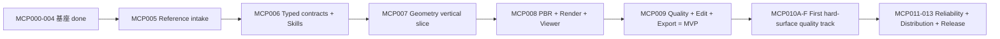

# ForgeCAD Codex-only MVP 执行计划

版本：2026-08-17
状态：MCP005–MCP009 MVP host golden path 已收口；FGC-MCP010A done；FGC-MCP010B structural source Gate PASS 但 Darwin OS memory hard cap deferred/NOT_RUN；FGC-MCP010C source-focused PASS_WITH_UNRUN_VISUAL_GATES；FGC-MCP010D/E source-focused PASS；FGC-MCP010F source-focused in_progress（packaged/人评/360 子门 NOT_RUN/BLOCKED）。2026-08-17 最新 PDK v0 source Gate 与完整 `script/test_mcp010f.sh` source Gate PASS，源码已重建并安装 Dev.app cohort `6f00a58a2b71fd87a9e70844915ef33c3d640200f283ac6601c1da6ca553ed50`，package/probe PASS；当前真实授权参考隔离 RepairIntent 回归仍以既有 cohort receipt 为准，已走到 evaluate 后按 `QUALITY_TARGET_NOT_MET` blocked；无 confirm/version/export。Codex Desktop live restart 仍 `NOT_RUN`。ADR-0026 的 Agentic Design Runtime 已落地 projection、durable prepare/readback、独立 stage batch、带父程序哈希链校验的可选 cumulative-program composition merge prepare 和 `repair_apply_prepare` CAS-backed apply-intent boundary；正向 merge candidate、Repair 实际应用、用户批准后的晋级和视觉门仍未完成。

## 1. 产品策略

ForgeCAD 是 Codex 控制的本地 3D Runtime。MVP 优先证明一张真实参考图可以变成一个真实、可编辑、可验证、可回退的硬表面 GLB，而不是先建设生产级后台治理或插件市场。

ADR-0026 后续策略：不要继续把高质量问题理解为“多调用几个工具”或“替换为更强图生 3D 模型”。下一阶段要先把 Codex 的观察面和 Runtime 的设计状态机补齐：`SemanticSceneGraph`、`ReferenceCanvas`、`DesignSession`、stage gates、Visual Evidence Bundle、Critic/Repair loop 和 Parametric Design Kit。

固定架构：

```text
Codex Desktop/CLI
  → forgecad-mcp (stdio + lightweight Runtime start/connect)
  → forgecad-runtime (唯一 writer + SQLite/CAS)
  → typed geometry/render worker
  → optional read-only Viewer
```

MVP 使用 OS 文件锁，不使用 TTL lease/heartbeat；MCP initialize 不等待 Runtime；Runtime 崩溃最多一次简单重启；不保证 Codex 断线后未完成 Job 继续。

## 2. 两条完成线

### MVP 完成线

`MCP005 → MCP006 → MCP007 → MCP008 → MCP009`

- 真实参考字节进入 CAS；
- Codex 输出 typed 建模程序；
- Worker 生成真实多 Part mesh/GLB；
- UV/PBR/固定视图和明确 limited 质量投影有 evidence；像素级参考比较仍未运行；
- 一次局部修改、拒绝、批准、不可变版本、restore 和 GLB export 成功。

### 正式发布线

`MCP010A → MCP010B → MCP010C → MCP010D → MCP010E → MCP010F → MCP011 → MCP012 → MCP013`

- 首个硬表面参考的 V2 真值、固定参考比较、高细节几何、离线材质和完整 Viewer/爆炸图/无障碍；
- Job checkpoint/性能/GC/灾难恢复；
- 第三方 Skill/外部项目分发治理；
- Developer ID/notarization、clean install、升级回滚、packaged Desktop/CLI、跨类别真人门。

签名和公证是发布硬门，不是开发 3D vertical slice 的前置条件。

## 3. 阶段图



同一时刻只允许一个任务 `in_progress`。只读研究可以提前进行，但不能提前改共享合同、lockfile 或能力状态。

## 4. 已完成基座

- MCP000：文档权威和迁移路线；
- MCP001：可恢复硬切，新架构骨架；
- MCP002：contracts、SQLite/CAS、OS 文件锁单写者、authenticated IPC；
- MCP003：MCP stdio/resources/read-only tools，Codex Desktop/CLI P0 只读验收；
- MCP004：candidate/approval/version/restore/diagnostic export 事务、MCP 内置 Runtime supervisor、真实 Codex CLI diagnostic write、Viewer read model。

MCP004 原始 evidence 中的 signing、attachment、Geometry、GLB `BLOCKED/NOT_RUN` 保持不变；它们不是被“通过”，而是分配给后续正确任务。

## 5. MVP 实施顺序

### MCP005 — Reference

先完成真实字节和安全边界，不做视觉理解算法。P0 仅 PNG/JPEG；CAS 保存原始授权字节，ReferenceEvidence 保存 hash/尺寸/授权和派生引用，不保存路径。真实 Codex CLI receipt 是硬门。

### MCP006 — Typed design + first-party Skills（done）

Codex 是唯一视觉大脑；ForgeCAD 不调用模型。Codex 把参考理解成 `SubjectProfile`、`RepresentationPlan`、`AssemblyGraph`、`GeometryProgram` 和 `AppearanceProgram`。Skills 是声明式知识/Recipe/Validator，不是 prompt 插件或脚本。

MVP 已交付 10 个组合能力的历史声明式 Bundle profile，不建市场：reference intake、subject profile、semantic assembly、silhouette blockout、hard-surface detail、mesh integrity、UV/PBR、render evidence、reference compare、local edit/export。MCP010B 在此基础上新增 `primitive-blockout@0.2.0`，绑定当前 `primitive@2` consumer；所有 Bundle 仍不包含任意执行代码，MCP007/010B 的 Runtime/Worker 才是唯一 product-owned operator consumer。

### MCP007 — Geometry（done）

已把 MVP fixture 做成 14 个稳定语义 Part 的程序化硬表面资产；当前实现收口为 box/cylinder/sphere、有限 budget/finite/index/lineage 和 deterministic glTF 2.0 GLB/readback。profile/extrude/revolve、sweep/loft、boolean/bevel 等扩展不在本轮假装完成；每个输出保留 Part/source lineage，严格 GLB readback，focused evidence 见 `docs/evidence/mcp007/`。

### MCP008 — Appearance/Render/Viewer（done）

完成白色涂层金属、黑色机械内构和橙色 emissive 的 typed MaterialZone；实现 hash-bound UV/tangent/glTF metallic-roughness；Viewer 显示 Runtime 真实 GLB canvas；headless renderer 输出固定 beauty/silhouette/normal/part-ID。`npm run mcp008:test` 与证据 manifest PASS；真实 Codex appearance/readback 已在 MCP009 receipt 中 PASS；glTF-Validator 和真人评分仍未运行。

### MCP009 — Quality/Edit/Version/Export（MVP host golden path done）

`quality_get` 绑定 candidate/GLB/fixed-render checks，参考比较仅返回明确 limited aspect ratio；`change_prepare` 执行一次 stable Part ID 有界重编；拒绝不写、批准一次写一个版本；restore-as-new-version；`mvp-glb` 返回 CAS GLB + manifest/output hash receipt。`npm run mcp009:test` 的 24 Runtime + 16 MCP tests PASS；真实 Codex CLI 十二调用 full chain 已 PASS。pixel metrics、Viewer 同 hash、change/restore host 和人评仍是 open acceptance gates，不被 CAS receipt 替代。

## 6. 外部工具实施规则

`EXTERNAL_PROJECT_ADOPTION.md` 是唯一清单。MVP 优先评估 `image-rs/image`、`gltf-rs/gltf`、Manifold、xatlas、mikktspace、glTF-Validator；glTF-Transform 只作构建/测试工具。每项先建 adoption receipt，再改依赖。

不安装 BlenderMCP、FreeCAD MCP、CadQuery/build123d MCP、远程 image-to-3D Provider。它们暴露任意脚本/文件/网络或引入第二状态真值；可学习 API 粒度，不能成为 MVP 插件。

## 6.1 MCP010A–F 固定顺序

- 010A：只重排权威、构建/激活同 revision 用户级开发 App，并等待用户重启后的真实 Codex capability/build-hash Gate；
- 010B：先让 Schema、GeometryProgram/OperatorCatalog/GLB readback 和失败路径成为真实真值；
- 010C：再实现 perspective/z-buffer 固定 renderer、九 AOV、参考比较和 typed visual/human review；
- 010D：在 C 的指标闭环上扩展受限高细节 Operator；Manifold 通过 fixed-revision adoption gate 后以 product-owned isolated Worker 进入，当前开放同一 Part bounded union/difference/intersection；
- 010E：离线 AssetPack、512px UV atlas、固定 `mikktspace@0.3.0`、embedded PBR 纹理及逐资产 provenance；不建设网络 API 或通用安装器；
- 010F：Viewer compare/selection/explosion、AOV、undo/redo 和真实机器人闭环。当前只读 Viewer source Gate 已通过；单图只允许 `PARTIAL_VISIBLE_VIEW_PASS`，补齐五张全身参考前 360 固定 blocked。

010D/E 的单操作资源预算不替代 MCP011 的 Job checkpoint/GC/全局性能；first-party 固定 AssetPack 不替代 MCP012 的通用第三方生命周期；ad-hoc 开发 App 不替代 MCP013 的正式签名、安装和 packaged E2E。

## 6.2 Agentic Design Runtime 重规划顺序

ADR-0026 的工作只能在不破坏 MCP010F 当前真值的前提下增量落地。推荐顺序：

```text
truth freeze / current quality boundary
→ SemanticSceneGraph@1 / ModelUnderstandingBundle@1
→ ReferenceCanvas@1 / DesignSpec@1
→ DesignSession@1 / DesignCheckpoint@1 / DesignStagePlan@1
→ scene_observe_get / visual_evidence_bundle_get
→ Parametric Design Kit v0
→ DesignCriticReport@1 / RepairIntent@1
→ real Codex stage-gated loop
→ human/export/restart hash
```

每一步都必须先有公开 Schema、validator/negative tests、Runtime producer、MCP read/write 边界、Viewer 消费面和 evidence。当前 Agentic 的 `scene_observe_get`、`design_stage_plan_get`、`critic_report_get`、`visual_evidence_bundle_get` 已满足 source/read-only projection Gate，真实 Runtime 的 scene/stage 嵌套只读 projection 已由 `scripts/check_agentic_projection_receipt.py` 完成 conformance 校验；`session_create_or_resume`、`session_get`、`checkpoint_prepare`、`checkpoint_get`、`checkpoint_restore_prepare` 已满足 durable prepare/readback Gate；bounded `authoring_context`、primary-form/secondary-structure/tertiary-detail single-Part geometry proposal 与 CADFit multi-fidelity checkpoint/resume 另有独立 source/runtime receipt。后者不等于跨视图 Visual Evidence conformance、完整多动作 orchestrator、MaterialZone/UV-PBR/Repair execution、用户批准后的候选变更或 Manifold Boolean；composition merge 目前只接受显式累计程序和父哈希链，并在完整批次通过后准备独立 review candidate，尚无正向 candidate/Repair/promotion 证据。没有对应证据的后续能力仍只能写 `目标设计/NOT_IMPLEMENTED`；任何会创建 candidate/version 的动作仍走现有 prepare/approval/confirm 纪律。

## 7. 质量证据顺序

1. reference bytes/hash/license；
2. typed contract、预算和 canonical program；
3. mesh integrity、Part/source map、strict GLB readback；
4. UV/tangent/PBR/material zones；
5. fixed beauty/silhouette/normal/part-ID；
6. reference metrics + Codex typed review；
7. 用户接受 + version/restore/export hash 一致。

任何材质包、单张 beauty、GLB 能打开、Skill 已安装或 Codex 自评都不能跳过前一层。

ADR-0026 后，质量证据还必须按 stage 写明：`reference-canvas`、`primary-form`、`secondary-structure`、`tertiary-detail`、`uv-pbr`、`final-review`。Primary/form 门失败时，后续 detail/material 的运行只能记录为诊断或误操作，不能解锁确认。

## 8. Gate 顺序

每任务：

```text
dirty baseline
→ Schema/negative tests
→ Core/Runtime
→ MCP/Worker/Viewer
→ focused
→ aggregate
→ real Codex / visual / user evidence
→ docs + capability matrix + handoff
```

共同命令：

```bash
npm run release:docs-walkthrough
npm run repository:integrity
npm run release:safety-scope
npm run release:secrets-files
npm run release:license-sbom
npm run contracts:check
npm run mvp:functional-core
npm run desktop:typecheck
npm run desktop:build
npm run desktop:tauri-check
git diff --check
```

禁止为绿色恢复旧 Provider/U004/端口 8000，禁止 mock 附件、图片平面、手工成品 GLB、任意 Blender Python 或篡改 QualityReport。

## 9. 声明边界

- MCP004 done：事务基座完成，不表示 3D 完成；
- MCP005 done：真实图片入 CAS，不表示建模完成；
- MCP007 done：真实几何 vertical slice，不表示 PBR/相似度完成；
- MCP009 host golden path done：可以声明“单用户 MVP 真实 Codex host 路径完成”；像素级相似度、Viewer/restore host 和真人评分通过后，才可声明“首个硬表面参考基准质量闭环完成”；
- MCP013 done 且跨类别真人门通过后，才可声明可分发、通用高质量产品。
- ADR-0026 docs done：只能声明“Agentic Design Runtime 目标架构已记录”；不能声明 DesignSession、SemanticSceneGraph、scene observe、Critic loop 或 Parametric Design Kit 已实现。
