# ForgeCAD Codex-only MCP Runtime 执行计划

版本：2026-08-07
状态：当前唯一实施顺序

## 1. 总原则

这是产品断代，不是对 U004 或 Provider Registry 的增量升级。实施先删旧产品，再建设新 Runtime；但删除与最小可编译骨架必须在同一个原子任务完成。

任何阶段都不得：

- 继续修 DeepSeek、千问、API-first Provider、旧聊天工作台或端口 8000；
- 为了保留旧测试而恢复已删除架构；
- 把确定性算法迁移等同于产品能力已通过；
- 在脏 `main` 直接执行大规模删除；
- 用 mock/fixture 替代真实 Codex、附件、packaged Viewer 或真人质量门。

## 2. 阶段图

```mermaid
flowchart LR
  A["MCP000 文档重置"] --> B["MCP001 安全硬切"]
  B --> C["MCP002 Runtime 单写者"]
  C --> D["MCP003 Codex MCP 只读"]
  D --> E["MCP004 候选事务"]
  E --> F["MCP005 参考图真实 E2E"]
  F --> G["MCP006 Skill Bundle V2"]
  G --> H["MCP007 几何与局部修改"]
  H --> I["MCP008 Appearance Compiler"]
  I --> J["MCP009 Render/Quality Compiler"]
  J --> K["MCP010 版本/回退/爆炸图"]
  K --> L["MCP011 Job/恢复/性能"]
  L --> M["MCP012 外部项目与内置 Skills"]
  M --> N["MCP013 打包与真人门"]
```

同一时刻只允许一个原子任务 `in_progress`。并行研究可以只读进行，不能并行修改共享合同、数据库和状态文档。

## 3. 阶段定义

### FGC-MCP000：文档权威重置

目标：接受 ADR-0025，建立删除/重写/升级清单、MCP/Viewer/Compiler/Skill 合同和 Luna 原子任务链。

退出：新权威链没有冲突；旧路线明确 superseded；用户指南不虚构新能力；docs/integrity/safety/secrets/license/diff Gate 通过。

### FGC-MCP001：安全硬切与最小骨架

前置：已完成用户授权、`codex/forgecad-mcp-reset` 分支、tracked/untracked/Library/DB/CAS 备份和恢复试验。

同一任务完成：

1. 删除 `RESET_MIGRATION_PLAN.md` 指定的旧 UI、Provider、App Server/Protocol、Python Agent、旧 contracts/fixtures/scripts/CI/docs；
2. 创建 `crates/forgecad-contracts|core|store|runtime|mcp|worker-protocol` 和 `apps/geometry-worker|render-worker` 骨架；
3. 从零创建 `runtime-viewer` 最小 Shell；
4. 新建 Runtime V1 migration 根，不打开旧 DB；
5. 重写 root scripts、integrity、docs 和 CI；
6. build/check/test 绿色，产品明确显示迁移中且无伪入口。

退出：源码搜索旧模型/Provider/工作台/端口 8000 为零；新骨架、MCP/worker smoke 和 release gates 通过；旧 Library 未修改；恢复包可用。

### FGC-MCP002：Contracts、Store 与 Runtime 单写者

实现首批公开 Schema、canonical hash、CAS、SQLite V1、writer lease、Project/Candidate/Version/Snapshot/Job/Audit repository 和 authenticated local IPC。

退出：两个写者并发、crash transaction、disk full、CAS mismatch、migration/restart、backup/restore Gate 通过；MCP/Viewer 无 DB 权限。

当前证据：`docs/evidence/mcp002/manifest.json`；10 个 Store/CAS tests、Runtime IPC auth test、3 个 Core hash tests、workspace tests 和 release:mcp002。physical filesystem exhaustion、kill-9 packaged recovery、Codex 三宿主和完整 conformance 不属于 MCP002，保持后续任务阻断。

### FGC-MCP003：Codex-only MCP 只读入口

实现 `forgecad-mcp` stdio、capabilities、project/snapshot/selection/job/version/skill/artifact resources 和只读 tools；生成 Codex Desktop/CLI/IDE 配置。

退出：官方 conformance、tools/resources Schema/annotation snapshot、三种 Codex 宿主发现/连接/只读 E2E；无 client-name 安全判断；Server/Runtime 版本不匹配 fail closed。

### FGC-MCP004：候选与审批事务

实现 project/reference/design/candidate/change/render/evaluate/confirm/reject/restore/export prepare/confirm 合同，长任务返回 RuntimeJob，永久写入绑定用户 approval。

退出：重复请求、stale base、hash mismatch、approval reject/expire、quality hard fail、cancel/restart 均不写版本；批准只创建一个不可变版本。

### FGC-MCP005：真实 Codex 文本/图片闭环

实现受限 `reference_import`，用真实 Codex Desktop/CLI/IDE 证明附件字节进入 CAS；实现 ReferenceEvidence → typed design → candidate → Viewer → confirm。

退出：单图、多图、错误 MIME、超限、symlink、未授权路径、图片解压炸弹和路径泄露测试；三宿主真实附件与 packaged Viewer 同 candidate/hash。

### FGC-MCP006：Skill Bundle V2 与 Registry

实现 `skill.yaml`、Schema/Recipe DAG/Operator lock/Validator/assets/Benchmark/LICENSE/NOTICE/SPDX SBOM/provenance/signature/revocation，P0 声明式 execution plan。

退出：篡改、未知 Operator、循环 DAG、预算溢出、许可证缺失、SBOM 漂移、签名失效、撤销和 Benchmark 不兼容全部 fail closed；历史 receipt 可读。

### FGC-MCP007：几何、轮廓、比例和局部修改

从旧 Core/Worker 只迁移经审查的确定性算法，统一通用 GeometryProgram、Assembly/Part/source-map、曲线/profile/loft/sweep/surface/CSG/deform、SemanticChangeSet。

退出：跨类别 fixtures、严格 readback、stable ID、局部失效、non-manifold/self-intersection、预算/取消/重启；无机械模板回退和任意 mesh patch。

### FGC-MCP008：UV、PBR、纹理和材质

实现 UvLayout、tangent、MaterialGraph、TextureSet、BakeRecipe、MaterialZone、色彩空间、preview/production profiles 和 GLB lowering。

退出：UV overlap/padding/stretch/density、MikkTSpace、通道语义、normal orientation、seam、bake、PBR readback、asset provenance 和引擎 roundtrip Gate。

### FGC-MCP009：Render Evidence 与 Quality Compiler

实现 Viewer 无关的 headless fixed views/AOV、参考相机绑定、轮廓比例指标、纹理/材质/局部细节检查、Codex typed visual review 和统一 QualityReport。

退出：同一 candidate hash 的 beauty/depth/normal/AO/IDs/wireframe/UV/silhouette，固定相机可复现；硬门不可被 Codex 评价覆盖；盲测基线诚实记录。

### FGC-MCP010：版本、回退、局部 undo 和爆炸图

实现候选 undo/redo、immutable version DAG、restore-as-new-version、version diff、ExplodedViewPlan、Viewer selection/explosion 和 export binding。

退出：拒绝无写入、restore 不改历史、Part lineage 稳定、爆炸碰撞/遮挡/标签检查、重启/导出一致；不支持任意 mesh 三方合并。

### FGC-MCP011：Job、事件、崩溃恢复与性能

实现 queue、bounded concurrency、monotonic events、pagination/replay、checkpoint、cancel、timeouts、quotas、GC 和故障注入。

退出：MCP/Viewer/Worker/Runtime 分别崩溃、磁盘满、进程被杀、重复启动、晚到结果、取消竞态、长任务超出 Codex tool timeout 均有 deterministic 结果和无双写。

### FGC-MCP012：外部项目治理和 first-party Skills

按采用清单逐项 pin/审计/benchmark；先交付 reference intake、subject profile、silhouette blockout、semantic assembly、mesh integrity、UV/PBR/render/reference compare/local edit/exploded view 等 first-party Bundles。

退出：每项有 revision、LICENSE/NOTICE、SBOM、provenance、签名、恶意输入/资源/性能/质量 Benchmark、平台打包和退出方案；无整仓复制/自动下载权重/任意脚本。

### FGC-MCP013：生产打包与跨类别质量门

打包同版本签名 Runtime/MCP/workers/Viewer/Skills，生成 Codex 配置，执行普通用户完整路径、升级/回滚和跨类别独立真人盲评。

退出：真实安装、无开发环境变量；Codex 附件 → MCP → 高质量候选 → Viewer → 局部修改 → 拒绝/批准 → 重启 → 回退 → 爆炸图 → 导出；安全、许可证、性能、灾难恢复和真人质量全部通过。

## 4. 质量门顺序

质量建设顺序固定：

1. reference/lineage 硬证据；
2. Assembly/Part/stable ID 和几何完整性；
3. 轮廓、比例和局部修改；
4. UV/tangent/PBR/texture/material；
5. fixed view/AOV/reference compare；
6. Codex visual review 与独立真人门；
7. compression/LOD/collision/asset packs 和可选 Blender worker。

不得先用大量材质/纹理包掩盖几何主体、轮廓或比例不合格。

## 5. 发布红线

任一情况存在即不发布：内置模型网络调用；旧 Provider/8000/Agent fallback；多数据库写者；Codex 附件未实测；Viewer/导出 hash 漂移；未批准写版本；hard gate 可绕过；Skill 无签名/SBOM/license；绝对路径/secret 泄露；旧用户 Library 被自动修改；跨类别真人门未完成却宣称高质量通用产品。
