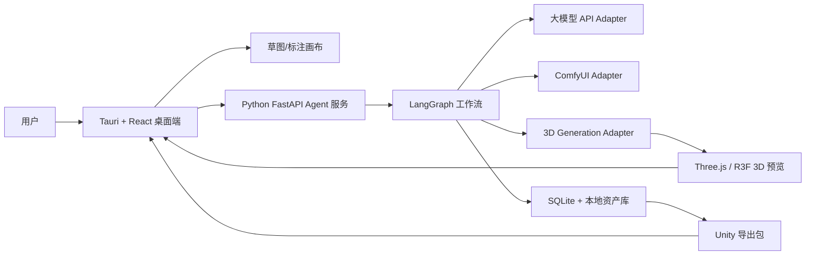
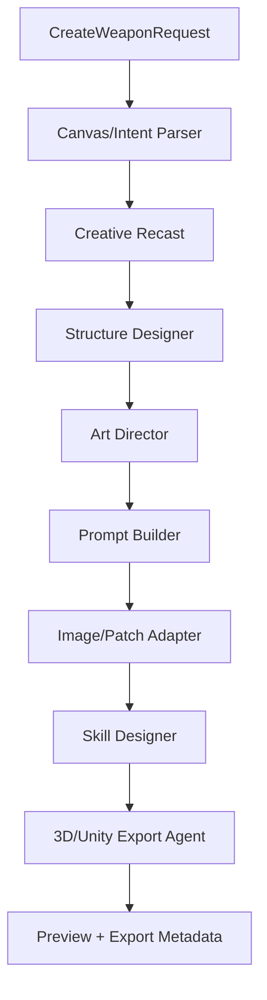
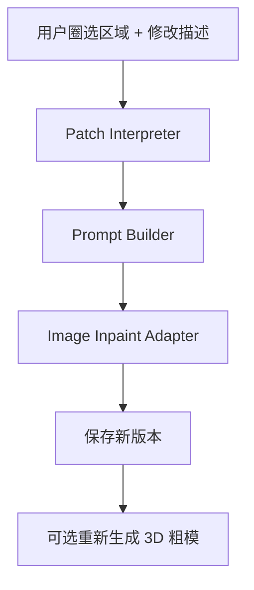

# 武神 Forge 设计文档

## 1. 产品定义

武神 Forge 是一款开源的 3渲2国风神兵设计桌面 Agent 软件。第一目标是“任意物件 -> 结构解释 -> 神化重构 -> Unity 可用幻想战斗物体资产”，而不是先做 Steam 游戏逻辑。

配套工程契约：

- [API Contract](API.md)
- [Schema Contract](SCHEMAS.md)
- [Database Contract](DATABASE.md)
- [Frontend Contract](FRONTEND.md)
- [Implementation Plan](IMPLEMENTATION_PLAN.md)
- [M1 Skeleton Notes](M1_SKELETON.md)
- [M2 SQLite AssetStore Notes](M2_ASSETSTORE.md)
- [M3 LLM and Contract Generation Notes](M3_LLM_AND_CONTRACTS.md)
- [M3 ComfyUI Adapter Notes](M3_COMFYUI_ADAPTER.md)
- [M3 Desktop Agent Supervisor Notes](M3_DESKTOP_SUPERVISOR.md)
- [M4 Patch AssetStore Notes](M4_PATCH_ASSETSTORE.md)
- [M5 Rough 3D Preview Notes](M5_ROUGH3D_PREVIEW.md)
- [Local 3D Runtime](LOCAL_3D_RUNTIME.md)
- [SQLite migration](../migrations/0001_init.sql)
- [JSON schemas](../packages/weapon-spec/schemas/)

当前契约分层：

- `WeaponDesignSpec@1`：当前可跑通的兼容输出，作为现阶段写盘和质量门底座。
- `CreativeWeaponGraph@1` / `SkillGraph@1`：下一阶段主结构抽象，先在文档合同和流程验证中冻结。

核心体验：

```text
用户给出创意（可为非武器物体）
结构解释器解析形体、连接点、运动关系
Creative Recast 生成神化约束
生成 WeaponDesignSpec（兼容字段）
产出概念图
支持结构+局部修改（Patch）
提交 SkillGraph（目标态）
保存到资产库
生成 3D 粗模
导出 Unity ZIP
```

## 1.1 核心设计修正（GPT Pro 对齐版）

为了避免“武器类别先验”，第一阶段把“输入对象”与“类型标签”解耦。核心目标是“对象级结构解释”，而不是“武器类目映射”：

- 任何对象都先走结构解释链路（骨架、握持、攻击源、能量流、关节、保护区）。
- 再由 Creative Recast 给对象一个可执行的神化重构。
- 再由 `SkillGraph`（目标态）定义玩法能力，而不是按剑/枪类目决定可用玩法。
- `weapon_family` 仅用于兼容回放，不参与分类驱动。

这意味着用户可输入“防弹裤/椅子/木棍/镜子”等非典型对象，系统仍能返回 2~3 个可选结构解释供确认，之后才继续生成图像与 3D。

核心原则：

- 解释链路优先：`interpretation` 先于 `concept` 触发。
- 单点确认：每次只允许在候选中选择一个结构解释作为当前工作流入口。
- 候选约束：系统默认返回 2~3 条候选；超出范围时进行降噪并返回 2~3 条 `rank` 稳定排序结果。
- 回溯链路：最终 `concept / patch / 3D / export` 必须可回到 `creative_graph_id` 与 `skill_graph_id`，而不是 `weapon_family`。

统一解释闭环（GPT Pro）：

1. **结构层**：先抽取可执行骨架（核心、握持、轴线、关节、受力/受控关系）。
2. **交互层**：再生成握持/放置/吸附/移动/扭转等交互动作描述。
3. **功能层**：再映射 `combat_affordances`（攻击、防护、控制、召唤、位移、反射、变形等）。
4. **资产层**：最后才到材质区、发光、材质风格、Unity handoff 参数（socket/比例/可放置锚点）。

每个层级都要持久化，进入确认前 `interpretation` 不能落空。

反模式（本阶段禁止）：

- 在 UI/后端路由出现“先分类后生成”。
- 以“是/否武器”判断是否继续流程。
- 将 `weapon_family` 作为主键路由、分页分组或推荐依据。

扩展约束：

- 先输出 2~3 个结构解释再继续；每次候选确认只允许一个选项落地为当前 `creative_graph_id`。
- `interpretation` 与 `recast` 必须输出 `combat_affordances`，而不是传统的器械类别。
- 自由度控制建议固定为 4 个滑块：形态、神化程度、玩法复杂度、资产可用性。

非特化输入对象池要求（第一阶段）：

- 已覆盖样例：防弹裤、木棍、椅子、镜子、伞、门、戒指、树枝。
- 每轮新增至少 2~3 个对象：贝壳、花盆、钥匙、风车、花环、雨伞、车把、竹简。
- 同一非武器对象重复复测时，不允许出现“候选全部离散退化”（至少保留一个候选稳定 `rank` 或核心 `combat_affordances` 方向）。

结构解释候选字段（目标态）：

```
structure_candidates: [
  { id, rank, name, summary, anchor_points, protected_regions, combat_affordances, confidence, structure_graph }
]
```

每个候选必须包含最小的结构锚点与风险标签（`protected_regions`/`risk_tags`），用于 Patch 与 3D 的稳定重现。

建议的自由度映射（非约束）：

- 结构解释自由度：骨架线、握持点、攻击源、技能锚点、可动关节
- 战斗能力自由度：`melee`、`projectile`、`summon`、`area_control`、`shield`、`mobility`、`transform`、`reflect`、`healing`、`chain` 等
- 表达自由度：国风形态 + 3渲2 + 真实材质感 + 层次化装饰
- 可用性自由度：`形态自由度 / 神化程度 / 玩法复杂度 / 资产可用性`

产品类比：

- 像 Codex / Claude Code 一样具备 Agent 执行流、工具调用、任务日志、版本记录。
- 但目标不同：不是写代码，不以武器分类为主分类，而是先做结构解释再做艺术诠释。

## 2. 用户已确定的方向

| 决策项 | 结论 |
| --- | --- |
| 开源策略 | 开源产品 |
| 模型运行方式 | 调用大模型 API |
| 核心风格 | 3渲2国风神兵 |
| 生成核心 | 任意物件优先结构解释，不预设武器类别 |
| 外观目标 | 逼真可信，有重量感、视觉材质感和装饰细节层次 |
| 游戏引擎方向 | Unity |
| 第一优先级 | 可进游戏的 3D 资产 |
| Agent 执行方式 | 自动跑完整流程 |
| 第一阶段 | 结构解释 -> Creative Recast -> CreativeWeaponGraph -> WeaponDesignSpec -> 概念图 -> 局部修改 -> SkillGraph -> 3D 展台/粗模 |

## 3. 安全和产品边界

本项目生成虚构游戏美术资产和高拟真武器外观。这里的“高拟真”指视觉可信，而不是现实可制造：武器需要有合理的体块、比例、视觉材质、磨损、雕刻、拼接、能量核心、发光区和 3D 形体，让玩家感觉它属于一个真实的国风幻想世界。

项目不生成现实可制造武器的精确蓝图、制造尺寸、材料配方、加工流程、结构工艺或制造说明。

因此，Agent 的输出应描述“看起来像什么”和“如何作为 Unity 游戏资产组织”，而不是“现实中如何制造”。允许逼真的外观、装饰结构、材质视觉和磨损细节；禁止把这些内容转写成现实工程图、制造参数、材料规格或工艺流程。

允许：

- 国风神兵外观
- 幻想武器轮廓
- 逼真的视觉比例、材质表现、细节和结构层次
- 游戏资产比例
- 3D 粗模
- Unity 材质与贴图映射
- 装饰性结构描述和美术资产说明

不做：

- 现实武器制造图纸
- 可制造尺寸
- 材料强度/热处理/加工工艺
- 现实武器组装步骤
- 提升现实伤害能力的设计建议

这个边界不会限制美术自由度，也不会限制武器外观的逼真程度；它只限制现实制造可操作性。

## 4. 总体架构



架构原则：

- 桌面端负责交互、预览、本地文件访问。
- Agent 后端负责流程、任务状态、模型调度。
- 图像生成和 3D 生成通过 adapter 接入，不锁死某一个模型。
- 所有产物写入本地资产库，方便追溯和二次修改。
- Unity 作为目标引擎约束导出格式，但第一阶段不开发 Unity 插件。
- 下一阶段新增 `creative_weapon_graph` 与 `skill_graph`，把结构解释作为 `WeaponDesignSpec` 之前的主输入。

## 5. 编程语言和技术选型

### 5.1 桌面端

| 项 | 选择 |
| --- | --- |
| 语言 | TypeScript, Rust |
| 框架 | Tauri + React |
| 主要职责 | 桌面窗口、项目管理、文件权限、画布、预览、任务状态 UI |

使用 GitHub 项目：

- [tauri-apps/tauri](https://github.com/tauri-apps/tauri)：桌面壳、跨平台打包、文件权限。
- [pmndrs/react-three-fiber](https://github.com/pmndrs/react-three-fiber)：React 方式构建 Three.js 预览。
- [mrdoob/three.js](https://github.com/mrdoob/three.js)：GLB/GLTF 预览、灯光、描边、材质调试。

### 5.2 Agent 后端

| 项 | 选择 |
| --- | --- |
| 语言 | Python |
| API | FastAPI |
| Agent 编排 | LangGraph |
| 主要职责 | 工作流状态、LLM 调用、ComfyUI 调度、3D 粗模调度、质量检查、资产库写入 |

使用 GitHub 项目：

- [langchain-ai/langgraph](https://github.com/langchain-ai/langgraph)：多节点 Agent 状态机。
- [cline/cline](https://github.com/cline/cline)：参考工具调用、人类可读任务轨迹、执行状态展示。
- [All-Hands-AI/OpenHands](https://github.com/All-Hands-AI/OpenHands)：参考长任务执行和工作区式 Agent 体验。
- [Aider-AI/aider](https://github.com/Aider-AI/aider)：参考版本化迭代和变更记录，但不复制其代码编辑逻辑。

### 5.3 画布和局部修改

| 阶段 | 选择 |
| --- | --- |
| MVP | tldraw 或 Excalidraw |
| 正式版 | Fabric.js |

使用 GitHub 项目：

- [tldraw/tldraw](https://github.com/tldraw/tldraw)：现代白板和标注体验。
- [excalidraw/excalidraw](https://github.com/excalidraw/excalidraw)：快速实现手绘草图输入。
- [fabricjs/fabric.js](https://github.com/fabricjs/fabric.js)：后续自定义结构画布、图层、蒙版、局部圈选。

设计方案：

- 支持上传参考图。
- 支持用户画物体轮廓与结构标注。
- 支持导出解释结构元数据：`anchor_points`、`protected_regions`、`combat_affordances`、`skill_anchor_points`、`structure_graph`。
- 支持局部圈选并输入修改要求。
- 支持把圈选区域导出为 mask，交给图像生成 adapter。

### 5.4 图像生成

| 项 | 选择 |
| --- | --- |
| 工作流引擎 | ComfyUI 外部服务 |
| 调用方式 | HTTP/WebSocket adapter |
| 输出 | 概念图、局部修改图、材质参考图 |

使用 GitHub 项目：

- [Comfy-Org/ComfyUI](https://github.com/Comfy-Org/ComfyUI)：节点式图像生成和工作流调度。

设计方案：

- 不把 ComfyUI 源码直接合入客户端。
- 桌面端只配置 ComfyUI 地址。
- Agent 后端保存 workflow JSON 模板。
- Prompt Agent 负责把 `WeaponDesignSpec` 转成工作流输入。
- 生成完成后，结果写入资产库。

### 5.5 3D 粗模生成

| 项 | 选择 |
| --- | --- |
| 输入 | 概念图或局部修改后的定稿图 |
| 输出 | GLB 优先，OBJ 备选 |
| 第一阶段标准 | 可旋转预览、可导入 Unity、允许后续人工修 |

使用 GitHub 项目：

- [Tencent-Hunyuan/Hunyuan3D-2](https://github.com/Tencent-Hunyuan/Hunyuan3D-2)：高质量 3D 资产生成方向。
- [Stability-AI/stable-fast-3d](https://github.com/Stability-AI/stable-fast-3d)：单图快速 3D 粗模方向。
- [VAST-AI-Research/TripoSR](https://github.com/VAST-AI-Research/TripoSR)：快速图生 3D 备选方案。
- [microsoft/TRELLIS](https://github.com/microsoft/TRELLIS)：3D 生成备选方案。

设计方案：

- 定义统一 `ThreeDProvider` 接口。
- 第一阶段只要求粗模，不承诺生产级拓扑。
- 3D 结果进入 Three.js 预览。
- 资产库保存原始模型、优化模型、贴图和生成参数。

### 5.6 3渲2和 Unity 导出

使用 GitHub 项目：

- [Unity-Technologies/com.unity.toonshader](https://github.com/Unity-Technologies/com.unity.toonshader)：参考国风 3渲2材质规则中的描边、边缘光、Emission、MatCap、明暗分层。
- [donmccurdy/glTF-Transform](https://github.com/donmccurdy/glTF-Transform)：GLB/GLTF 优化、压缩、纹理处理。

设计方案：

- 导出 Unity 友好的 GLB/FBX/贴图包。
- 第一阶段优先 GLB。
- 保存一份 `unity_material.json` 描述材质意图。
- 后续 Unity 插件可读取该描述并生成对应 Toon Shader 材质。

## 6. Agent 设计

第一阶段对用户可见的产品抽象保持 8 个业务节点，并引入结构解释与技能图目标态。后端实现层会拆成更细的可恢复状态机，见后文“生产级后端编排”。

| 节点 | 职责 |
| --- | --- |
| Canvas/Intent Parser | 解析文字、草图、参考图，抽取初始结构锚点 |
| Creative Recast | 根据输入结构输出神化重构方向 |
| Structure Designer | 维护骨架线、握持点、攻击源、可动关节 |
| Art Director | 输出 1 条用于后续 3D/技能生成的主视觉方案 |
| Prompt Builder | 生成概念图、局部修改、skill seed 的 prompt |
| Image/Patch Adapter | 调用 ComfyUI 协议并回写 |
| Skill Designer | 输出目标态 `SkillGraph`（6+卡片） |
| 3D/Unity Export Agent | 生成粗模、GLB 与 Unity 交接文件 |

LangGraph 流程：



### 6.1 子智能体协作上限

该阶段的多模态执行约束设为“最多 8 个并发子智能体”。每个子智能体是 LangGraph 工具节点的专责代理，不是无限制调用模型，而是固定分工：

- `Spec Interpreter`：解析文字/草图输入。
- `Creative Recast Specialist`：输出神化重构候选与约束。
- `Structure Designer`：维护骨架、握持点、攻击源、能量流、可动关节。
- `Art Director`：输出方案级视觉约束与可读轮廓。
- `Prompt Engineer`：生成概念图与局部修改的正负向提示词与参数。
- `Image/Patch Adapter`：统一处理 ComfyUI 与局部修改（Mask + Manifest + Repaint）回写链路。
- `SkillGraph Designer`：管理 6 卡技能结构与交互能力映射。
- `3D/Unity Export`：接入 3D provider、回写模型指标、并生成 Unity 交接清单。

并行约束：任意时刻不超过 8 个子智能体；并行主要用于并行并发执行、重试和审计场景，不作为无界扩张。系统默认以可追溯、有序、可恢复为先。

建议在产品级方案上将以上 8 个并发槽映射为 12 个职责角色（解析、重铸、结构、视觉、技能、3D、导出等），
但在运行时只保证“并发不超 8”，多余职责通过同一工具节点内复用实现。

12 角色映射参考（用于产品文档和排障，而非运行时创建新角色）：

- `Intent Parser` / `Text Parser`：输入抽取
- `Sketch Parser`：画布形状与标注抽取
- `Source Normalizer`：统一对象语义与字段归一化（source_object/raw_description）
- `Creative Recast`：非典型对象重诠释与能力标签映射
- `Structure Validator`：结构图与受保护区域验收
- `Weapon Graph Builder`：生成 `CreativeWeaponGraph@1`
- `Visual Director`：色彩、材质层级与风格约束
- `Prompt Builder`：概念图与补图 prompt 组织
- `Image Adapter`：ComfyUI/图像适配
- `Patch Coordinator`：局部修改、mask 与 manifest 回流
- `SkillGraph Designer`：6槽能力图与技能重生重试
- `3D Export Operator`：3D 任务、Unity 交接、模型质量阈值

### 6.2 战斗能力与自由度定义（目标态）

- `combat_affordances`：`melee`、`pierce`、`blunt`、`projectile`、`energy`、`area_control`、`summon`、`shield`、`mobility`、`transform`、`return`、`dot`、`heal`、`reflect`。
- `CreativeWeaponGraph`（目标）包括：`structure`（skeleton/grip/attack_source/movable_joint/energy_flow）、`protected_regions`、`anchor_points`、`recast_profile`。
- `SkillGraph`（目标）输出 6 卡：普通、重击、机动/防御、控制、被动、终结。
- `WeaponDesignSpec@1` 在目标态保留兼容字段：`weapon_family` 仍可保留但不再作为主分类。

### 6.3 结构解释样例（非具像化）

```text
输入：防弹裤式结构
解释候选：
1) 腰部环形防御炮台（affordance：shield / projectile）
2) 膝部加速步兵架（affordance：mobility / melee）
3) 腰部阵环+连射装置（affordance：area_control / summon）

输入：椅子
解释候选：
1) 王座炮台（affordance：control / shield）
2) 可分裂领域台（affordance：area_control / summon）
3) 高台投射站（affordance：ranged / chain）
```

这些候选只描述结构与功能闭环，避免把模型提前限定为某一“武器类目”。

### 更好的想法（GPT Pro 建议）

- 把非特化对象测试改为“能力分叉覆盖率”指标：每轮同一 `source_object` 至少产生 2 条候选，其能力主轴不同（例如 `mobility + projectile` 与 `shield + summon`）。
- 将候选比较从文本匹配改为图约束对比：是否存在不同的 `anchor_points`、`protected_regions` 与 `risk_tags` 分布。
- 对 `interpretation` 退化为低于 2 个候选的请求，先自动进入一次“重采样”子流，保留首次 `rank=1` 作为稳定锚点；重采样后仍不足 2 个有效候选时返回 `PROVIDER_BAD_OUTPUT`，不允许继续概念图或 3D。
- 每 5 个新对象示例里至少包含 2 个家具/结构型对象（椅子、桌腿、栏杆、花盆、车把）和 1 个日常工具（钥匙、雨伞、剪刀），帮助系统学习几何语义而非武器语义。
- 在 3D 阶段同步输出 `worn_pose` 与 `held_pose` 双态提示：让展台先支持手持与穿戴两种展示映射，减少后续 Unity 绑定人工修正。

解释闭环错误策略：

- 未确认候选时调用 `concept / patch / generate-3d / export-unity`，统一返回 `INTERPRETATION_NOT_CONFIRMED`。
- `interpretation` 输出 JSON 非法、候选缺字段、候选全部能力同轴或重采样后不足 2 条，统一归入 `PROVIDER_BAD_OUTPUT`。
- `selected_candidate_id`、`selected_candidate_rank` 或 `interpretation_id` 不匹配时，返回 `INVALID_INTERPRETATION_CANDIDATE` 或 `INVALID_INTERPRETATION_ID`。
- 前端和文档不得把以上错误展示成“请选择武器类型”；只能提示用户重跑解释、调整描述或补充结构标注。

非特化示例补充（用于 GPT Pro 产线闭环测试）：

- 椅子：可映射为“防御域 + 领域控制 + 传送锚点”，兼容王座炮台/领域站/折叠盾阵 3 套形态。
- 木棍：可映射为“炮口-能量泵”与“束缚链条”双路线，兼容手持/杖类/双手重构。
- 防弹裤：可映射为“腿部环形炮台 + 护体风雷阵 + 短距位移”的战斗链。
- 镜子：可映射为“反射场 + 同步破绽判定 + 链式指引”三形态。
- 钥匙：可映射为“锁定位移 + 目标选择 + 返回位”三形态。

并发策略：

- 默认同时启动 1~2 个子智能体执行（成本友好）。
- 有明确并行收益时可短暂提升到最多 4 个。
- 严格上限 8 个，满足你提到的边界，超过后需要串行复用而不是扩张新子角色。

这个限制对应我们当前实现：主流程保持单轨状态机，子智能体职责可复用为同一工具节点的并发实例，确保可复现性与日志可读性。

局部修改流程：



## 7. 核心数据结构

### 7.1 WeaponDesignSpec

`WeaponDesignSpec@1` 是当前兼容契约；下一步会把 `CreativeWeaponGraph@1` 和 `SkillGraph@1` 作为主结构输出，避免将 `weapon_family` 当作第一分类。

```json
{
  "id": "weapon_20260704_0001",
  "name": "雷步腰炮神兵",
  "style": "3渲2国风神兵",
  "source_object": "pants",
  "combat_affordances": ["mobility", "projectile", "shield"],
  "creative_graph_id": "cg_20260704_0001",
  "skill_graph_id": "sg_20260704_0001",
  "fantasy_category": "wearable_artifact",
  "silhouette": {
    "primary_shape": "wearable_long_range_artifact",
    "readability": "strong",
    "asymmetry": "medium"
  },
  "visual_keywords": [
    "dragon spine",
    "black gold metal",
    "red jade core",
    "cel shaded outline",
    "divine fire aura"
  ],
  "color_palette": {
    "primary": "#1B1A1A",
    "secondary": "#C79A3A",
    "accent": "#D93B2B",
    "glow": "#FF6A2A"
  },
  "material_zones": [
    {
      "zone": "core_structure",
      "material": "stylized dark metal",
      "notes": "main structural frame, decorative accents only"
    },
    {
      "zone": "guard",
      "material": "golden engraved alloy",
      "notes": "dragon motif"
    },
    {
      "zone": "core",
      "material": "red jade energy core",
      "notes": "emissive"
    }
  ],
  "toon_rules": {
    "outline": "strong",
    "shadow_steps": 2,
    "rim_light": "warm",
    "emission": "localized"
  },
  "generation": {
    "concept_prompt": "",
    "negative_prompt": "",
    "seed": null,
    "provider": "comfyui"
  },
  "unity_target": {
    "format": "glb",
    "scale_policy": "game_asset_relative_scale",
    "material_profile": "toon_weapon"
  }
}
```

注意：`scale_policy` 只表达游戏资产相对比例，不输出现实制造尺寸。

### 7.2 Asset Record

```json
{
  "asset_id": "asset_20260704_0001",
  "weapon_spec_id": "weapon_20260704_0001",
  "versions": [
    {
      "version": 1,
      "type": "concept_image",
      "path": "assets/weapons/weapon_20260704_0001/v001/concept.png",
      "prompt_path": "assets/weapons/weapon_20260704_0001/v001/prompt.json",
      "created_at": "2026-07-04T22:00:00+08:00"
    }
  ],
  "current_model": {
    "path": "assets/weapons/weapon_20260704_0001/models/rough.glb",
    "provider": "stable_fast_3d",
    "status": "rough_preview"
  }
}
```

## 8. 本地资产库设计

SQLite 存元数据，本地文件夹存大文件。

```text
WushenForgeLibrary/
  weapons/
    weapon_20260704_0001/
      spec.json
      timeline.json
      v001/
        concept.png
        prompt.json
        comfyui_workflow.json
      v002/
        concept_patch.png
        patch_mask.png
        patch_prompt.json
      models/
        rough.glb
        rough_preview.png
        unity_material.json
      exports/
        unity_package/
```

SQLite 表：

- `weapons`
- `weapon_versions`
- `generation_jobs`
- `asset_files`
- `provider_configs`
- `agent_events`

## 9. API 设计草案

Python FastAPI 提供本地接口：

```text
POST /api/weapons
GET  /api/weapons
GET  /api/weapons/{weapon_id}
POST /api/weapons/{weapon_id}/patch
POST /api/weapons/{weapon_id}/generate-3d
GET  /api/jobs/{job_id}
GET  /api/assets/{asset_id}/file
```

`POST /api/weapons` 输入：

```json
{
  "text": "我有一件防弹裤外形的神兵化装备，做成腰部炮台风格",
  "sketch_asset_id": null,
  "auto_run": true,
  "target": {
    "phase": "concept_to_rough_3d",
    "engine": "unity"
  }
}
```

输出：

```json
{
  "weapon_id": "weapon_20260704_0001",
  "job_id": "job_20260704_0001",
  "status": "running"
}
```

## 10. 自动执行策略

用户要求 Agent 自动跑完整流程，因此第一阶段默认 `auto_run=true`。

自动流程需要有成本控制：

- 每条武器任务默认只生成 1 个主方案和 1 张主概念图；后续由 patch / 重铸生成派生版本。
- 3D 粗模只在概念图生成成功后执行。
- API provider、ComfyUI、3D provider 都需要超时和失败重试。
- 所有失败都写入 `agent_events`，用户可以重试当前步骤。

## 11. 质量检查

第一阶段质量检查只做游戏资产方向，不做复杂审美评分。

检查项：

- 是否能映射为清晰的战斗用途与 `combat_affordances`
- 是否符合国风神兵
- 是否符合 3渲2风格
- 外观是否逼真可信，是否有清楚的重量感、视觉材质表现和结构层次
- 剪影是否清晰
- 是否适合单图转 3D
- 是否有明显破碎、错乱、文字水印
- 是否误输出可用于现实制造的参数、图纸或工艺信息

## 12. Unity 目标格式

第一阶段 Unity 侧目标：

```text
GLB 模型
PNG 贴图
unity_material.json
preview.png
weapon_spec.json
```

`unity_material.json` 示例：

```json
{
  "shader_family": "toon",
  "outline_width": 0.035,
  "shadow_steps": 2,
  "rim_light": {
    "enabled": true,
    "color": "#FFB36A",
    "intensity": 0.7
  },
  "emission_zones": [
    {
      "name": "core",
      "color": "#FF6A2A",
      "intensity": 1.4
    }
  ]
}
```

## 13. 开源和第三方 license 策略

正式集成前必须审核每个依赖的 license。

策略：

- MIT/Apache/BSD 类依赖可优先直接使用。
- GPL 类项目避免直接合入客户端，可作为外部服务或用户自装工具调用。
- 3D 生成模型需要单独确认模型权重和代码 license。
- API provider 的输出资产归属需要在用户协议里明确。

特别注意：

- ComfyUI 更适合作为外部服务调用。
- Hunyuan3D、Stable Fast 3D、TripoSR、TRELLIS 的代码 license 和模型权重 license 要分开审核。
- Unity Toon Shader 当前只作为材质规则参考，是否直接接入 Unity 项目需后续审查。

## 14. 第一阶段里程碑

### M1: 文档和骨架

- README
- 设计文档
- Tauri + React 初始化
- Python FastAPI 初始化
- LangGraph 空流程

### M2: WeaponDesignSpec

- 定义 schema
- 生成 1 条可重构的主方案（兼容结构约束）
- 保存到 SQLite 和本地文件

### M3: 概念图生成

- ComfyUI adapter
- Prompt Builder
- 概念图写入资产库
- 任务日志 UI

### M4: 局部修改

- 已完成后端 patch 基础：上传 `patch_mask` / `patch_manifest`，查询武器详情，校验 source version、source image、`patch_mask`、`PatchManifest@1`、空 mask、尺寸不匹配。
- 已完成追加式版本写入：生成 `patch_prompt`、`concept_patch`、`comfyui_workflow`、`quality_report`，新版本 `parent_version_id` 指向源版本，不覆盖旧版本。
- 已完成 ComfyUI HTTP patch provider 边界：显式设置 `WUSHEN_IMAGE_PROVIDER=comfyui` 后，patch job 上传源图和 PNG mask，绑定 inpaint workflow，提交 `/prompt`，轮询 `/history/{prompt_id}`，下载 `/view` 输出并落库；默认 `mock_comfyui` 仍用于离线开发。
- 已完成前端 API-connected Patch Mode 基础：选择武器/版本，受控读取源图文件，加载背景图，画笔或套索绘制 mask，支持画笔尺寸、mask 透明度、撤销/重做，上传 mask 和 `PatchManifest@1`，提交 patch job，并复用任务事件流。
- 已完成 patch 前后对比基础：当选中 patch 版本时，前端解析 `parent_version_id`，以滑杆对比父版本源图和当前 `concept_patch`。
- 已完成版本控制基础：`POST /api/weapons/{weapon_id}/versions/{version_id}/activate` 可把 committed 版本设为当前版本，前端提供设为当前、回到父版本、从父版本重试入口。
- 已完成旧库迁移补强：`0002` 补 `idempotency_records`，`0003` 重建 `asset_files.role` 约束以允许 `concept_patch`，`0004` 允许同一内容对象被多条资产记录复用。
- 待完成真实本地 ComfyUI inpaint workflow 验收、生产美术 workflow 替换，以及真实 provider 失败后的任务级重试策略。

### M5: 3D 粗模

- 已完成 M5 preview foundation：mock 3D 产物是最小合法 GLB 2.0，不再是文本占位文件。
- 已完成 M5 provider foundation：`mock_3d` provider 产出 raw / normalized / optimized GLB、Unity material metadata 和模型质量指标；`POST /api/weapons/{weapon_id}/generate-3d` 可从概念图或 patch 图追加 `rough_3d` 子版本。
- 已完成桌面端 Three.js 展台预览、generate-3d 入口和 Unity 导出入口：读取资产库，定位当前或最近的 `rough_raw_glb`，通过受控 asset file URL 加载，并放入“展览台 + 简单角色 + 手持武器”的 360 度查看场景；支持自动旋转、拖拽旋转、toon/solid/wireframe、重置和截图；同时可从当前 `concept_patch` 或 `concept_image` 发起 generate-3d job，也可从当前 rough model 导出 Unity ZIP 包，并把 job id 接回全局任务时间线。
- 已完成 GLB/generate-3d gate：资产库检查会校验 GLB magic、version、length、JSON chunk、非空 BIN chunk、generate-3d 资产角色、事件顺序和模型质量报告；模型质量报告会解析 optimized GLB JSON chunk，记录 triangle/vertex/mesh/material/texture/image counts、PBR material、bounds、center、extents 和 longest axis，并把缺失 mesh/bounds 证据标为 blocker、缺失 material slots 标为 warning；`scripts/smoke_m5_glb_preview_contract.py` 与 `scripts/smoke_m5_generate3d_http.py` 覆盖预览和 API 契约。
- 已完成 Unity export ZIP 快照基础：`POST /api/weapons/{weapon_id}/export-unity` 可从已优化 rough model 生成 `unity_export_package`，包内包含优化 GLB、`unity_material.json`、`weapon_spec.json`、模型质量报告、manifest 和非制造说明，资产库检查会校验 ZIP 路径和 manifest 边界。
- 已完成 Unity import smoke 基础：`scripts/smoke_m5_unity_import.py` 会生成临时 export 包并验证 ZIP/manifest/hash/GLB/material/spec/report；配置 `WUSHEN_UNITY_EXECUTABLE` 或 `UNITY_EXECUTABLE` 后会创建临时 Unity 项目、安装 `com.unity.cloud.gltfast` 并用 batchmode 验证 GLB 和 JSON 资产导入。当前无 Unity 环境时记录 `UNITY_EXECUTABLE_NOT_CONFIGURED` release blocker。
- 已完成 local HTTP 3D provider adapter 与 runtime wrapper 基础：`local_http_3d` 可连接外部本地 3D runtime 服务，并覆盖异步提交、轮询、取回、取消、GLB 校验和取消后不入库；`scripts/wushen_local_3d_runtime.py` 作为独立子进程实现该协议，支持 deterministic `mock` backend、调用本地 Stable Fast 3D `run.py` 的 `sf3d-cli` backend 路径，以及调用本地 TripoSR `run.py --model-save-format glb` 的 `triposr-cli` fallback 路径；`docs/LOCAL_3D_RUNTIME.md` 定义安装、手动验收、许可边界和 release criteria。
- 待完成真实 Stable Fast 3D / TripoSR 环境验收、真实 runtime 重启后的 provider task resume、真实 provider 错误分类，以及把 Unity import smoke 接入真实 CI 并取得 `unity_import_status=imported`。

## 15. 生产级设计升级

本节记录从“概念设计”升级到“生产级软件设计”时必须补齐的工程边界。第一阶段仍只做：

```text
文字/草图 -> 结构解释 -> Creative Recast -> CreativeWeaponGraph -> WeaponDesignSpec -> 概念图 -> 局部修改版本 -> SkillGraph -> 资产库记录 -> 3D 展台/粗模 -> Unity 可导入包
```

### 15.1 参考资料和设计依据

本轮设计使用 GitHub 项目和官方文档作为依据：

| 方向 | 参考 | 设计结论 |
| --- | --- | --- |
| Tauri sidecar | [Tauri Sidecar](https://v2.tauri.app/develop/sidecar/) | Python Agent 服务可作为 sidecar 或本地受控进程，Tauri 只授予必要执行和文件权限。 |
| LangGraph | [LangGraph Overview](https://docs.langchain.com/oss/python/langgraph/overview) | 使用 durable execution、streaming、human-in-the-loop 和 checkpoint 思路设计可恢复 Agent。 |
| ComfyUI API | [ComfyUI Server API](https://docs.comfy.org/development/comfyui-server/comms_overview) | 通过 REST/WebSocket 提交 workflow、上传文件、监控进度、下载产物。 |
| glTF 优化 | [glTF-Transform](https://gltf-transform.dev/) | GLB/GLTF 优化必须可重复、可检查、可写入质量报告。 |
| GitHub 项目 | Tauri、LangGraph、ComfyUI、tldraw、Three.js、R3F、glTF-Transform | 只套用架构和能力边界，不盲目复制业务。 |

### 15.1.1 GitHub 项目-能力映射（第一阶段）

为降低重复建设，每类能力只绑定一个“主参考”与两个“备选”项目：

| 设计能力 | 参考项目（主） | 备选/增强项目 | 约束与交付 |
| --- | --- | --- | --- |
| 桌面壳与发布 | [tauri-apps/tauri](https://github.com/tauri-apps/tauri) | [tauri-docs sidecar 指南（官方）](https://github.com/tauri-apps/tauri-docs/blob/v2/src/content/docs/ja/develop/sidecar.mdx)、[example-tauri-v2-python-server-sidecar](https://github.com/dieharders/example-tauri-v2-python-server-sidecar) | `desktop` 主体、sidecar 生命周期、target triple 命名、能力最小化、窗口与菜单。 |
| 图像编辑画布 | [tldraw/tldraw](https://github.com/tldraw/tldraw) | [fabricjs/fabric.js](https://github.com/fabricjs/fabric.js) | 草图输入优先，局部修改导出 mask 与坐标一致性。 |
| LLM 工具调用与工作流 | [langchain-ai/langgraph](https://github.com/langchain-ai/langgraph) | [microsoft/autogen](https://github.com/microsoft/autogen)（备用） | 仅抽象节点状态机与恢复，不复用业务规则；保留可追踪日志。 |
| Agent 执行经验 | [cline/cline](https://github.com/cline/cline) / [Aider-AI/aider](https://github.com/Aider-AI/aider) | [All-Hands-AI/OpenHands](https://github.com/All-Hands-AI/OpenHands) | 对齐任务轨迹、可恢复重试、步骤审计。 |
| 图像生成适配 | [Comfy-Org/ComfyUI](https://github.com/Comfy-Org/ComfyUI) | [A1111-sd-webui](https://github.com/AUTOMATIC1111/stable-diffusion-webui)（备选） | 保留 ComfyUI 生态兼容 API 流程，避免把服务和渲染栈打进桌面。 |
| 3D 粗模 | [VAST-AI-Research/TripoSR](https://github.com/VAST-AI-Research/TripoSR) | [Tencent-Hunyuan/Hunyuan3D-2](https://github.com/Tencent-Hunyuan/Hunyuan3D-2) / [Stability-AI/stable-fast-3d](https://github.com/Stability-AI/stable-fast-3d) / [microsoft/TRELLIS](https://github.com/microsoft/TRELLIS) | 统一 `ThreeDProvider` 接口；先用轻量 provider 做稳定闭环，再逐步替换。 |
| Unity 预览/导入约定 | [Unity-Technologies/com.unity.toonshader](https://github.com/Unity-Technologies/com.unity.toonshader) | [KhronosGroup/glTF](https://github.com/KhronosGroup/glTF) | 先按 GLB 与材质意图导出，再在 Unity 侧做最终材质实例化。 |

设计规则：

- `tauri` 与 `agent` 仍是主执行路径，其他项目只做适配层复用，不直接接管主流程。
- 每当新增/替换 provider，必须在 `docs/IMPLEMENTATION_PLAN.md` 增一条“验收证据优先级”任务。
- GitHub 项目升级只在满足“安全边界、license、性能”三要素后执行。

### 15.2 8 人位子 Agent 分工

后续每轮设计和实现前，默认按 8 人位子 Agent 分工审查，再由主 Agent 收敛冲突、更新文档和计划；复杂 release 审计可以临时增加专家，但总人数不得超过 8 个子 Agent。

| 分组 | 子 Agent | 产出 |
| --- | --- | --- |
| 前端 | Frontend Agent A | Forge 工作台任务流、3D 展台可用性、资产库交接体验、Playwright 验收建议 |
| 前端 | Frontend Agent B | 桌面信息架构、视觉层级、Agent 操作模式、交互替代方案 |
| 后端/架构 | Backend Architecture Agent | API contract、任务状态、资产库、provider adapter、Unity export/import 管线风险 |
| 后端/编排 | Runtime Agent | 3D/图像异步 worker、任务恢复、provider checkpoint、重试策略 |
| 后端/部署 | Packaging/Distribution Agent | Tauri 打包、sidecar、签名/安装器、桌面发布脚本 |
| 数据 | Quality & Safety Agent | 安全边界审计、非制造约束、prompt 风险和质量报告 |
| 验收 | Verification Agent | Release gate、自动化测试、安全边界、Unity blocker、文档证据缺口 |
| 外部依赖 | Provider Specialist | ComfyUI、3D provider、Unity 导入行为和适配协议评估 |

分工规则：

- 两个前端 Agent 只定义交互、模块边界、视觉层级和测试，不直接设计后端内部状态机。
- Backend Architecture Agent 负责 API、任务、数据、安全和 Unity 管线，不直接决定 UI 视觉布局。
- Verification Agent 有权把缺失证据标为 release blocker。
- 主 Agent 负责把分歧收敛到 `README.md`、`DESIGN.md`、schema 和计划，并决定当轮实际实现范围。
- 超过 4 个子 Agent 并发处理时，新增角色必须是短期、明确、可验收的专家任务，例如 Security、Unity Pipeline、Provider Adapter 或 Packaging；总数不得超过 8。

### 15.2.1 当前轮 8 位 RACI

- In Progress: 所有 8 位子 Agent 都进入第一阶段第一轮。
- 交付规则：每位子 Agent 给出当前阶段建议；下一轮只推进已验证建议并保留未闭环项到待办。

| 子 Agent | 当前交付目标 |
| --- | --- |
| Frontend Agent A | 统一主流程状态定义并补齐 UI 关键操作/边界场景。 |
| Frontend Agent B | 完成任务架构与状态文案统一，并输出交互异常兜底建议。 |
| Backend Architecture Agent | 明确下一阶段接口变更范围，输出 Mx Notes 与 schema 联动清单。 |
| Runtime Agent | 给出 worker 恢复、provider 失败、超时、cancel 的决策矩阵。 |
| Packaging/Distribution Agent | 列出 sidecar 打包交付最短路径与 release-readiness 证据。 |
| Quality & Safety Agent | 列出非制造边界判定点与 prompt 风险控制清单。 |
| Verification Agent | 输出本轮缺口 gate 列表与每项最小复现证据。 |
| Provider Specialist | 输出 3D provider 与 ComfyUI、Unity 导入真实验收比较表。 |

### 15.5 生产级 goal 模式

该项目采用“目标-文档-计划闭环”：

1. 先冻结目标边界（本阶段范围、非制造约束、子 Agent 上限、交付验收标准）。
2. 先选主参考框架（仓库/官方文档），再把接口契约固定到文档和 schema。
3. 完成功能设计后，先更新 `README.md`、`DESIGN.md`、`IMPLEMENTATION_PLAN.md`，再更新 `M*` Notes 与 `checks`。
4. 每次设计更新必须给出下一步 plan：下一轮验收项、风险、待验证证据、负责人。
5. 未形成可执行 plan 前不扩展实现。

### 15.5.1 生产级交付门禁（与 README 对齐）

设计完成后，必须先清零下列门禁，且每项均提供可复现证据，才允许进入下一阶段实现。

| 门禁 | 目标状态 | 触发阻塞 | 当前状态 | 负责人 | 证据路径（标准落点） | 失败归档分类 |
| --- | --- | --- | --- | --- | --- | --- |
| 安全边界 | `npm run release:safety-scope` 通过 | 非制造内容、泄露风险、目录越权 | 运行中（边界条款已在文档锁定） | Quality & Safety / Verification | `scripts/check_release_safety_scope.py`、`docs/API.md`、`docs/UNITY_IMPORT_SMOKE.md` | `scope_violation`、`non_manufacturing_drift`、`safety_phrase_missing` |
| 秘钥与文件安全 | `npm run release:secrets-files` 通过 | 明文密钥、非法外泄文件路径、绝对路径入库 | 待排查 | Verification / Packaging | `scripts/check_release_secrets_files.py`、`apps/desktop/src-tauri/tauri.conf.json`、`apps/agent/wushen_agent/asset_store.py` | `secret_literal`、`tauri_hardening_gap`、`reveal_path_leak`、`absolute_path_reject` |
| Prompt 质量门 | `npm run release:prompt-quality` 通过 | 质量报告缺失、negative prompt 覆盖不足 | 待补齐 | Quality & Safety | `scripts/check_release_prompt_quality.py`、`docs/PROMPT_QUALITY_SET.md` | `prompt_coverage_gap`、`quality_threshold_shortfall`、`negative_prompt_missing` |
| 文档可复现性 | `npm run release:docs-walkthrough` 通过 | 关键流程无复现脚本或证据缺失 | 待补齐 | Backend Architecture / Verification | `scripts/check_release_docs_walkthrough.py`、`docs/QUICKSTART.md`、`docs/M3_DESKTOP_SUPERVISOR.md`、`docs/LOCAL_3D_RUNTIME.md`、`docs/UNITY_IMPORT_SMOKE.md` | `walkthrough_gap`、`endpoint_mismatch`、`script_ref_missing` |
| 打包就绪 | `npm run release:packaging-readiness` 通过 | Tauri 打包 pipeline、sidecar 二进制、签名/资源项缺失 | 待处理 | Packaging/Distribution | `scripts/check_release_packaging_readiness.py`、`docs/PACKAGING.md`、`apps/desktop/src-tauri/tauri.conf.json`、`apps/desktop/src-tauri/src/main.rs`、`apps/desktop/src-tauri/Cargo.lock` | `sidecar_binary_missing`、`externalbin_mismatch`、`packaged_mode_missing`、`csp_or_capability_missing` |
| License/SBOM | `npm run release:license-sbom` 通过 | 未知许可项或 SBOM 缺失 | 待确认 | Packaging / Verification | `scripts/check_release_license_sbom.py`、`package-lock.json`、`apps/agent/requirements-release.lock`、`docs/THIRD_PARTY_LICENSES.md` | `license_forbidden`、`lockfile_missing`、`external_review_pending` |
| 3D provider 真实对比 | `agent:p0-local-3d-runtime-sf3d-manual` 与 `agent:p0-local-3d-runtime-triposr-manual` 有结果 | 无法稳定输出可用 raw/normalized/optimized 模型 | 待真实验收 | Provider Specialist | `scripts/smoke_p0_local_3d_runtime_sf3d_manual.py`、`scripts/smoke_p0_local_3d_runtime_triposr_manual.py`、`docs/LOCAL_3D_RUNTIME.md` | `backend_install`、`no_glb_output`、`invalid_glb`、`timeout`、`oom`、`provider_cancel_gap` |
| 任务恢复能力 | `agent:p0-runtime-recovery-smoke` / `agent:p0-generate3d-worker-loop-smoke` 通过 | provider task 重试、cancel、checkpoint 恢复异常 | 待补齐 | Runtime | `scripts/smoke_p0_runtime_recovery.py`、`scripts/smoke_p0_generate3d_worker_loop.py`、`scripts/smoke_p0_provider_runtime_boundary.py` | `cursor_invalid`、`cancel_conflict`、`checkpoint_stale`、`retry_state_mismatch` |
| 运行时恢复边界 | `GET /api/jobs/{job_id}/runtime` 与 runtime action 映射一致 | unknown cursor、cancel 409、超时状态不一致 | 基础有，但未闭环 | Runtime / Backend Architecture | `scripts/smoke_p0_runtime_recovery.py`、`apps/agent/wushen_agent/main.py`、`apps/agent/wushen_agent/asset_store.py` | `runtime_action_mismatch`、`cancel_not_propagated`、`runner_lease_stuck` |
| Unity 导入验证 | `npm run unity:import:gate` 由 `blocked_unity_not_configured` 转 `imported` | 环境缺失或导入失败 | 阻塞（待本机/CI 配置） | Verification / Provider Specialist | `scripts/smoke_m5_unity_import.py`、`docs/UNITY_IMPORT_SMOKE.md` | `unity_not_configured`、`unity_import_failed`、`manifest_path_invalid` |

执行规则：

- 本轮任一门禁为 blocker 时，不得开启新阶段；只允许形成下一轮 `本轮设计闭环待办`。
- 每项待办必须绑定证据来源（日志、截图、smoke 报告、脚本输出）和负责人。
- 门禁项在本轮内只允许一次状态前置（待处理/进行中/阻塞/通过），禁止反复新增无效状态。

#### 15.5.2 证据落地与失败归档规范

- 证据统一存入 `output/release/<gate-id>/`，其中：
  - `report.json`：门禁主命令的结构化 JSON 输出；
  - `trace.txt`：执行命令行记录；
  - `artifacts.txt`：截图、日志、ZIP、workflow、模型文件路径清单。

`output/release/_TEMPLATE` 提供落盘样例，执行每项 gate 前先复制一份到 `output/release/<GATE_ID>/`，填入当次执行产物。
- 每次执行记录需至少包含：
  - `blocker` 级失败；
  - `warning` 级风险；
  - `next_action`；
  - `owner` 与 `next_owner`（如需转单）。
- 失败归档分类使用本表标准分类：  
`scope_violation`、`secret_literal`、`prompt_coverage_gap`、`walkthrough_gap`、`sidecar_binary_missing`、`license_forbidden`、`backend_install`、`runtime_action_mismatch`、`unity_not_configured`。  
未在该分类中的新失败必须先补充到本节再执行回归。

执行边界：

- 设计产物必须可落地在 `m4/m5` 实现切片。
- 每个切片至少包含：
  - contract 更新（如有）
  - 文档更新
  - gate 脚本或验收脚本新增/更新
- 任何阶段都不得突破“虚构游戏美术资产”边界。

### 15.3 桌面端体验设计

桌面端启动后直接进入生产工作台，不做营销首页。

主导航：

| 区域 | 目的 |
| --- | --- |
| Forge 工作台 | 创建武器、查看概念图、局部修改、生成 3D 粗模 |
| 资产库 | 浏览武器资产、版本、概念图、GLB、Unity 导出包，并通过受控 asset URL 下载交接文件 |
| 任务中心 | 搜索历史 job、手动恢复 job id、查看 Agent 执行、失败原因、重试入口和 action 审计 |
| 设置 | 配置 API provider、ComfyUI 地址、3D provider、本地资产库路径 |
| 关于/开源 | license、第三方依赖、模型权重责任说明、贡献入口 |

路由草案：

```text
/forge
/weapons/:weaponId
/weapons/:weaponId/versions/:versionId
/library
/jobs
/jobs/:jobId
/settings/providers
/settings/library
/about
```

主工作台采用四区布局：

```text
Top Bar: 项目名 / Provider 状态 / 当前任务状态
Left Panel: 武器概要、版本、当前阶段
Main Stage: 概念图、Patch 画布、3D 预览
Right Inspector: WeaponDesignSpec、prompt、材质区、Unity 元数据
Bottom Drawer: Agent 任务日志、生成轨迹、错误和重试
```

P0 Agent Trace Drawer 当前实现：

- 底部抽屉不再平铺原始事件，而是显示任务摘要、事件流状态、进度条、按 step 分组的阶段卡和最近消息。
- 阶段卡用中文业务名解释底层 step，并保留 artifact id 和 metadata 摘要，方便从资产库反查。
- 桌面端在接受新 job 后调用 `GET /api/jobs/{job_id}` 水合历史事件，替换为该 job 的事件集合，并把最近 job 写入 `localStorage`，支持重启后自动恢复最近任务上下文。
- SSE 订阅使用已知最后事件 id 作为 `after` 参数续订，避免重复回放；后端已公开 `JobEvent.seq`，前端以 `seq` 作为稳定排序来源；未知 `after` cursor 会返回 `INVALID_EVENT_CURSOR` 的 `job.error` frame。
- 恢复动作按状态启用：失败后可请求任务重试或从失败步骤重试，运行/等待中可请求取消，provider 配置问题可打开设置，3D 失败时可跳过 3D 继续使用概念/patch 资产。
- 这些恢复动作已经持久化为 job action request：更新 job 状态、记录 step attempt/cancel 状态、追加 action event，并写入 `job_actions` 审计表。当前还新增了 `GET /api/jobs/{job_id}/runtime` 和 `POST /api/runtime/recover`，用于查看 provider task/checkpoint 元数据和把中断任务保守暂停为 `waiting_user`。真实 provider task cancel、checkpoint resume 和重启后继续执行仍属于后端 worker P0 编排工作。

P0 Task Center 当前实现：

- `/jobs` 使用主工作区 `JobCenterPanel`，不再把完整任务中心挤进左侧面板。
- `GET /api/jobs` 提供轻量历史 job 列表，支持 `query/status/job_type/error_code/cursor/limit`，用于搜索 job id、武器名、步骤和失败原因。
- `GET /api/jobs/{job_id}/actions` 提供 `job_actions` 审计列表，显示 action type、状态、previous/resulting job status、requested step、event id、message 和时间。
- 查看历史行只加载选中 job 的详情、runtime、失败原因和审计，不会自动切换当前 Forge/Patch/3D 工作台上下文；只有“恢复到工作台”或手动 job id 恢复才订阅为 active job。
- 任务中心筛选条件保存在本机，重载后恢复；action 审计行可按 event id 定位并高亮 Agent timeline 中的对应步骤。
- 任务中心维护本机最近任务队列和终态任务通知记录。最近任务唤醒、通知记录打开任务、手动 job id 恢复都走同一条 `onRestoreJob` 路径；系统桌面通知只在用户授权后触发，通知失败不会影响任务恢复。
- `0007_p0_job_history_indexes.sql` 增加 read-side cursor 索引，避免大本地库历史搜索退化为全表扫描。

Top Bar 长期显示：

- 当前资产名和版本号。
- 本地保存状态。
- LLM / ComfyUI / 3D provider 连接状态。
- 当前任务状态：空闲、运行中、失败、等待用户确认、完成。
- 估算成本或已用 token/调用次数。

局部修改使用 Patch Mode：

| 工具 | 用途 |
| --- | --- |
| 画笔 mask | 精确涂抹要修改区域 |
| 套索 | 快速圈选主体结构区、护体区、核心区等大区域 |
| 橡皮 | 修正 mask |
| 对比 | 原图/修改图滑杆对比 |
| 接受版本 | 将 patch 结果设为当前版本 |
| 重新生成 | 只重试当前 patch |

Patch 表单字段：

```text
修改目标：主体结构 / 护体区 / 核心区 / 纹样 / 光效 / 材质 / 轮廓
修改描述：用户自然语言
保持不变：整体剪影 / 国风纹样 / 3渲2描边 / 主色调
强度：轻微 / 中等 / 大幅
是否重新生成 3D 粗模：否 / 是
```

### 15.4 前端生产级架构

前端按 feature 拆分：

```text
apps/desktop/src/
  app/                 # 路由、全局 Provider、窗口级布局
  features/create/     # 文本/草图输入、创建武器任务
  features/library/    # 资产库、版本历史、文件预览
  features/canvas/     # tldraw/Fabric 画布、圈选、mask 导出
  features/preview3d/  # Three.js/R3F GLB 预览
  features/jobs/       # Agent 任务时间线、重试、取消、错误状态
  shared/api/          # FastAPI client、SSE/WebSocket、schema
  shared/tauri/        # Tauri commands、文件权限、路径打开
  shared/state/        # 轻量 UI store
  shared/types/        # WeaponDesignSpec、AssetRecord、JobEvent
```

职责边界：

- React 只负责交互、任务状态展示、画布和预览，不直接实现 Agent 决策。
- FastAPI 是所有生成任务的唯一入口，前端不直接调用 ComfyUI、LLM 或 3D provider。
- Tauri 只暴露受控命令：选择项目目录、读取资产文件、打开导出目录、启动/检测本地 Agent 服务。
- 画布模块只产出 `sketch_asset_id`、`mask_asset_id`、`patch_manifest.json`，不拼 prompt。
- 3D 预览模块只消费已入库的 GLB 和 metadata，不参与模型生成。

状态管理：

- Server state：TanStack Query 管 `weapons`、`weapon_versions`、`asset_files`、`provider_configs`、`jobs`。
- UI state：Zustand 管当前项目、当前选中 weapon/version、面板开合、预览设置、画布工具。
- Long-running job state：由后端事件流驱动，前端不把页面 `loading` 当任务真相。

核心事件类型：

```ts
type JobEvent = {
  id: string
  job_id: string
  weapon_id?: string
  step: string
  level: 'info' | 'warning' | 'error'
  status: 'started' | 'progress' | 'succeeded' | 'failed'
  message: string
  artifact_asset_id?: string
  created_at: string
}
```

画布 adapter：

```ts
interface CanvasAdapter {
  loadBackground(assetId: string): Promise<void>
  exportSketch(): Promise<CanvasExport>
  exportMask(selectionId: string): Promise<MaskExport>
  getPatchManifest(selectionId: string): PatchManifest
}
```

mask 导出规则：

- mask PNG 尺寸必须等于原始概念图尺寸，不等于 CSS 尺寸。
- 白色区域代表需要重绘，黑色区域代表保留。
- `patch_manifest.json` 记录 source image、mask path、画布缩放、旋转、裁切、selection polygon 和用户修改描述。
- 空 mask、过小 mask、超出图像边界、透明背景错误必须在前端阻止提交。

GLB 预览输入：

```ts
type GlbPreviewInput = {
  assetId: string
  glbUrl: string
  unityMaterialUrl?: string
  previewMode: 'solid' | 'toon' | 'wireframe' | 'normal'
}
```

GLB 预览要求：

- 使用 `Canvas` + `Suspense` + `ErrorBoundary`。
- 自动计算 bounding box，设置 camera target、near/far，模型居中。
- 支持旋转、缩放、平移、重置视角、截图、线框、toon/solid 切换。
- 切换模型时释放 geometry/material/texture，撤销 object URL。
- 3D 面板动态加载，不进入首屏主 bundle。

统一错误码：

```ts
type AppErrorCode =
  | 'AGENT_OFFLINE'
  | 'PROVIDER_UNCONFIGURED'
  | 'PROVIDER_AUTH_FAILED'
  | 'PROVIDER_TIMEOUT'
  | 'COMFYUI_WORKFLOW_INVALID'
  | 'ASSET_FILE_MISSING'
  | 'ASSET_PERMISSION_DENIED'
  | 'MASK_EMPTY'
  | 'MASK_SIZE_MISMATCH'
  | 'GLB_INVALID'
  | 'GLB_TOO_LARGE'
  | 'QUALITY_CHECK_FAILED'
  | 'SAFETY_BOUNDARY_BLOCKED'
```

### 15.5 生产级后端编排

FastAPI 只负责接收请求、返回 `job_id`、推送事件；长任务由 LangGraph + 本地 job worker 执行，不绑定 HTTP 请求生命周期。

任务总状态：

| 状态 | 含义 |
| --- | --- |
| `created` | 请求已入库，尚未执行 |
| `queued` | 等待 worker 获取 |
| `running` | LangGraph 正在执行 |
| `waiting_provider` | 等待 ComfyUI / 3D provider 异步结果 |
| `waiting_user` | 需要用户确认、补充输入或选择重试 |
| `retrying` | 失败后按策略重试 |
| `succeeded` | 全流程完成 |
| `failed` | 不可恢复失败 |
| `cancelled` | 用户取消 |
| `partial_succeeded` | 概念图成功但 3D 或导出失败，可从失败步骤继续 |

实现层 LangGraph 节点：

| 节点 | 职责 |
| --- | --- |
| `request_guard` | 校验请求、预算、provider 配置、资产目录权限 |
| `input_interpreter` | 解析文字、草图、参考图，输出结构化创意输入 |
| `weapon_spec_planner` | 调 LLM 生成 1 条结构约束化 `WeaponDesignSpec` |
| `safety_boundary_check` | 检查现实制造尺寸、工艺、蓝图等禁止内容 |
| `prompt_builder` | 生成概念图 prompt、negative prompt、ComfyUI workflow inputs |
| `image_submit` | 向 ComfyUI 提交任务，保存 provider task id |
| `image_poll` | 轮询或 WebSocket 等待 ComfyUI 结果 |
| `image_qc` | 检查图像是否符合战斗物体结构可读性、国风、3渲2、无明显水印/错乱 |
| `asset_commit_image` | 原子写入图片、prompt、workflow、版本记录 |
| `rough3d_plan` | 根据概念图选择 3D provider 和参数 |
| `rough3d_submit` | 提交图生 3D 任务 |
| `rough3d_poll` | 等待 3D provider 输出 |
| `model_qc_optimize` | 检查 GLB/OBJ、生成预览图、可选 glTF-Transform 优化 |
| `asset_commit_model` | 原子写入模型、贴图、`unity_material.json` |
| `finalize_job` | 写入完成事件，更新 asset current version |

工具调用边界：

| 工具 | 接口 |
| --- | --- |
| `LLMAdapter` | `complete_json(schema, messages, budget)` |
| `ComfyUIAdapter` | `submit(workflow_inputs)`, `poll(task_id)`, `cancel(task_id)` |
| `ThreeDProvider` | `submit(image_path, options)`, `poll(task_id)`, `cancel(task_id)` |
| `AssetStore` | `write_version(...)`, `write_event(...)`, `resolve_file(...)` |
| `QualityChecker` | `check_spec(...)`, `check_image(...)`, `check_model(...)` |

M3 foundation 决策：

- 默认 LLM provider 是 `mock`，真实 provider 必须显式设置 `WUSHEN_LLM_PROVIDER=openai_compatible`。
- OpenAI-compatible provider 只读取白名单环境变量：`WUSHEN_LLM_BASE_URL`、`WUSHEN_LLM_MODEL`、`WUSHEN_LLM_API_KEY` 或 `WUSHEN_LLM_API_KEY_FILE`、`WUSHEN_LLM_TIMEOUT_SECONDS`。
- Provider settings API 只返回 `base_url` 和 `has_secret` 等安全状态，不返回 key、headers、原始错误体或环境变量。
- 真实 provider 失败不会静默回退 mock；mock 是开发默认 provider，不是生产故障兜底。
- LLM provider 输出必须在 `AssetStore` 写入前通过 `WeaponDesignSpec@1` JSON Schema 校验；坏输出返回 `PROVIDER_BAD_OUTPUT`，不得落库或写资产文件。
- Image provider 默认是 `mock_comfyui`；显式设置 `WUSHEN_IMAGE_PROVIDER=comfyui` 时才走 ComfyUI HTTP API。
- ComfyUI adapter 只返回 image bytes、workflow、provider task metadata；不得直接写 DB。`AssetStore` 原子写入 `prompt`、`negative_prompt`、`comfyui_workflow`、`concept_image`、`quality_report`。
- ComfyUI 下载的 PNG/JPEG/WebP 必须解析真实像素宽高并写入 `asset_files.width/height`；后续 patch mask 尺寸以该值为准。
- ComfyUI transient failure 允许有限重试：网络错误、超时、`408/409/425/429/5xx`；`400` workflow/config 错误不得重试，直接返回 `PROVIDER_BAD_OUTPUT`。
- `comfyui_workflow` metadata 必须记录 workflow template、checkpoint、sampler、scheduler、steps、cfg、denoise、seed 和输出尺寸。
- 概念图必须先生成 schema-valid `QualityReport@1`，`rough3d_submit` 事件必须记录被哪个 quality report gate 放行。
- JSON Schema 和 FastAPI OpenAPI 都生成可检查 artifact，作为前后端契约漂移 gate。

M4 patch foundation 决策：

- `POST /api/weapons/{weapon_id}/patch` 已从占位接口升级为 AssetStore provider-backed patch job。
- `POST /api/weapons/{weapon_id}/versions/{version_id}/assets` 已提供本地 JSON/base64 上传入口，仅允许 `patch_mask` 和 `patch_manifest`，并用 `idempotency_records` 防止重复上传。
- `GET /api/weapons/{weapon_id}` 返回版本和资产元数据，桌面端不需要手填源图 asset id。
- `GET /api/assets/{asset_id}` 与 `/file` 提供受控资产元数据和文件读取，只按 asset id 解析对象库文件，做路径 containment 与 sha256 校验。
- Patch 请求必须携带 `source_version_id`、`source_image_asset_id`、`mask_asset_id`、`patch_manifest_asset_id`、`target_area`、自然语言修改描述、保留项和强度。
- `patch_mask` 与源图的 `asset_files.width/height` 必须完全一致；空 mask 在 provider 调用前返回 `MASK_EMPTY`，尺寸不一致返回 `MASK_SIZE_MISMATCH`。
- `PatchManifest@1` 必须通过 JSON Schema gate，并且 `weapon_id`、`source_asset_id`、`mask_asset_id` 必须与请求一致。
- 成功 patch 写入新 `weapon_versions(version_type='patch')`，`parent_version_id` 指向源版本，输出 `concept_patch`、`comfyui_workflow` 和 `quality_report`，并更新当前版本指针。
- M4 默认输出仍可用 mock SVG，便于离线开发；ComfyUI HTTP inpaint 边界已接入，真实 provider 会上传源图和 mask、绑定 `patch_inpaint_api_template.json`、提交 prompt 并下载输出。前端 Patch 画布已支持画笔/套索 mask、上传 `PatchManifest@1` 和提交 patch job。
- Patch prompt、manifest 和质量报告继续遵守虚构 Unity 游戏美术资产边界，不输出现实制造尺寸、蓝图、材料配方或工艺步骤。

重试策略：

| 错误类型 | 策略 |
| --- | --- |
| `transient_network` | 指数退避重试，最多 3 次 |
| `rate_limited` | 按 `Retry-After` 或配置等待 |
| `invalid_llm_json` | 使用修复 prompt 重试，最多 2 次 |
| `safety_violation` | 不自动重试，进入 `waiting_user` |
| `provider_bad_output` | 重建 prompt 后重试 1 次 |
| `local_io_error` | 不自动重试，提示用户处理 |
| `cancelled` | 立即停止后续节点 |

幂等规则：

- `POST /api/weapons`、`POST /patch`、`POST /generate-3d` 必须支持 `client_request_id` 或 `idempotency_key`。
- 相同项目下，相同 `idempotency_key + request_hash` 只创建一个 job。
- 外部 provider 调用保存 `provider_task_id`；如果 `image_submit` 已成功但进程重启，不再次提交，直接进入 `image_poll`。
- 文件写入使用临时目录 + 原子 rename。

事件 API：

```text
GET  /api/jobs/{job_id}/events
POST /api/jobs/{job_id}/cancel
POST /api/jobs/{job_id}/retry
POST /api/jobs/{job_id}/retry-from/{step_name}
```

事件表 `agent_events` 必须 append-only，并在每个 job 内使用单调 `seq` 保证稳定顺序。桌面端断线重连时，优先用 `after`，兼容 `last_event_id` 和 `Last-Event-ID` 拉取缺失事件。未知 cursor 必须显式暴露为 `INVALID_EVENT_CURSOR`，不能静默空回放。

当前实现状态：

- `GET /api/jobs/{job_id}` 和 `GET /api/jobs/{job_id}/events` 已能回放 SQLite 中已存在的事件，事件响应包含单调 `seq`。
- `GET /api/jobs` 和 `GET /api/jobs/{job_id}/actions` 已能支撑任务中心历史搜索、失败原因过滤、手动 job id 恢复后的详情加载，以及 action 审计列表；`GET /api/jobs/{job_id}` 也会填充结构化 `error`。
- `GET /api/jobs/{job_id}/runtime` 已能返回 `provider_tasks` 和 `job_checkpoints`；`POST /api/runtime/recover` 和启动恢复会把 active 中断 job 暂停为 `waiting_user` 并追加恢复事件。
- opt-in generate-3d worker loop 已接入：默认路径仍同步完成以保持 M5 兼容；设置 `WUSHEN_GENERATE3D_WORKER=1` 会让 `POST /api/weapons/{weapon_id}/generate-3d` 先返回 queued job，并在 FastAPI 启动时拉起本地后台 Worker 自动领取 queued/retrying/waiting-provider generate-3d job，写入 worker lease、provider task、checkpoint 和 rough_3d 输出。`POST /api/runtime/work-once` 保留为本地/测试单步领取钩子。
- generate-3d provider runtime boundary 已接入：`ThreeDProvider` 现在拆分为 `submit_rough_model`、`poll_rough_model`、`fetch_rough_model` 和 `cancel_rough_model`；worker 首次提交 provider task 后，如果 provider 返回 `submitted`、`polling` 或 `unknown`，job 保持 `waiting_provider`，不会提交 `rough_3d` 版本、不会写 GLB 资产，后续 worker tick 继续 poll；provider 成功后才 fetch 并提交 raw/normalized/optimized GLB、Unity material 和质量报告。mock provider 可用 `WUSHEN_MOCK_3D_POLL_SEQUENCE=polling,succeeded` 模拟异步 provider。
- local HTTP 3D provider adapter 已接入：`WUSHEN_3D_PROVIDER=local_http` 会启用 `LocalHTTPThreeDProvider`，通过 `POST /v1/rough-models`、`GET /v1/rough-models/{task}`、`GET /v1/rough-models/{task}/result`、`POST /v1/rough-models/{task}/cancel` 连接本地 Stable Fast 3D、TripoSR、Hunyuan3D 或自研 runtime 包装服务。adapter 不引入模型权重和重依赖，只负责协议、超时、重试、GLB header 校验、provider task 持久化和取消语义。
- local 3D runtime wrapper 已接入：`scripts/wushen_local_3d_runtime.py` 是独立 HTTP 子进程，实现 `/health`、submit、poll、result、cancel。`mock` backend 用于确定性本地验收；`sf3d-cli` backend 接收概念图，调用本地 Stable Fast 3D `run.py --output-dir`，查找输出 GLB 并返回 raw/normalized/optimized 三阶段结果；`triposr-cli` backend 接收概念图，调用本地 TripoSR `run.py --model-save-format glb`，以同一 Wushen GLB contract 回传结果。`npm run agent:p0-local-3d-runtime-wrapper-smoke` 覆盖 wrapper 子进程、Agent local HTTP adapter、异步 worker、取消和资产库写入闭环；`npm run agent:p0-local-3d-runtime-sf3d-manual` 与 `npm run agent:p0-local-3d-runtime-triposr-manual` 是真实模型 checkout 的手动验收入口。
- 模型质量指标已接入：AssetStore 写入 rough model 时会解析 optimized GLB 的 glTF JSON，生成 mesh/material/texture/bounds 指标并写入 `QualityReport@1` 和 `models_3d.quality_report_json`；资产库校验和 M5 GLB smoke 都会验证 triangle count、mesh count、material count 和 finite bounds。桌面 3D 展台的 Unity handoff card 现在会展示这些 parsed GLB 指标，包括 triangles、meshes、vertices、materials、textures、longest axis、center/extents、PBR 和 bounds 状态，并展示 `orientation_policy` 中的 forward axis、long axis、pivot、fallback pivot 和游戏相对尺度策略。
- opt-in export-unity worker loop 已接入：默认路径仍同步完成以保持 M5 兼容；设置 `WUSHEN_EXPORT_UNITY_ASYNC=1` 时，`POST /api/weapons/{weapon_id}/export-unity` 先返回 queued job，不提前写 export version、export_packages row 或 ZIP asset；设置 `WUSHEN_EXPORT_UNITY_WORKER=1` 或 `WUSHEN_RUNTIME_WORKER=1` 时，本地后台 Worker 会自动领取 export_unity job 并完成 Unity ZIP 交接包入库。
- 桌面端 runtime/handoff 可见性已接入：`JobTimeline` 显示 provider task、checkpoint、resumable/cancellable 和 last seen；3D 展台与资产库显示 Unity 交接 checklist，明确 raw/normalized/optimized GLB、Unity material、quality report、export ZIP、fallback 和旧导出包风险；3D 展台同时显示模型质量证据和 Unity 轴向/尺度策略，避免用户只看到文件存在却看不到资产复杂度、bounds 可用性和导入朝向约定。资产库版本卡现在会给 handoff checklist 增加质量徽标、版本溯源摘要、快速预览和版本级下载动作：当前模型 report 显示 QC 状态、blocker/warning 数量、triangle/material 数量和 bounds 状态，非当前模型 report 则保守标记为 report present 或 not applicable；版本溯源显示 job id、root/parent v 来源、创建时间和输出资产角色，并提供“查看生成轨迹”入口来恢复该版本 job 到任务中心；快速预览优先显示 concept/patch 图片缩略图，非图片版本显示 GLB/ZIP 摘要；资产行可打开 JSON/GLB/ZIP 预览抽屉，JSON 展示 schema、顶层 keys 和截断正文，GLB 展示 header、chunk、mesh/material/texture/node 计数、generator 和 BIN 摘要，Unity ZIP 展示 central directory、deflated manifest.json、package root、payload counts、relative path safety 和 manifest coverage；版本级下载通过受控 asset file URL 下载当前版本文件，不暴露本地对象库路径；`POST /api/assets/{asset_id}/reveal` 只接受 asset id，在本地 Agent 内部完成 containment/hash 校验后打开系统文件管理器，响应只返回文件名、role、target 和状态，不返回绝对路径。资产库详情顶部还展示可点击版本 DAG 条带，按 v 号标明 concept / patch / rough_3d / export 及 root/parent v 关系。桌面壳层使用轻量 hash route 保留上下文，`#/jobs/:jobId` 可冷启动任务中心并恢复 job 轨迹，`#/weapons/:weaponId/versions/:versionId` 可冷启动资产库并恢复指定版本。任务中心还会持久化最近任务队列和终态通知记录，支持从打包桌面端快速唤醒历史 job；系统通知采用用户授权后的浏览器/桌面 Notification 能力。
- runtime/handoff 浏览器验收已脚本化：`npm run desktop:p0-runtime-handoff-smoke` 使用临时库、随机 Agent/Vite 端口、mock providers 和 system Chrome，完整验证 generate-3d worker、export-unity worker、recent job restore、runtime mini panel、Unity handoff card、资产库跨版本 handoff 覆盖、受控 asset file 链接，以及 3D canvas 非空和拖拽变化。Agent CORS 可通过 `WUSHEN_CORS_ORIGINS` 追加临时桌面/浏览器 origin。
- 上下文连续性浏览器验收已脚本化：`npm run desktop:p0-context-continuity-smoke` 通过真实桌面 UI 走完 Forge create -> Patch brush mask -> patch job -> generate-3d from `concept_patch` -> export-unity -> Library sync，并校验请求体 source version/image、export model id、版本父子链、Inspector/top bar active version、Unity handoff asset links 和 3D canvas 交互。为支撑该验收，Patch mask canvas 初始化改为按 source asset id 和像素尺寸幂等执行，job restore/terminal event 会优先选择 job 输出版本。
- `POST /api/jobs/{job_id}/cancel`、`POST /api/jobs/{job_id}/retry` 和 `POST /api/jobs/{job_id}/retry-from/{step_name}` 已调用 AssetStore 持久化 action request。成功动作会更新 `generation_jobs`、写入 `job_actions`、追加 `agent_events`，重复 cancel 会记录 noop，非法状态会返回 409；cancel 会把已知 rough3d provider task 标记为 `cancel_requested`，并调用 provider cancel，mock provider 会落到 `cancelled`。
- job action-state 浏览器验收已脚本化：`npm run desktop:p0-job-action-state-smoke` 构造 failed rough3d、waiting_provider 和 recovered waiting_user job，验证 JobTimeline 的重试、从失败步骤重试、取消、恢复按钮状态，点击动作后校验 action response、runtime provider task cancel 状态和截图证据。`GET /api/jobs/{job_id}/runtime` 不再把 `retrying` 判定为 resumable，避免 UI 暴露重复重试入口。
- job history/task-center 浏览器验收已脚本化：`npm run desktop:p0-job-center-history-smoke` 构造 succeeded、failed、retryable failed 和 waiting_provider job，验证历史搜索、失败/error_code 过滤、手动 job id 恢复、retry-from action 审计刷新、waiting-provider cancel 和截图证据 `output/playwright/p0-job-center-history.png`。后端 `npm run agent:p0-job-history-search-smoke` 覆盖列表排序、分页、查询、失败过滤、`JobDetail.error`、action 审计和 runtime recovery no-repeat 语义。
- provider runtime 边界已覆盖 mock/local-http adapter 层以及本地 runtime wrapper 子进程的 submit/poll/fetch/cancel 和取消后不入库；生产级后端仍需跑通并硬化真实 SF3D/TripoSR/Hunyuan3D 模型后端、跨进程 provider task id resume、更细的 checkpoint resume、结构化 `JobDetail.steps`，以及真实 provider 的超时/配额/错误分类。

### 15.6 生产级资产库

资产库必须是不可变、可校验、可重建的对象库，而不是普通文件夹。

目录建议：

```text
WushenForgeLibrary/
  library.db
  library.db-wal
  library.db-shm
  library.lock
  config/
    providers.local.json
  objects/
    sha256/
      ab/
        cd/
          <sha256>.png
          <sha256>.json
          <sha256>.glb
  weapons/
    <weapon_id>/
      manifest.json
      specs/
        v0001.weapon_spec.json
      versions/
        v0001/
          concept.png
          prompt.json
          comfyui_workflow.json
          quality_report.json
        v0002/
          patch_mask.png
          patch_prompt.json
          concept_patch.png
          quality_report.json
      models/
        m0001/
          source_image.png
          rough_raw.glb
          rough_optimized.glb
          preview.png
          unity_material.json
      exports/
        e0001_unity_glb/
  backups/
    snapshots/
    manifests/
  trash/
```

核心表：

```text
library_meta
schema_migrations
weapons
weapon_versions
weapon_specs
generation_jobs
agent_events
provider_configs
asset_files
models_3d
export_packages
```

`asset_files` 必填字段：

```text
file_id
weapon_id
version_id
job_id
role
logical_path
object_path
sha256
byte_size
mime_type
ext
width
height
created_at
```

不变量：

- `weapon_versions` 是追加式版本 DAG，成功版本不可原地修改。
- `asset_files.sha256` 必须等于磁盘文件实际哈希。
- `object_path` 一旦写入不得移动；用户可见路径变化只更新 `logical_path` 或重建 manifest。
- 任何 concept/patch/model/export 文件必须能反查到 `job_id`、`version_id`、provider、输入参数和事件轨迹。
- `provider_configs.secret_ref` 只存凭据引用，不存 API key 明文。
- 删除采用软删除；只有无引用对象才允许垃圾回收。

SQLite 启动配置：

```sql
PRAGMA foreign_keys=ON;
PRAGMA journal_mode=WAL;
PRAGMA busy_timeout=5000;
```

迁移规则：

- 使用顺序 SQL 迁移：`migrations/0001_init.sql`、`0002_m4_idempotency_records.sql`、`0003_m4_concept_patch_role.sql`、`0004_m4_asset_file_content_reuse.sql`。
- 迁移必须在事务中执行。
- 大迁移前自动生成 `backups/snapshots/pre_migration_<timestamp>/`。
- JSON 字段必须带 `schema_version`，例如 `WeaponDesignSpec@1`、`unity_material@1`。

### 15.7 第一阶段 3D 粗模生产管线

目标不是保证成品级拓扑，而是建立可重复、可检查、可导入 Unity、可继续人工加工的粗模资产管线。

```text
定稿概念图
-> 图生 3D Provider
-> 原始模型归档
-> Blender 规范化处理
-> glTF-Transform 优化
-> Three.js 预览验收
-> Unity 导出包
-> 质量门禁报告
```

3D 生成只吃定稿概念图，不直接吃用户草图。进入 3D 前必须满足：

- 单个武器主体清晰。
- 背景尽量干净。
- 轮廓完整，不被裁切。
- 主要材质区可读：主承力段、握持结构、能量核心、装饰层、发光区。
- 优先使用正交或轻透视 3/4 视角。
- 如果概念图不适合图生 3D，Agent 先生成 `model_sheet_image`。

`ModelGenerationInput`：

```json
{
  "weapon_id": "weapon_20260704_0001",
  "source_image": "v003/concept_final.png",
  "model_sheet_image": "v003/model_sheet.png",
  "provider": "stable_fast_3d",
  "target_format": "glb",
  "style": "stylized_toon_weapon",
  "orientation_policy": {
    "forward_axis": "+Z",
    "long_axis": "+Y",
    "pivot": "grip_center"
  },
  "scale_policy": "normalized_game_asset_scale"
}
```

GLB 处理分三份保存：

```text
models/
  raw/provider_output.glb
  processed/rough_normalized.glb
  processed/rough_optimized.glb
  unity/weapon_rough.glb
  unity/unity_material.json
  unity/import_report.json
```

Blender Python 规范化：

- 删除空对象、隐藏对象、无效材质。
- 应用 transform。
- 合并重复顶点。
- 修复反向法线。
- 移除极小碎片网格。
- pivot 优先放到 `grip_center`，无法识别时放整体包围盒中心。
- 武器长轴对齐到 `+Y`，正面朝 `+Z`。
- 归一化到游戏相对比例，最长轴约等于 `1.0`。

材质命名类别：

```text
WS_Blade_Metal
WS_Edge_Highlight
WS_Guard_Metal
WS_Handle_Wrap
WS_Core_Emission
WS_Gem_Jade
WS_Rune_Emission
WS_Cloth_Talisman
WS_Bone
WS_Crystal
WS_Unknown
```

`unity_material.json` 必须表达 Toon Shader 材质意图：

```json
{
  "shader_family": "toon",
  "shader_reference": "Unity Toon Shader compatible profile",
  "profile": "wushen_toon_weapon_v1",
  "global": {
    "outline_enabled": true,
    "outline_width": 0.025,
    "shadow_steps": 2,
    "rim_light_enabled": true,
    "rim_light_color": "#FFB36A",
    "rim_light_intensity": 0.7,
    "matcap_enabled": true
  }
}
```

3D 质量门禁：

| 检查项 | 级别 | 规则 |
| --- | --- | --- |
| GLB 可加载 | blocker | Three.js 和 glTF validator 均可读取 |
| Mesh 非空 | blocker | 至少 1 个有效 mesh |
| 包围盒有效 | blocker | 无 NaN、无无限值、非零体积 |
| Transform 已应用 | warning | scale 接近 1，rotation 已规范化 |
| 朝向规范 | warning | 长轴接近 +Y |
| 三角面数量 | warning | 建议 5k-150k |
| 材质数量 | warning | 建议 1-12 个 |
| 贴图大小 | warning | 最大边不超过 2048 |
| Unity 导出文件完整 | blocker | GLB、weapon_spec、unity_material、quality_report 必须存在 |
| 安全边界 | blocker | 不允许现实制造尺寸、图纸、材料配方或工艺说明 |

`Rough 3D Builder` 内部子流程：

```text
Prepare Model Input
-> Call ThreeDProvider
-> Archive Raw Model
-> Normalize Model
-> Optimize GLB
-> Build Toon Material Metadata
-> Run Quality Gates
-> Generate Three.js Preview Snapshot
-> Build Unity Export Folder
```

### 15.8 验收标准和 Release Gate

第一阶段 release 只验收主闭环，不验收战斗、数值、联机、Steam 游戏本体、Unity 运行时插件、成品级拓扑。

功能验收：

| 模块 | 必须通过 |
| --- | --- |
| 创建武器 | `POST /api/weapons` 返回 `weapon_id/job_id/status=running`，默认只生成 1 条主方案和 1 张主概念图。 |
| Agent 流程 | 每个节点必须写 `agent_events`，任务可追踪、可重试。 |
| WeaponDesignSpec | 必含 `id/name/style/silhouette/visual_keywords/color_palette/material_zones/toon_rules/generation/unity_target`，并在入库前通过 JSON Schema gate；`weapon_family` 为兼容字段可选。 |
| 概念图生成 | 保存 `concept.png`、`prompt.json`、`negative_prompt.json`、`comfyui_workflow.json`、seed、provider、provider task、job 参数和 schema-valid quality report。 |
| 局部修改 | 生成 `concept_patch.png`、`patch_mask.png`、`patch_prompt.json`，版本递增，不覆盖旧版本。 |
| 资产库 | SQLite 元数据与本地文件一致，无 orphan 文件，无 DB 记录指向缺失文件；桌面端能按版本展示资产并下载 GLB、Unity material、Unity ZIP。 |
| 3D 粗模 | 输出 `rough.glb`、`rough_preview.png`、`unity_material.json`，Three.js/R3F 中以“展览台 + 简单角色 + 对象手持/佩戴/围绕示意”的形态 360 度可旋转预览。 |
| 失败恢复 | 用户可从失败节点重试，不重新生成前序成功资产。 |
| 任务中心 | 用户可搜索历史 job、按状态/失败原因过滤、输入 job id 恢复上下文、查看 runtime、失败原因和 action 审计。 |

生成质量验收集：

- 固定 20 个 prompt，覆盖传统武器类别与非标准对象（防弹裤、木棍、椅子、镜子、树枝、伞等）。
- 至少 18/20 被判定为“可映射到幻想战斗能力”的产物。
- 至少 16/20 有明确 3渲2、国风、强剪影、材质层次。
- 0/20 包含现实制造参数或工艺指导。
- 水印、乱码文字、主体严重破碎、主体缺失合计不得超过 2/20。
- 至少 15/20 适合单图转 3D。

Unity 导入包：

```text
Assets/WushenForge/Weapons/{weapon_id}/manifest.json
Assets/WushenForge/Weapons/{weapon_id}/Models/rough_optimized.glb
Assets/WushenForge/Weapons/{weapon_id}/README_WUSHEN.txt
weapon_spec.json
unity_material.json
model_quality_report.json
textures/*.png 或内嵌贴图（真实 provider 阶段）
```

Release Gate：

| Gate | 阻断条件 | 当前可执行证据 |
| --- | --- | --- |
| G0 Scope | 出现战斗、数值、联网、Steam 游戏本体、Unity 运行时插件承诺。 | `npm run release:safety-scope` 检查 README/DESIGN/API/Unity 文档边界。 |
| G1 Build | 桌面端、Agent 后端、schema 包任一不能构建。 | `npm run m5:gate` 覆盖 typecheck、build、schema、Agent compile。 |
| G2 Test | 单测、集成 mock、端到端 smoke、资产一致性任一红灯。 | `npm run m5:gate` 覆盖 mock E2E、资产库、Playwright UI。 |
| G3 Safety | 现实制造可操作信息、secret 泄漏、越权文件访问。 | `npm run release:safety-scope` 动态检查 WeaponDesignSpec、negative prompt、Unity ZIP manifest/README、质量报告非制造证据；`npm run release:secrets-files` 扫描密钥字面量、检查 Tauri CSP/capabilities，并动态验证 asset file/reveal 不泄露本地路径。 |
| G4 Quality | 固定 prompt 集未达到质量阈值。 | `npm run release:prompt-quality` 用 20 条固定 prompt 检查 mock planner 的 WeaponDesignSpec schema、3渲2国风强剪影、材质层次、非制造边界、图像质量 negative prompt 和单图转 3D 契约；真实 provider 证据仍需补齐。 |
| G5 Unity | GLB/贴图/material/spec 任一无法导入 Unity。 | `npm run unity:import:gate`；未配置 Unity 时必须阻断 release。 |
| G6 Docs | 用户无法按文档启动、配置 provider、生成资产、导出 Unity 包。 | `npm run release:docs-walkthrough` 检查 Quickstart、README、API、桌面 supervisor、ComfyUI、local 3D runtime 和 Unity 文档覆盖安装、Agent 启动、桌面启动、provider 环境变量、核心端点、Unity 导入和 release 命令。 |
| G7 License | 第三方依赖、模型权重、API 输出归属未审。 | `npm run release:license-sbom` 检查 npm lock license、Python/Rust release lock 状态和 `docs/THIRD_PARTY_LICENSES.md` 外部 runtime/model 台账；当前会阻断未锁定 Python/Rust 依赖和 Pending 外部审查。 |
| G8 Packaging | 桌面端不能作为生产安装包交付。 | `npm run release:packaging-readiness` 检查 Tauri bundle、CSP/capabilities、Cargo.lock、生产图标、`bundle.externalBin`、target-suffixed Agent sidecar、Rust `packaged-sidecar` 模式和 packaging 文档；当前会阻断 local-dev-only supervisor。 |

### 15.9 测试矩阵

Python：

- pytest：schema、API、LangGraph 节点、provider mock、资产库一致性、失败重试。
- ruff/black/mypy 或等效 lint/type gate。

Frontend：

- 单测：UI 状态、任务日志、资产库列表、局部修改表单。
- API contract：MSW mock FastAPI，覆盖 create weapon、patch、generate-3d、job polling、SSE reconnect。
- Canvas pixel tests：固定背景图和固定圈选，断言 mask PNG 尺寸、黑白区域、边界像素。
- R3F/GLB tests：fixture GLB 验证加载、自动居中、错误边界、资源释放。
- Playwright：输入文本 -> 任务事件 -> 概念图出现 -> 圈选 patch -> GLB 预览。

Integration：

- mock LLM + mock ComfyUI + mock 3D provider 的端到端测试。
- real provider smoke 至少 1 条，可手动触发，不作为普通 PR 必跑。
- SQLite 文件记录一致性检查。
- 导出包结构检查。
- Unity import smoke：普通环境先做 ZIP/manifest/GLB preflight；配置 Unity 后用 batchmode + glTFast 验证导入。

## 16. 决策冻结（v0.1）

以下决策已固化为本阶段实施约束：

1. **模型 API 兼容策略**：采用 OpenAI-compatible 适配层作为默认主入口；在不改协议的前提下提供 provider profile（如 `openai`、`deepseek`、`claude`）映射。
2. **ComfyUI 部署模式**：第一阶段以“用户本地自装 + 地址配置”作为基线，不在主包中包含 ComfyUI 可执行文件。文档和安装流程提供可选的本地启动帮助脚本（不强制一体化打包）。
3. **3D 粗模优先级**：第一阶段先以 `local_http` provider 抽象接入最小可用链路（兼容 mock）；默认首选轻量 SF3D/TripoSR 真实运行路径，先输出稳定的 raw/normalized/optimized 结果作为 production-ready 的最小交付标准，再做 provider 深度能力扩展。
4. **开源许可边界**：核心代码与主要平台文档优先采用 MIT/Apache-2.0；对于 GPL 类依赖不作为默认直接捆绑依赖，仅允许在外部服务/工具链边界隔离使用，并在 `docs/THIRD_PARTY_LICENSES.md` 标注审计状态。
5. **平台优先级**：从第一天起支持 Windows 一等公民（面向 Steam）+ 本地发布；macOS/Linux 在第一轮文档与测试闭环完成后并行补齐。

对应的实现要求：

- 所有相关能力必须在 `OPENAI_COMPATIBLE`、`COMFYUI`、`3D_PROVIDER` 的配置文档中可验证。
- 关键决定必须反映到 `README.md` / `IMPLEMENTATION_PLAN.md` 的门禁矩阵和动作表。
- 若任何决策与当前实现冲突，优先以“先决条件补齐 + 门禁可复现实物证”方式修复。
