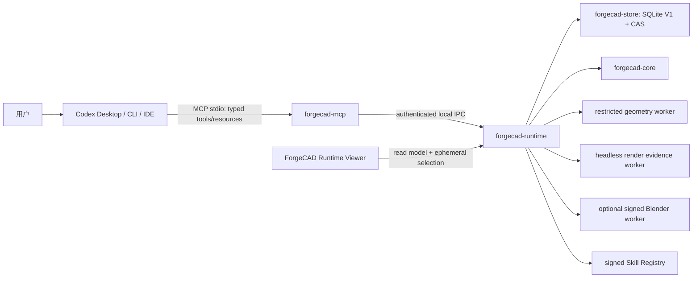
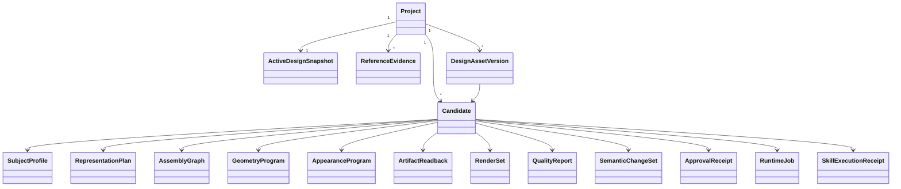
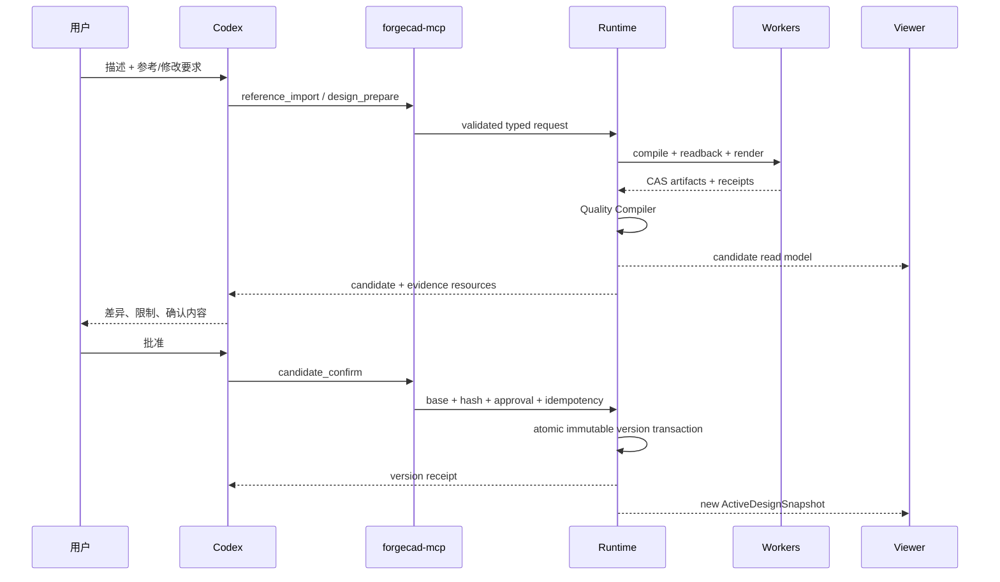

# ForgeCAD Codex-only MCP Runtime 设计

版本：2026-08-08
状态：目标架构；MCP001 已硬切，MCP002 已实现 Store/CAS/lease/IPC 基础层

## 1. 系统上下文

```mermaid
flowchart LR
  U["用户"] --> C["Codex Desktop / CLI / IDE"]
  C -->|"MCP stdio: typed tools/resources"| M["forgecad-mcp"]
  M -->|"authenticated local IPC"| R["forgecad-runtime"]
  V["ForgeCAD Runtime Viewer"] -->|"read model + ephemeral selection"| R
  R --> S["forgecad-store: SQLite V1 + CAS"]
  R --> K["forgecad-core"]
  R --> G["restricted geometry worker"]
  R --> E["headless render evidence worker"]
  R --> B["optional signed Blender worker"]
  R --> SK["signed Skill Registry"]
```

Codex 拥有对话、推理、图片理解和编排；ForgeCAD 拥有产品状态、确定性工具、工件和质量证据。两者通过公开 typed MCP 合同连接，不共享模型凭据或内部会话。

## 2. 模块与所有权

| 模块 | 唯一责任 | 明确禁止 |
|---|---|---|
| `forgecad-contracts` | JSON Schema 与生成类型 | 业务执行、兼容旧 Schema |
| `forgecad-core` | canonical IR、编译、readback、quality 纯逻辑 | DB、网络、模型、UI |
| `forgecad-store` | 新 Runtime V1 SQLite、CAS、事务 | 直接对 MCP/Viewer 开放写入 |
| `forgecad-runtime` | 单写者、Job、审批、版本、Skill 编排 | 模型调用、聊天、任意脚本 |
| `forgecad-mcp` | Codex stdio tool/resource 适配 | 数据库、第二状态、算法真值 |
| `geometry-worker` | 受限 typed 几何编译 | 网络、任意路径、FastAPI |
| `render-worker` | 固定 headless scene/AOV | 作为项目材质或版本真值 |
| `blender-worker` | 可选固定 bake/render recipe | 任意 Python/addon/.blend 真值 |
| Runtime Viewer | 查看、选择、隔离、临时爆炸 | 聊天、上传、Provider、永久编辑 |
| Skill Registry | Bundle 验证、启用、撤销 | 直接执行未注册代码 |

依赖方向：`Viewer/MCP → Runtime → Core/Store → Contracts`。Worker 依赖 Contracts 和经审查的算法子集。禁止 Store、Worker、Viewer、MCP 绕过 Runtime 写项目。

## 3. 领域模型

```mermaid
classDiagram
  Project "1" --> "1" ActiveDesignSnapshot
  Project "1" --> "*" ReferenceEvidence
  Project "1" --> "*" Candidate
  Project "1" --> "*" DesignAssetVersion
  Candidate --> SubjectProfile
  Candidate --> RepresentationPlan
  Candidate --> AssemblyGraph
  Candidate --> GeometryProgram
  Candidate --> AppearanceProgram
  Candidate --> ArtifactReadback
  Candidate --> RenderSet
  Candidate --> QualityReport
  Candidate --> SemanticChangeSet
  Candidate --> ApprovalReceipt
  DesignAssetVersion --> Candidate
  Candidate --> RuntimeJob
  Candidate --> SkillExecutionReceipt
```

`ActiveDesignSnapshot` 只引用当前 confirmed version、当前候选、选择投影和能力状态，不复制整份资产。`Candidate` 是可 GC 的未确认构建；`DesignAssetVersion` 是不可变提交。所有对象都有 project scope、schema version、canonical hash 和父 lineage。

## 4. 写事务

```mermaid
sequenceDiagram
  participant U as 用户
  participant C as Codex
  participant M as forgecad-mcp
  participant R as Runtime
  participant W as Workers
  participant V as Viewer

  U->>C: 描述 + 参考/修改要求
  C->>M: reference_import / design_prepare
  M->>R: validated typed request
  R->>W: compile + readback + render
  W-->>R: CAS artifacts + receipts
  R->>R: Quality Compiler
  R-->>V: candidate read model
  R-->>C: candidate + evidence resources
  C-->>U: 差异、限制、确认内容
  U->>C: 批准
  C->>M: candidate_confirm
  M->>R: base + hash + approval + idempotency
  R->>R: atomic immutable version transaction
  R-->>C: version receipt
  R-->>V: new ActiveDesignSnapshot
```

任何阶段失败都不得创建永久版本。Quality hard gate 失败时可继续生成诊断/修复候选，但 confirm 被拒绝。

## 5. 版本和并发

- 每个项目一个 Runtime lease 和数据库写者；
- prepare 绑定 `base_version_id` 和 snapshot revision；
- confirm 校验 base、candidate hash、quality report、approval receipt 和 idempotency；
- 并发候选可以存在，但只有基于当前头且审批有效者可确认；
- stale candidate 返回结构化冲突，Codex 可 rebase 为新的 typed change；
- restore 是以历史内容生成当前头的子候选，批准后创建新版本；
- 不支持任意 mesh 三方合并或隐式 last-write-wins。

## 6. Compiler 架构

`Design Compiler → Geometry Compiler → Appearance Compiler → Render Evidence Compiler → Quality Compiler → Delivery Compiler`。详细合同见 `COMPILER_PIPELINE.md`。

每层输入/输出可 canonicalize、hash 和缓存；缓存键包含合同、输入、Skill、Operator、worker、platform-relevant configuration。缓存命中不改变 lineage，也不能复用与候选不匹配的旧质量报告。

## 7. Skill 架构

Skill Registry 只接受符合 `SKILL_PACKAGE_STANDARD.md` 的 Bundle。Runtime 展开 Recipe DAG，解析产品内置 Operator，计算静态预算并生成 execution plan hash。Bundle 没有直接权限；有效权限是 `Runtime policy ∩ project grant ∩ Skill manifest ∩ Codex approved tool scope`。

资产和材质进入 CAS，逐项有 license/provenance。签名证明来源与完整性，不证明 Operator 安全、结果质量或许可证适用；这些分别由沙箱、Quality Compiler 和供应链 Gate 负责。

## 8. Viewer 设计

Viewer 从零建设，不复用旧 `cad-workbench`。它使用一个 WebGL context 显示同一 Runtime candidate/version，提供 assembly tree、reference/fixed-view compare、quality inspector、version/jobs 和临时 selection/explosion。Viewer 不存当前版本头，不用 localStorage 还原产品状态，不承担 headless evidence。

Runtime 关闭或不兼容时，Viewer 显示 fail-closed 诊断；没有旧 HTTP/FastAPI fallback。

## 9. MCP 与长任务

P0 MCP 是本地 stdio。预计超过 10 秒的调用在 2 秒内返回 `RuntimeJob`，由普通 MCP 工具读取事件/取消/恢复，避免依赖 Codex 单次工具调用超时或可选 MCP Tasks extension。大工件通过 resources/CAS link 读取。

参考附件只允许受限内联内容或 Codex 授权 attachment path。路径经过 canonicalization、root、symlink、MIME、尺寸、解压炸弹和 hash 检查，入 CAS 后不保存原绝对路径。

## 10. 安全模型

### 进程与文件

- MCP/Workers 不监听网络端口；
- Runtime 仅访问应用 Library、授权导入和受控临时目录；
- Worker 临时目录每 Job 隔离、无网络、资源受限；
- 项目路径和 Codex attachment path 不进入日志/数据库/导出；
- CSP、Tauri allowlist 和 custom protocol 只暴露必要 read resources。

### 内容和能力

项目只生成非功能性视觉资产。虚构游戏美术资产允许；项目不生成现实可制造武器、现实制造图、制造尺寸、材料配方、加工流程、功能机构或性能建议。其他类别也不输出安全、结构、适航、医疗或认证结论。

### 供应链

二进制、workers、Skills、资产和外部库均 pin、SBOM、NOTICE、签名和撤销。安装/更新在原子切换前备份数据库并验证合同兼容；任一组件签名或版本不匹配即拒绝启动写路径。

## 11. 故障模型

| 故障 | 行为 |
|---|---|
| MCP 崩溃 | Runtime/Job 继续；重连后按 ID 读取 |
| Viewer 崩溃 | 产品状态不变；重新投影 |
| Worker 超时/崩溃 | Job fail/cancel；无版本写入；临时目录隔离清理 |
| Runtime 崩溃 | SQLite 事务回滚；按 checkpoint 恢复或明确失败 |
| 磁盘满 | 写前配额；事务失败；已确认版本/CAS 不删除 |
| base 漂移 | `STALE_BASE_VERSION`，不自动覆盖 |
| Skill 撤销 | 禁止新执行；历史 receipt 可读 |
| renderer 不可用 | render/quality 能力 degraded；不得确认需要视觉门的候选 |

## 12. 性能与预算

所有 Recipe 在运行前静态估算 CPU、内存、三角、纹理像素、磁盘和时间；运行中监控并可取消。P0 先保证正确和可恢复，再设置基于真实 Benchmark 的 preview/quality profiles。文档不得先承诺未测 P50/P90。

## 13. 迁移

旧 UI、Provider、App Server、Agent、Schema 和数据库不在新架构中渐进兼容。`FGC-MCP001` 硬切代码，`MCP002` 建新 V1 Store/CAS/lease/IPC；旧 Library 只读归档，后续离线工具显式导出可迁移资产。详见 `RESET_MIGRATION_PLAN.md`。
