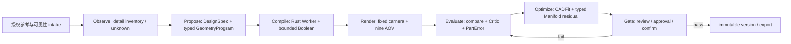

# img2threejs Pipeline 受控学习与 ForgeCAD 落地计划

2026-08-16 当前映射再收口一层：img2threejs 的 `image → spec → action → render/review` 现在先落到 `ReferenceCanvas@1 + DesignSpec@1 → consolidated AgenticSceneObserveResult@1`，再进入 typed action/CADFit；真实 Codex 编排层会把单张参考的 coverage unknowns 和 primary-form/detail locks 一起持久化，Runtime 重新生成 observation 后才允许后续 Rig/Repair 消费。源码/合同 Gate 已通过，但本轮 live boundary probe 未返回 typed authoring receipt，不能称为完整 Agent loop 或视觉质量 PASS；single-view 仍为 `BLOCKED_REFERENCE_COVERAGE`。

2026-08-15 当前映射新增一条可验证边界：img2threejs 的 staged `image → spec → action → render/review` 思路现在对应 ForgeCAD 的 `design_stage_run_prepare` action entry；entry 可带 typed `parameter_changes` 和 hash-bound `view_spec`，Runtime 负责物化受限参数补丁、编译、回读、渲染、评估和独立 review candidate。真实 receipt `docs/evidence/mcp010f/design-action-run-real-reference-stage-view-spec-20260815-b37.json` 已验证该传输链，但质量门仍阻断，不能称为完整 Agent loop、自动 Repair 或 likeness PASS。

版本：2026-08-15
状态：`reference-only / first-party reimplementation`；未安装 upstream Skill，未执行其脚本，未将 Three.js/TypeScript 作为 ForgeCAD 真值。

## 1. 结论

`img2threejs` 最值得吸收的是“分阶段、可恢复、每阶段有证据和视觉门”的 Agent 工作流，而不是它的 Python 脚本、Three.js factory 或某个生成结果。公开仓库把职责拆成：参考图技术 intake、对象分类与质量合同、detail inventory/spec、逐阶段生成、固定相机对照、局部反馈和最终优化；确定性脚本处理机械工作，Agent 只在需要视觉判断的 comparison sheet 上做决策。

ForgeCAD 的等价实现必须保持自己的边界：Codex 是外部大脑，MCP 是薄适配器，Runtime 是唯一永久状态写者，Rust Worker 是几何/渲染真值，Viewer 只读。上游的 Three.js factory 可以作为研究输出格式，但不能绕过 `GeometryProgram@2`、GLB strict readback、CAS lineage、quality gate 和用户确认。

## 2. 分阶段映射



| img2threejs 责任 | ForgeCAD 对应模块 | 当前状态 | 不能混淆的事实 |
|---|---|---|---|
| image validation、subject/complexity assessment | MCP005 reference admission、ReferenceCanvas/DesignSpec、Codex detail inventory | 部分实现 | 单张图的背面、隐藏结构和 360 覆盖仍是 `unknown`/`BLOCKED_REFERENCE_COVERAGE` |
| detail inventory、quality contract、component hierarchy | `ReferenceViewSpec@1`、`DesignSpec@1`、semantic Part/source map、Skill recipe | 有界合同和投影已存在 | 合同存在不代表图片语义理解或 likeness 通过 |
| blockout → structural → form | GeometryProgram@2、Operator Catalog、DesignActionRun、单 Part proposal | 已实现 bounded slice | 当前真实参考仍为 `QUALITY_TARGET_NOT_MET`，不是通用生成能力 |
| material → surface → lighting | AppearanceProgram@2、离线 AssetPack、UV/tangent、九 AOV renderer | source/结构 Gate 已通过 | PBR likeness、xatlas、Khronos Validator 和真人门仍未运行 |
| interaction / animation-ready hierarchy | semantic Part、stable IDs、Viewer selection/explosion 的只读投影 | 只读/有限 | 不把 Three.js hierarchy、pivot 或 arbitrary runtime code 写入 Runtime 真值 |
| render-vs-reference review | candidate-bound camera、RenderSet@2、comparison、typed review、Critic/PartError | 已有真实 transport，视觉门失败 | `strict_improvement` 只是优化提案门，不等于视觉相似度 PASS |
| local correction / optimization | CADFit `OptimizationJob`、多保真 checkpoint、Manifold residual | 已接入 proposal-only 闭环 | 不覆盖 baseline，不自动 Repair/Confirm，不宣称全局最优 |
| pass state / resume / stop | DesignSession、Checkpoint、ActionRun、stage batch、proposal continuation | 多个 bounded slice 已通过 | 完整跨阶段 orchestrator、Repair 应用、跨视图正向 promotion 仍未完成 |

## 3. 当前真实接入结论

- `design_action_run_prepare` 已能校验 session/candidate/stage/Part、外层 intent hash 和 nested camera/Rig hash，并创建 child `OptimizationJob`。
- v4 真实回执中，父级直接 Repair 探针被阻断；嵌套 CADFit child 完成 39 次 `32/4/3` 多保真评估，并通过显式 continuation 物化一个独立 review candidate。该 candidate 的视觉门仍为 `QUALITY_TARGET_NOT_MET`，`confirm_allowed=false`，`version_count=0`。
- 新增真实同 cohort Surface Signal 回执 `docs/evidence/mcp010f/optimization-job-real-reference-20260815-surface-signal-cohort-v4-camera-rebound.json`：MCP/Runtime/Geometry Worker/Render Worker 四者统一 cohort，Surface Signal hash 与 `OptimizationResidual@1.source_visual_surface_sha256` 一致，39 次 `32/4/3` CADFit/Manifold residual 通过 proposal-only transport；comparison 仍为 `QUALITY_TARGET_NOT_MET`，但 optimization camera 与 comparison camera 已通过 `CameraCalibrationRef@1` 绑定为同一 hash `3ed0c20…87859`。
- 本轮又完成真实同 cohort 的 bounded `chest-shell` contour correction：回执 `docs/evidence/mcp010f/part-correction-real-reference-20260815-v9-same-camera.json` 记录四组件统一 cohort、5 个候选、同一 `camera_fit_prepare` 相机 `35e938…7fdd` 和同一 reference/target binding。`part_contour_fit_prepare` 建议的 `chest-height +0.25` 候选使 silhouette IoU `0.523518 → 0.533249`、Boundary F1 `0.077158 → 0.079165`、critical-region min IoU `0.587601 → 0.614734`，`strict_improvement=true`；但每个候选仍为 `QUALITY_TARGET_NOT_MET`，没有 confirm/version/export，不能晋升为 likeness 或高质量结果。该 receipt 已加入 `current-quality-evidence-ledger.json` 并由 `check_mcp010f_current_quality_evidence.py` 校验。
- v10 同时对这 5 个 candidate 运行 automatic target 与 refined Part target 的两个 `silhouette_candidate_compare`：global winner 仍是 `chest-height +0.25`，但 Part-bound winner 是未修改 baseline，`part_strict_improvement=false`、`target_ranking_consistent=false`。该 divergence 被记录为 `BLOCKED_GLOBAL_PART_WINNER_DIVERGENCE`，因此当前只允许 global correction 作为诊断证据，禁止把它晋升成胸甲局部修正或自动 Repair；下一步先统一 target/ROI 语义，再进入多视图 promotion。
- v11e 已完成统一 objective 的 source/Runtime/MCP/真实 transport slice：`SilhouetteEvaluationObjective@1` 把 automatic global target、带 parent lineage 的 refined Part target、PartError canonical hash、Runtime-owned `CameraCalibrationRef@1` 和 global/Part promotion priorities 固定为同一 immutable objective；`silhouette_evaluation_objective_prepare` 与 `silhouette_objective_compare` 只读返回 objective/compare result。真实回执 `docs/evidence/mcp010f/part-correction-real-reference-20260815-v11e-unified-objective.json` 在 cohort `752e1ad39233543749308a6e7c2b10d37156aa0812a3d6eb9d97afcc2de60274` 下验证 5 个 candidate 共用 camera `35e938…7fdd`。global-only 与 Part-only improvement 冲突，compare 返回 `blocked_global_or_part_objective`、无 winner；`PASS_UNIFIED_GLOBAL_PART_OBJECTIVE` 是协议状态，不是 likeness/quality PASS，所有候选仍 `QUALITY_TARGET_NOT_MET`，无 confirm/version/export。v10 divergence 不删除，继续作为历史回归对照。
- Manifold 已是 product-owned、固定 revision、隔离 Geometry Worker 的真实 C ABI；当前 `boolean@1` 只开放同一 Part 的 bounded union/difference/intersection。MeshGL topology、source-run/face lineage、确定性、预算/超时、恶意输入和移除 fallback 已分别有 Gate，但这不等于任意 mesh Boolean 或视觉质量通过。
- 当前 CADFit/Boolean 账本位于 `docs/evidence/mcp010f/current-quality-evidence-ledger.json`，检查器为 `scripts/check_mcp010f_current_quality_evidence.py`。父 Repair、嵌套 CADFit proposal、历史 provisional observation 和无 cohort Boolean receipt 必须保持分离。

## 4. 下一项 Visual Surface 设计

2026-08-15 source slice 已落地：`VisualSurfaceRequest@1`/`VisualSurfaceResult@1`、`VisualSurfaceReadback@1`、`visual_surface_get`、Runtime canonical/lineage validation、MCP read-only dispatch 和负向 checker 已通过；机器回执为 `docs/evidence/mcp010f/visual-surface-readback-gate-20260815.json`。Runtime 现在会从同一 candidate 的 `RenderSet@2/pass_artifacts` 与 CAS 重新解码九个 512×512 AOV、参考/候选 mask、4px edge/SDF 和 Part-ID ROI，并从同一 candidate GLB 回读 bounded mesh-derived curvature/feature-line summary；`DesignCriticReport@1.visual_surface` 同时携带 readback canonical hash 与 `surface_signal_canonical_sha256`，`OptimizationResidual@1` 可带 `source_visual_surface_sha256`，并在进入 CADFit/Boolean 前重新验证 signal status、hash 与 lineage。新增分析回执为 `docs/evidence/mcp010f/visual-surface-analysis-gate-20260815.json`；它不宣称视觉质量通过。

同日新增 Visual Surface 几何源切片：`GeometryProgram@2` 的 `forgecad.geometry.surface-patch@1`、`forgecad.geometry.surface-shell@1` 与 `forgecad.geometry.subd-cage@1` 已接入 Schema、Runtime/Worker catalog 与产品自有 Geometry Worker。open patch 用 4×4 Bézier control cage 生成 128-triangle 开放曲面；shell 复用同一 cage，以显式 constant thickness 生成 320-triangle watertight shell；subd cage 用 3×3 typed rectangular quad cage 在 0/1/2 级分别生成 8/32/128 triangles，并支持控制点编辑后的确定性重编译；重复编译、strict GLB readback、UV/tangent 和负向参数 fixture 均通过。receipts 为 `docs/evidence/mcp010f/visual-surface-patch-gate-20260815.json`、`docs/evidence/mcp010f/visual-surface-shell-gate-20260815.json`、`docs/evidence/mcp010f/visual-surface-subd-cage-gate-20260815.json`。这仍只是受限 `SurfaceProgram` typed source operators，不等于 arbitrary-topology SubD、完整 watertight CAD surface、主曲率/zebra/曲面重建或视觉质量提升。

这里的 Visual Surface 不是 Viewer，也不是第二个质量真值。它是一个无模型、无网络、无任意脚本的 typed diagnostic path：把“参考图与同 candidate 渲染之间哪里不一致”与 candidate mesh 的表面信号变成可审计的局部证据。

当前合同保持最小并已固定为：

```text
VisualSurfaceRequest@1
  project_id / candidate_id
  requested_signals[] / expected_binding{}
  target_sha256 / max_part_errors / canonical_sha256

VisualSurfaceResult@1
  status: ready | blocked | not-run
  projection_status: projection/read-only
  target_sha256 (explicitly echoed in result and lineage)
  candidate/reference/artifact/RenderSet/camera/compare/quality lineage
  AOV/contour metrics、bounded Part errors、unknowns
  backend: candidate-bound-aov-diagnostics@1 | candidate-bound-surface-analysis@1
  surface_program_status: ready | not-run | unavailable
  canonical_sha256
```

当前 deterministic signals 包括 silhouette、boundary、depth、normal、part-id、material-id，以及基于同一 candidate GLB 的 `triangle-dihedral@1` curvature proxy 和 `boundary-and-crease-edge@1` feature-line summary。后两者不是 SubD/NURBS 主曲率或 zebra，不得自行决定 `quality_hard_gate_passed`，不得读取 prompt/path/URL/secret，不得产生 GeometryProgram，不得自动调用模型；Runtime 负责 candidate/reference/camera/hash revalidation，Viewer 只读展示结果。缺少已通过的 candidate artifact 或遇到 non-manifold mesh 时保持 `not-run/blocked`。

Visual Surface 的首个 Gate 已收口为“同一 candidate、同一 camera、同一 RenderSet、同一 reference byte”的单视图回读；其 surface signal 已进入同一 candidate-bound Critic/PartError/CADFit evidence，并由可选 residual source hash 做二次绑定。v4 已证明 Surface Signal/CADFit/Manifold chain，v9/v10 暴露了同相机单 Part correction 的 target 分歧，v11e 已把 global/Part target、PartError 和 promotion policy 固定到同一 objective，但真实 compare 仍因全局与局部改善冲突而阻断；下一步必须让 OptimizationJob 复用该 objective，再做一致性 promotion，之后才扩展多视图 Evidence Bundle、MaterialZone/PBR、跨视图 Repair 和独立真人门。

## 5. 固定实施顺序

1. 保持当前 evidence ledger、Manifold 隔离 adoption 和 ActionRun→CADFit proposal 边界；不得用新 receipt 覆盖历史 observation。
2. 新增 Visual Surface 的 Schema、canonical hash、预算和负向 fixture；先完成 Runtime/MCP/Worker source Gate，不接 Viewer 写入。
3. 在单一真实参考上完成同 candidate/same camera 的 mask、edge、ROI、AOV diff readback；视觉结果仍独立标记 `QUALITY_TARGET_NOT_MET` 或 `NOT_RUN`。
4. 已将 `CriticReport → PartError → VisualSurface evidence → CADFit proposal` 串为一个可恢复 ActionRun continuation；`surface_signal_canonical_sha256` 与可选 `source_visual_surface_sha256` 必须保持同一 candidate 绑定。proposal candidate 必须独立、可回放、不可覆盖 baseline。
5. 再扩展 Manifold residual family 的 operation/operand 组合和资源压测；仍维持 same-Part typed DAG，不开放任意 mesh。
6. 最后才做多视图 ReferenceCanvas、cross-view promotion、MaterialZone/PBR executor、human review、export/restart hash 和 360 Gate。

## 6. 采用与退出边界

- 不 clone、安装或执行 upstream `img2threejs` Skill；若未来需要文件级研究，必须先生成冻结 revision、许可证、SBOM、恶意输入、确定性、资源、平台和 removal receipt。
- 不把生成的 TypeScript、Three.js scene、截图或 Agent 自评当作 Geometry/Quality 真值。
- 不用单一 pixel score、材质数量、三角形数量或“GLB 可打开”替代 silhouette/form/region/human gate。
- 不让 Visual Surface、CADFit 或 Manifold 直接写 candidate/version；所有永久修改仍遵循 `prepare → compile/readback → render/evaluate → user approval → confirm`。
