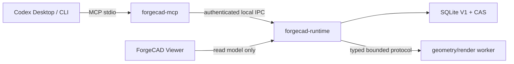

# ForgeCAD 单用户 MVP 交付计划

> **Weaponry P0 override (2026-08-29):** 本文只有在与 `docs/WEAPONRY_CROSSFIRE_PRODUCT_CONSTITUTION.md` 和 ADR-0029 一致时才具有当前执行权。ForgeCAD 在本文中解释为 Weaponry 的 Rust Runtime lineage；当前唯一产品主线是由 Codex 生成、修改、验证并交付高质量穿越火线非功能性游戏武器。通用 3D、机器人和原创科幻示例仅作 fixture/历史能力，不得抢占本月主线。 本文中所有 2026-08-28 及更早的“当前”“下一原子”“唯一 `in_progress`”和工具/Schema 数量语句均按历史 cohort 解释，不得覆盖 `WPN-*` successor queue。

## V1 delivery cohort

本月交付不是通用 MVP，而是两个同 cohort 样本：一个逐资产授权的穿越火线武器和一个
原创 control weapon。二者必须用同一 generic kernel、Modifier、High/Low/UV/Bake、PBR、
FPS camera、engine profile 和质量门。若授权样本只能靠专用 Rust 分支通过，而 control
无法重放，则 V1 失败。

开发构建、安装包生成、合作方体验、正式验收和发布继续分开记录。

> 2026-08-29 `FPS-FORM-04BE-U` 交付口径：0.01 偏移已实际进入 Runtime 评审 policy，wide 已成为下一修形基线。这一交付是“有界放宽后的候选选择”，不是 Hero Asset：FormArt 内容门、Formal High 正向回执、artist Hero UV、zero-fallback High→Low Bake、分层 PBR 视觉门和引擎/真人验收均未交付。

> 2026-08-29 交付口径：ForgeCAD 已证明可在同一 Runtime lineage 中生成 strict-GLB、六视图/九 AOV 的 layered aperture 候选并打开指定负空间；该能力仍是 `QUALITY_TARGET_NOT_MET`，不是商业 Hero Weapon。外观、正式拓扑、UV/Bake、FPS/引擎和真人美术验收继续由现有 Gate 阻断。

> 2026-08-28 `FPS-FORM-04BE-L` 已交付用户授权范围内的 `receiver-upper` typed 局部修改和确定性拒绝闭环：4 个候选结构有效，但没有一个通过目标孔与六视图门。这不是视觉资产晋级；父候选不变，下一切片只做遮挡诊断，正式 FormQualityV2、High/Low/UV/Bake、真人与引擎验收仍未开始。

> 2026-08-28 `FPS-FORM-04BE-J/K` 交付了可编译、可复现、可回读的 `side-panel-a` 真孔拓扑族和相机映射变体族，但没有交付视觉通过的武器：8 个真实候选均被六视图与目标孔门拒绝，父候选不变。下一交付切片只做遮挡归因，避免在不知道 depth winner 的情况下继续返工网格；正式 FormQualityV2、High/Low/UV/Bake、真人与引擎验收仍未开始。

> 2026-08-28 `FPS-FORM-04BE-I` 交付了可复现的“物化→六视图→拒绝→保留母版”试验闭环：4 个 `side-panel-a` 变体全部完成 strict GLB、54 AOV 和重启回读，也全部被真实质量门拒绝。这不是高质量武器交付：本阶段仅证明错误形变不会被误推广；FormQualityV2、secondary、High/Low/UV/Bake、真人与引擎验收仍未开始。

> 2026-08-28 `FPS-FORM-04BE-H` 交付了可重启验证的 typed repair planning seam：ForgeCAD 现在能把两个不同 aperture owner 拆成严格顺序、单 Part、有预算的灵敏度试验。它没有交付修复后网格，也没有启动 FormQualityV2、High/Low/UV/Bake、真人或引擎验收。当前交付面 **583 schemas / 130 read + 94 opt-in write = 224 tools**，商业质量仍未证明。

> 2026-08-28 `FPS-FORM-04BE-G` 交付真实 D1、可跨 Runtime restart、逻辑零写的 pixel-level visibility calibration：ForgeCAD 已确定左右 trigger aperture 的首要可见遮挡源不同，并证明旧 rear-stock repair 在两个目标孔内零响应。当前交付面 **581 schemas / 129 read + 94 opt-in write = 223 tools**。它只把下一步缩窄为双视图/多 Part typed repair plan，没有交付已修复 Form、FormQualityV2、secondary、High/Low/UV/Bake、真人或引擎验收；商业资产状态保持未证明。

> 2026-08-28 `FPS-FORM-04BE-E` 交付了一个真实可重启的 registered repair candidate 与完整六视图证据闭环，但证据明确拒绝晋级：54 AOV/Part-ID/readback 完整，negative-space、line-flow、strict owner-void 和 proposal FormArt-ready 未通过，fresh FormQualityV2 因前置门失败未创建。该增量证明 ForgeCAD 能执行、观察并拒绝一次错误修复；它没有交付 secondary Form、Formal High、Low/Cage、Hero UV、Bake、真人或引擎验收。公共面仍 **577 schemas / 127 read + 94 opt-in write = 221 tools**。

> 2026-08-28 `FPS-FORM-04BE-D` 交付增量仅为 read-only evidence-bound typed repair plan 与真实 D1 restart/zero-logical-write receipt。它缩短下一次 rear-stock 修复的决策输入，但没有交付已修复 Mesh、FormQualityV2、secondary Form、High/Low/UV/Bake、真人或引擎验收。当前 **577 schemas / 127 read + 94 opt-in write = 221 tools**，视觉仍 `QUALITY_TARGET_NOT_MET`。

> 2026-08-28 `FPS-FORM-04BE-C` 已把真实 final candidate 的同 cohort 54 AOV、CrossView、proposal FormArt 与不可变 receipt 固化为可重启读取的 composite evidence sidecar；这完成的是证据交付，不是美术质量交付。当前为 **575 schemas / 126 read + 94 opt-in write = 220 tools**，资产仍 `Stage=camera-calibrated / secondary=NOT_CREATED / QUALITY_TARGET_NOT_MET`，无 confirm/version/export。下一原子 `FPS-FORM-04BE-D` 仅生成绑定 exact evidence hashes 的 rear-stock owner-void/left-boundary typed repair plan；通过新的 proposal evidence 与 FormQualityV2 前不进入 High→Low→UV→Bake。

> 2026-08-27 `FPS-FORM-04AL` 当前增量：Runtime-owned durable fresh six-view baseline producer 已接通合同、Store、Runtime 与 MCP `prepare/get`；每个视图绑定 approved registration lineage / RigV2、fresh same-cohort 512×512 九 AOV、camera/mask/compare/quality 与完整 CAS reachability，并以单事务持久化。精确状态为 `PASS_SOURCE_COMPILE_DURABLE_PRODUCER_NOT_RUN_REAL_D1`；真实 D1、orientation approval、fresh baseline、notch、secondary、Stage/confirm/version/export 均未执行。当前公共面 **538 schemas / 118 read + 88 opt-in write = 206 tools**，视觉仍 `QUALITY_TARGET_NOT_MET`。

> 2026-08-27 `04AK` 现行 source：**533 schemas / 117 read + 87 write = 204 tools**。新增的是 lineage-bound fresh-baseline 只读 preflight；materializer、real D1 write、fresh FormArt、secondary 与商业视觉交付均未完成，orientation-specific 用户批准仍是 durable lineage 前置门。

> 2026-08-26 `04AF`：真实 D1 rear-stock proposal 已执行并因六视图回退被拒绝；`AuthoringMesh@2` 持久化局部编辑仅为 structural delivery slice。两者都不提升 MVP 的 visual/commercial Gate。后续交付顺序为 real-weapon Authoring→High→Low→UV→Bake→Material→FPS→Engine→Human，不得因某一 source module 可编译而跳阶段。

> 2026-08-26 source 历史快照：**527 schemas / 115 read + 87 write = 202 tools**。当前已由 04AK 更新为 533/117+87=204；真实 D1 的 AuthoringMesh `MoveVertices` 纵切不等于可交付商业 Hero Weapon，fresh FormArt owner evidence、High、editable Low/UV、真实 Cage/Bake/材质、FPS、Engine 与 Human 仍是独立门。

> 2026-08-26 商业交付定义：最终包为 canonical GLB + KTX2/fallback + LOD/collision/socket/animation/event sidecars + fixed Unreal/Unity profiles；必须经过 clean import、reimport、restart、packaged readback 和 target-hardware performance。Three.js/glTF Validator 通过不能替代 EngineValidation。详见 `FPS_HERO_WEAPON_PRODUCTION_RESEARCH_20260826.md`。

> 2026-08-26 `FPS-FORM-04AD` 权威增量：当前合同面为 **518 schemas / 111 read + 83 opt-in write = 194 tools**。新增 `ProductionWeaponSemanticLandmarkOrdering@1` 只表达 Runtime-derived 的 3D source/subject-axis 顺序，明确 `target_landmark_arrays_present=false / metrics=NOT_PRESENT`，不得冒充 2D landmark；`ProductionWeaponAuthoredViewOrientation@1` 将诊断变换与用户方向回执分开；`RegisteredCameraRigCalibration@2` 只有绑定 promotable authored rear3q receipt 才能物化。定向 Contracts/Runtime/MCP compile 与 518-schema checker PASS。真实 D1 尚无 orientation-specific user receipt，因此保持 `BLOCKED_AUTHORED_REAR_THREE_QUARTER_ORIENTATION`、Stage=`camera-calibrated`、secondary=`NOT_CREATED`、quality=`QUALITY_TARGET_NOT_MET`，不 confirm/version/export。旧 `@1` 保持历史真值；durable 落点采用 CameraLock 的 additive child lineage，不复制/自动升级整张旧记录。

> 2026-08-26 MVP/商业分界：MVP host、CAS、事务、回退和 bounded GLB 交付是商业生产的底座，不是商业资产本身。商业扩展的可交付单位已明确为 `HeroSourceAsset@1`、`FpsPresentationPackage@1` 和 `EngineDeliveryPackage@1`；只有同 hash 的 Unreal-first/Unity 回执与独立 Hero Art Review 能完成商业验收。

2026-08-26 交付同步：当前合同面为 518 schemas、工具面为 194。真实 durable D1 的 registered-camera rebuild/restart 和 exact hash-bound raster attribution 已执行，open-stock 唯一最高源为 `rear-stock/548px`，04AA 的 muzzle 误归因已修复；这只解锁一个 bounded rear-stock RepairIntent，不解锁正式 High/Low/Cage/Bake。V2 durable semantic camera lineage、rear-three-quarter authored orientation、secondary approval、Formal High positive、visual/human/engine/package仍未完成，所以仍不进入可交付 Hero Asset 验收。

> 2026-08-26 最新权威 source 口径：**518 schemas / 28 operator entries / 111 read + 83 opt-in write = 194 MCP tools**。Low quad draft与Hero UV durable链仍为 structural/source；FormArt raster attribution真实 D1=`PASS_UNIQUE_REAR_STOCK_SOURCE`，只解锁一个 rear-stock RepairIntent。以上均不推进 Stage、confirm、version或export；`FPS-HIGH-05=NOT_PASSED`、Stage=`camera-calibrated`、`secondary-form-approved=NOT_CREATED`、visual=`QUALITY_TARGET_NOT_MET`、`HQ360=BLOCKED_REFERENCE_COVERAGE`、proposal=`registered=false`；`FGC-MCP010F`仍是唯一`in_progress`。

> 2026-08-25 历史快照（已由上方 2026-08-26 权威口径取代）—交付口径：当前是 **499 schemas / 107 read + 79 opt-in write = 186 tools**；Native High 当前 cohort durable restart **1/1 PASS**，Low quad draft与 Hero UV是 Worker-only source producer，Viewer Art Director矩阵是只读 source surface。它们都尚未成为 packaged/candidate-quality 交付能力，不进入 active registry，不改变商业质量 Gate。

2026-08-25 商业资产分界补充：MVP functional core 的目标是可靠的 typed 运行、证据、版本和回退，不等于商业武器美术生产能力。商业 Hero Weapon 另需 `COMMERCIAL_GAME_WEAPON_QUALITY_PLAN.md` 定义的 Art Direction、AuthoringMesh、High/Low、Hero UV、Cage/Bake、Material Layer Graph、FPS presentation、LOD/collision/socket、commercial engine 和 independent human review。当前 2K render/Three.js consumer 只能保留为 source/transport evidence。

## 商业级 FPS 资产交付门（计划补充，不改变 MVP 已完成证据）

MVP 交付线只证明 typed functional core；商业 Hero Weapon 必须以同一 candidate/export hash 按顺序闭合下表。任何一门为 `NOT_PROVEN`、`NOT_RUN` 或 `BLOCKED`，都不能写 `HERO_ASSET_APPROVED`，也不能用后续材质、VFX、截图或工具数量补偿。

| 交付阶段 | 真实退出条件 | 当前状态 |
|---|---|---|
| Art Direction / design language | `WeaponArtBrief`、style pillars、识别标记、material hierarchy、平台预算与授权/IP边界 | target/missing；独立 Art Direction `NOT_RUN` |
| Silhouette / primary / negative space | 五个核心视图、CameraLock、比例、landmark、闭合负空间、六视图不回退 | Stage=`camera-calibrated`，CrossView=`QUALITY_TARGET_NOT_MET`，`secondary-form-approved=NOT_CREATED`，depth=`UNKNOWN` |
| Secondary / tertiary / bevel | 二三级曲面和 panel/vent/groove/seam 密度符合设计语言，倒角高光连续，stable Part/source lineage | 现有 Operator/GLB 仅 source structural；商业视觉 `NOT_PROVEN`，不得 triangle padding |
| Authoring topology / edge flow | original/evaluated 分离、可编辑 quad/loop/ring/crease、稳定 ID、High↔Low 对应与局部历史 | split/collapse/dissolve `3/3 PASS` 仍只覆盖结构；general correspondence/evaluated retarget/editor `NOT_PROVEN` |
| High → Low/Retopo → Hero UV → Cage/Bake | Native High/DetailGraph、artist-authored Low、Hero UV density/seam/padding、对应 cage、无 miss/fallback/cross-part 的 8-map bake | Native High/Low/Hero UV 仍 structural/source。Cage/Bake fixed Worker、七记录 Store/MCP seam 与 replay 已 source PASS；Runtime-owned producer 未闭合，new prepare 零写失败，当前 D1 无正向 receipt。旧 bake 指标仅失败诊断 |
| Material Layer / PBR | Layer/Mask/Generator/Wear/Microdetail、roughness hierarchy、通道色彩空间/provenance、多视图材质一致 | 当前 embedded PBR/2K 和 Three.js 仅结构/consumer evidence；fixed-formula preview，commercial PBR `NOT_PROVEN` |
| FPS / world model | first-person hip/ADS/inspect/equip/reload/recoil、third-person/ground model、socket/attachment/readability | `NOT_RUN`；没有第一人称与世界模型共同验收 |
| Engine / performance / delivery | commercial engine importer/material/shader、LOD/collision/socket、draw-call/triangle/texture/memory/frame-time/streaming budget | commercial engine/performance `NOT_RUN`；Three.js readback 不是引擎验收 |
| Independent Art Director / export-restart | 独立真人盲审与修订批准；同 export hash confirm/version/export/restart readback | human=`NOT_RUN`，无 `PASS_HUMAN_ART_REVIEW`；export/restart=`NOT_RUN`，总体 `QUALITY_TARGET_NOT_MET` |

### 商业级 11 组交付验收（权威退出门）

上表保留为 MVP 到商业资产的工程摘要；Hero Weapon 交付必须按同一 `candidate_hash → export_hash` 拆分并顺序闭合：

`Art Direction/ReferenceViewSet → AuthoringMesh → High → Low → UV → Cage/Bake → Material → LOD → Viewer/animation/VFX/audio validation → Engine → independent Hero Art Review`

这 11 组用于商业交付验收与工程拆分；Runtime 的唯一 Stage 晋级顺序仍是 19 个 `ProductionStage@3` 值，其中 `hero-art-review-approved` 先于 `engine-validated`。任何 prepare/transition 都必须遵循 19 状态，不得由交付分组排列推断可跳跃的 Stage 边。

1. `Art Direction / ReferenceViewSet`：`WeaponArtBrief@1`、五个核心视图、CameraLock、silhouette/negative-space/landmark 与授权/预算；当前 `camera-calibrated`，CrossView=`QUALITY_TARGET_NOT_MET`、`secondary-form-approved=NOT_CREATED`、`HQ360=BLOCKED_REFERENCE_COVERAGE`。
2. `AuthoringMesh`：original/evaluated、稳定 V/E/H/C/F/loop/ring/boundary、可编辑局部历史与 High↔Low correspondence；split/collapse/dissolve **3/3 PASS** 仍只为结构，商业 editor/correspondence `NOT_PROVEN`。
3. `High`：非破坏 DetailGraph/High artifact、support/crease/weighted normal/Subdivision、严格 GLB 回读；当前 source-only，`FPS-HIGH-05=NOT_PASSED`、proposal=`registered=false`。
4. `Low`：artist-authored quad、hard-edge/seam/Part 边界、High↔Low correspondence 与 bake-ready；当前 `DRAFT_UNREVIEWED / structural_only / promotion_eligible=false`，durable replay/drop/reopen/get **1/1 PASS** 不等于商业 PASS。
5. `UV`：2K/4K density、seam/stretch/overlap/OOB/padding、UV0/UV1、tangent/Mikk；7 contracts/public get/prepare 的 **1/1 PASS** 与 4 CAS roots linked/GC 仍 structural/source，artist/package/engine `NOT_RUN/NOT_PROVEN`。
6. `Cage/Bake`：对应 Cage、per-Part rays、miss/fallback/cross-part/skew/penetration/dilation 与 8 类 maps；Worker/public persistence seam source PASS 只解锁结构面，Formal High 完整 positive restart/public surface 与 current-D1 receipt 缺失，正式门=`NOT_PASSED`。
7. `Material`：`MaterialLayerGraph@1` 与 Layer/Mask/Generator/Decal/Wear/Microdetail、粗糙度/色彩/provenance；当前仅 **4 MaterialZones / 6 formula textures**，fixed-formula preview，commercial PBR=`NOT_PROVEN`。
8. `LOD`：authored LOD0/1/2、collision/socket、误差与平台预算同 hash；商业 LOD/collision/socket/performance `NOT_RUN`。
9. `Viewer/animation/VFX/audio validation`：同 candidate read model、first/third-person fixed cameras、动画/VFX/audio/readability/accessibility；Three.js 仅结构消费，animation/VFX/audio/VoiceOver/human viewing `NOT_RUN`。
10. `Engine`：Unreal 或 Unity importer/material/tangent/LOD/collision/socket/animation round-trip 与预算；**Unreal/Unity 均未运行**，Three.js 不能替代引擎验收。
11. `Independent Hero Art Review`：独立资深艺术家盲审/修订闭合，同 `export_hash` confirm/version/export/restart；human=`NOT_RUN`，无 `PASS_HUMAN_ART_REVIEW`。

任一前门为 `NOT_PROVEN`、`NOT_RUN`、`BLOCKED` 或 `NOT_PASSED`，后门只能诊断，不能 `HERO_ASSET_APPROVED`、confirm、version 或 export。当前 source 仍为 **515 schemas / 28 operator entries / 111 read + 83 opt-in write = 194 MCP tools**；工具数量、Three.js readback 和旧 bake 数值都不能替代上述退出门。

Native High 的交付口径保持 **source-only structural/durable slice**：Worker/GLB/Runtime CAS/Store/restart 与公共 MCP source-focused 证据通过；`packages/forgecad-skills/proposals/native-high/0.1.0` 继续 `registered=false`，不进入 active registry。packaged same-cohort、candidate visual/human/engine/distribution 仍 pending/`NOT_RUN`，因此 High 不 active、不 PASS，也不解锁后续交付门。

2026-08-24 FPS form evidence gate：真实参考已完成 CameraLock、`camera-calibrated` Stage、六视图/54 AOV FormEvidence、reviewed-structure FormArt、同 candidate CrossView 与 durable structural-only legacy FormQuality replay/restart。CrossView 六视图均 `QUALITY_TARGET_NOT_MET`；真实混合 program 可解析 5 个 typed sinks、保留 7 个 unavailable。FormQuality@2 preflight 零写且重启等价，五项 parent/binding ready，仅 CrossView hard gate 与 FormArt target observation blocked，无 blockout/primary/secondary head。Low/Cage source bundle已有 durable证据，但 formal High/Low/Cage、Hero UV、Bake、人审、引擎和 export仍 `NOT_RUN`。

2026-08-22 `CandidateAnimationVfxQuality@2` source/structural gate：Contracts **402**；Store focused **3/3**、Store full **112/112**；Runtime focused **6/6**、同源码同 cohort Runtime full **354 passed / 0 failed / 22 ignored**（376 total，115.40s）；MCP focused **4/4**、full **152 passed / 0 failed / 0 ignored**（2.49s）；contracts/runtime/store/MCP joint cargo check **PASS**。旧 `GEOMETRY_WORKER_PROTOCOL` 报告来自 stale Worker binary，已由同源码 Geometry/Render Worker 重建后清除。尚无真实 `Attachment@3 + Quality@2` public full-chain positive fixture，durable end-to-end=`NOT_RUN`/`BLOCKED_FIXTURE_CHAIN`；当前仅 `structural_only`，visual/artistic/commercial FPS=`NOT_PROVEN`，human/engine=`NOT_RUN`，不推进 stage/confirm/version/export。证据：`docs/evidence/mcp010f/candidate-animation-vfx-quality-v2-durable-source-gate-20260822.json`。

2026-08-22 `CandidateMaterialSurfaceQuality@1` public positive fixture：`Geometry → CandidateTopologyQuality@1 → AppearanceProgram@3 → TextureBuild@2 → SurfaceBake@1 → AppearanceSourceLineage@1 → CandidateMaterialSurfaceQuality@1` 的 `prepare → same-key replay → get → Runtime drop/reopen → restart get` 通过 **1/1（111.72s）**；Runtime focused **5/5**、Store full **74/74**、Contracts **350**。CAS inventory unchanged；stable `artifact_id` 与 GLB object SHA-256、MaterialPack CAS kind 精确区分，合法 UV/tangent rebuild 不计入 geometry-preservation 漂移。该结果仅为 `structural_only`；V2 animated-socket-particles 仍无完整 public `prepare → Store → restart get`，durable end-to-end=`NOT_RUN`/`BLOCKED_FIXTURE_CHAIN`；visual/commercial=`NOT_PROVEN`，human/engine=`NOT_RUN`，stage/confirm/version/export=false。证据：`docs/evidence/mcp010f/candidate-material-surface-quality-public-positive-source-gate-20260822.json`。

最终同 cohort 修订口径：强制 build cohort `724278fe8f6777c8b3d07bc5058208aee90aa5c700db5f9284d6297126fa79f6` 下 material focused **5/5（112.63s）**；Runtime full **310 passed / 0 failed / 20 ignored**（330 total，201.91s），且 public material fixture 明确在该 full run 内执行。此前 **111.72s** 仅为 public fixture 单测时长；两者都只支持 `structural_only`，不提升 visual/commercial、human/engine 或 stage/confirm/version/export 状态。

数值口径：当前 source 为 **518 schemas / 28 operator catalog entries / 111 read + 83 opt-in write = 194 tools**；AuthoringMesh split/collapse/dissolve独立 full-chain 3/3，candidate-bound Low provenance 的 prepare replay/drop-reopen/get **1/1 PASS**，Hero UV public get/prepare 已接 Store/Runtime/MCP。它们仍仅 structural/source；artist UV review、packaged same-cohort、visual/human/engine/commercial 仍`NOT_RUN/NOT_PROVEN`，不推进 Stage/confirm/version/export。

2026-08-22 `FictionalEnergyVfxAnimatedSocketParticlesSequence@2` 双候选 source slice：Contracts **350**；Store V2 focused **2/2**、Store full **74/74**；Runtime V2 仅低层 focused **6/6**、cargo check **PASS**；MCP V2 **3/3**；同 cohort `724278fe8f6777c8b3d07bc5058208aee90aa5c700db5f9284d6297126fa79f6` Runtime full **309 passed / 0 failed / 20 ignored**（191.06s）、MCP full **128 passed / 0 failed / 0 ignored**（1.93s），这些是全量回归，不是 V2 public `prepare → Store → restart get` 正向 fixture。V1/V2 隔离；V2 仅证明 1..16 frame、geometry/appearance 双 candidate/delivery/AnchorSet bridge 以及 Store FK/reachability/idempotence/conflict/rollback 的结构面。完整双候选 public Runtime `prepare → Store → restart get` 正向 fixture 尚不存在，durable end-to-end=`NOT_RUN` / `BLOCKED_FIXTURE_CHAIN`，不能声称正向 durable。该 slice 为 `structural_only`；visual/commercial=`NOT_PROVEN`，human/engine=`NOT_RUN`，stage/confirm/version/export=false。证据：`docs/evidence/mcp010f/fictional-energy-vfx-animated-socket-particles-v2-dual-candidate-source-gate-20260822.json`。

2026-08-20 当前 source slice 新增 active `bevel@2`：它对 direct `authoring-mesh@1` 的单 stable edge 提供 closed convex valence-3 P0 倒角语法；不进入 Modifier/Agentic/Repair。此前 `energy-core@1` slice 提供 guard/mechanical ring、emitter core 和 backplate 四种有界闭合 Part 语法及 Geometry/Agentic/Modifier/Profile/Skill 入口。两者都只推进建模语法，不推进当前候选重建、视觉/PBR、人评、引擎导入、package/live 或 HQ360。

2026-08-19 当前 source slice 新增显式 `authoring_mesh_edit_prepare`：Runtime 对 preview/current head 做 exact 重验并只产生 approval-gated reviewable candidate，Store 原子保存 V2 evidence/Job/audit/idempotency；无 confirm/version/export。它推进 bounded authoring edit 的持久候选 staging，不推进 package/live、visual/PBR/human/HQ360。

2026-08-19 当前 source slice 新增默认只读 `render_evidence_replay_get`：对 exact integrity-bound GLB 重做 strict readback，由实际 fixed Render Worker 同 cohort 连续生成两轮九 AOV，并将 persisted/first/repeat 的原始 PNG bytes 与 decoded RGBA8 pixels 全部比对。结果不含图像字节，不写 CAS/SQLite/candidate/version，仅证明当前 source cohort 的 structural repeat-byte exactness。

2026-08-19 当前 source slice 新增默认只读 `mechanical_pose_geometry_preview`：它以 exact candidate cohort 和 caller-authored rigid rest/action 为输入，为纯 Part outputs 派生 pose delta GeometryProgram，经 fixed Worker compile/strict readback 返回 transient hash metadata，且不写 CAS/SQLite/candidate/version。source/focused PASS 不等于 package/live/Viewer/visual/human 或 Blender Armature/animation parity。

2026-08-19 当前 source slice 新增显式 `subdivision_artifact_lineage_prepare` 与只读 `subdivision_artifact_lineage_sidecar_get`：前者在 exact replay 验证后由 Runtime 写 immutable CAS sidecar/SQLite link，后者重启读回且不 backfill。幂等、CAS 篡改、跨 candidate、请求漂移与 1 MiB hard bound focused Gate PASS；仍不提供跨版本元素 ID 或视觉/发布 PASS。

2026-08-19 当前 source slice 新增 `subdivision_artifact_lineage_get`：它从 durable candidate evidence 重建完整 root lineage，以 strict readback + fixed-Worker full-GLB byte replay 证明 exact artifact binding，再暴露 source-primitive-local triangle ranges；getter 不写 SQLite/CAS/candidate/version。它不是持久 sidecar，也不提供 glTF vertex/edge/corner ID、跨版本稳定性或任何视觉 PASS。

2026-08-19 当前 source slice 新增 `subdivision_topology_lineage_preview`：fixed Worker 产生、Runtime 独立重验 control root → 最终 evaluated quad topology 的 bounded lineage；最大 16×16 level2 为 22,802 elements，完整 response 受 1 MiB 硬门约束。该只读投影不写 candidate/version/CAS，也未绑定 artifact/readback/GLB；corner/per-level child path/influence weight、package/live/视觉/人评/PBR/export/360 仍未完成。

2026-08-19 当前 source slice 新增 bounded crease-aware Subdivision：`subd-cage@2` 已进入 fixed Worker、Runtime prepare、MCP authoring、Agentic operator cohort 与 first-party Skill，并通过 strict GLB readback；只读 projection 与真实 prepare/write boundary 分开。它不改变 MCP010F 唯一 `in_progress`、不完成 package/live/视觉、人评/PBR/export/360，也不恢复 Python/Blender 插件路径。

2026-08-19 historical Boolean Operand Lineage source slice 当时为 164 schemas、19/19 active operators、45 read + 33 opt-in write = 78 tools。新增 `boolean_operand_lineage_preview` 仅返回 fixed Worker 的 bounded operand/evaluated-face runs；Runtime 从请求 program 独立重算 operation/operands/source lineage，不创建 candidate/version/CAS，不新增依赖或分发 Skill；它不是原始 authoring-face lineage、GLB 持久谱系或视觉质量证明。receipt：`docs/evidence/mcp010f/blender-boolean-operand-lineage-source-gate-20260819.json`。

2026-08-19 historical Render Evidence Integrity source slice 当时为 162 schemas、19/19 active operators、44 read + 33 opt-in write = 77 tools。新增 `render_evidence_integrity_get` 只读深度回读 exact current-cohort Render evidence；无新 Skill/operator/Worker/dependency、无持久写入。该 source/focused PASS 不能替代 package/live、visual/human、PBR likeness、export/restart 或 HQ360 Gate。

2026-08-19 historical Mechanical Pose Sequence Preview source slice 当时为 160 schemas、19/19 active operators、43 read + 33 opt-in write = 76 tools。Mechanical Pose Sequence Preview 通过现有只读 `mechanical_pose_evaluate` 返回最多 16 个严格有序 tick 的 structural samples，未新增 Skill、operator、tool、Worker 或依赖；该 source/focused PASS 不是 package/live/Viewer/visual/human PASS。receipt：`docs/evidence/mcp010f/blender-mechanical-pose-sequence-preview-source-gate-20260819.json`。

2026-08-18 historical Parametric Group v2 source slice 当时为 158 schemas；它通过现有只读 `geometry_program_hash` 提供三个 closed first-party group template，未新增插件执行、Skill、operator、tool 或依赖。receipt：`docs/evidence/mcp010f/blender-parametric-group-v2-source-gate-20260818.json`。

2026-08-18 historical Stage 0 当时为 160 Schema、43 read + 33 opt-in write = 76 tools。`mechanical_pose_evaluate`、`topology_snapshot_get` 与 Subdivision evaluation v2 保持只读 structural projection；`RenderProfile@1` 让 Render Worker 与 Runtime `RenderSet@2` 绑定固定 AOV/color-data lineage。它们都不写 candidate/version，也不改变质量门。此前 139/144/146/149/151/152 与 41/42-read、74/75-tool 行均为其日期的历史快照。

2026-08-17 Reference Visual Structure 增量后的历史快照为 139 Schema；该历史阶段随后为 144 Schema、41 read + 33 opt-in write = 74 tools；新增合同只扩展参考证据，不改变 candidate/version/confirm 边界。

版本：2026-08-13
状态：权威执行合同；MCP005–MCP009 单用户 MVP host golden path 已完成；FGC-MCP010A done
2026-08-17 历史 Stage 0 覆盖为 138 Schema；该阶段随后为 144 Schema、41 read + 33 opt-in write = 74 tools；新增 `repair_intent_run_prepare` 的 CAS-bound bounded run source slice已通过，但只产 staged candidate，`repair_apply_prepare`/confirm 仍未完成。
当前起点：`FGC-MCP005`–`FGC-MCP009` focused Gate 和真实 Codex CLI 十二调用 reference→CAS GLB receipt 已通过；MCP010B structural source Gate 已通过但 Darwin 512 MiB OS 总内存硬门仍未运行；MCP010C source Gate 已实现固定 renderer、九 AOV、reference comparison、MCP image block 和 typed/human review，真实 Codex CLI C 已完成六 turn/32-call transport，轮廓优先 attempt28 又完成 source-built 12-turn transport，但 likeness target 仍未通过（IoU 0.6623、boundary F1 0.2418）；MCP010D/E source Gate 已实现真实硬表面 Operator、离线 AssetPack、512px UV atlas、fixed mikktspace、embedded PBR 和九 AOV raw path；MCP010F source Gate 已实现只读 Viewer 的 AOV/对比/Part/MaterialZone/explosion/heatmap surface，并加入 hash-bound contour target、兼容 camera fit、Rig/SDF、Part proposal 和 candidate compare。真人视觉门、Viewer/package/live C/D/E/F、xatlas/Validator、真实 PBR likeness 和 360 仍为 `目标设计/NOT_RUN/BLOCKED`

Stage 0 当前交付口径：515 Schema、28 operator entries、111 read + 83 opt-in write = 194 tools，唯一 `in_progress` 为 `FGC-MCP010F`；机器证据入口为 `docs/evidence/mcp010f/commercial-weapon-hero-uv-durable-restart-source-gate-20260826.json`。Agentic observe/plan/critic/evidence projection 与 durable session/checkpoint/RepairIntent 仍按各自证据记录；Hero UV public get/prepare、candidate-bound Low provenance 与 prepare replay/drop-reopen/get **1/1 PASS** 仅为 structural/source，不替代 artist UV review、packaged same-cohort、visual/human/engine/commercial Gate。当前 Stage=`camera-calibrated`、`secondary-form-approved=NOT_CREATED`、`FPS-HIGH-05=NOT_PASSED`、`QUALITY_TARGET_NOT_MET`、`HQ360=BLOCKED_REFERENCE_COVERAGE`、proposal=`registered=false`，无 confirm/version/export。


<!-- forgecad-reference-source: input=ENV_AUTHORIZED_PNG original_sha256=1964704a62ed7a841b4d49c370b8d46f4626e201daad29092a9c39a40b4c4109 intake=PASS_SOURCE_SIX_REFERENCE_EVIDENCE_CAS views=6 worker=PASS_SAME_COHORT_SIX_FIXED_VIEWS target=USER_REFINED_USER_CONFIRMED_REVIEWED_STRUCTURE user_confirmed_crop=PASS_USER_CONFIRMED_SEVEN_CROPS contour=PASS_USER_CONFIRMED_SIX_IDENTITY_CONTOURS negative_space=BOUNDING_REGIONS_CONFIRMED_EXACT_SUBTRACT_UNKNOWN line_flow=EXPECTED_ROWS_DURABLE_MATCH_NOT_PROVEN camera_lock_fixture=PASS_REAL_DURABLE_REPLAY_RESTART form_art_fixture=PASS_REAL_DURABLE_NOT_PROVEN form_quality_v2_fixture=BLOCKED_ZERO_WRITE_MISSING_LEGACY_CROSS_VIEW secondary_form_approved=NOT_CREATED fixture=PASS_REAL_1_OF_1_108.07S -->

当前高质量 authoring/readback 路径使用 `GeometryProgram@2` 与 `ArtifactReadback@2`；下文 `GeometryProgram@1` 只保留为 `[transition-v1]` 的 MCP007 历史 MVP 证据，不能作为 MCP010F 当前执行入口。

ADR-0026 与本轮架构重规划补充：后续高质量交付必须先建立清晰模块边界和废弃隔离，再把 projection 和 durable prepare/readback 推进为有完整 producer conformance 的 ReferenceCanvas、DesignSpec、SemanticSceneGraph、DesignSession、Visual Evidence 和 Critic/Repair loop。当前 Runtime 的嵌套只读 projection conformance 已通过独立 checker，但该结果不扩展到 durable/reference/DesignSpec producer；该目标不改变当前 MVP done 状态，durable slice 仍不等于单动作 orchestrator 或 Repair producer。

## 1. MVP 要交付什么

ForgeCAD MVP 是一个由 Codex Desktop/CLI 控制的本地 3D 工作台，不是多用户平台、后台 Agent 服务或第三方插件市场。MVP 只承诺完成一条真实、可演示、可回退的硬表面视觉资产链路：

```text
用户在 Codex 上传一张已授权参考图
  → forgecad-mcp 导入真实图片字节
  → Runtime 写入 CAS 和 ReferenceEvidence
  → Codex 根据图片生成 typed SubjectProfile / GeometryProgram
  → Runtime/Worker 编译真实 mesh、GLB、材质和固定视图
  → Viewer 显示同一 candidate hash
  → Codex 通过 `change_prepare` 做一次稳定 Part ID 局部修改
  → 用户在 Codex 拒绝一次、批准一次
  → Runtime 创建不可变版本
  → restore 创建新版本
  → `export_prepare(format=glb, profile=mvp-glb)` / `export_confirm` 返回同一版本的 CAS GLB hash 和 manifest receipt
```

首个设计基准是用户提供的白色硬表面人形机器人参考。原图片不得复制进 Git、Markdown 或日志；开始 `MCP005` 时经授权 attachment root 导入 CAS，文档和 evidence 只记录 opaque reference ID、SHA-256、MIME、尺寸和授权声明。

MVP 不宣称：任意类别的一键高质量重建、多视图摄影测量、可制造 CAD、骨骼动画、后台 Job 永久在线、多客户端协同、插件市场、远程模型 Provider、签名公证后的公开发行。

## 2. 极简运行架构



- `forgecad-mcp` 负责协议、工具清单、启动或连接 Runtime；initialize 不等待 Runtime。
- `forgecad-runtime` 是唯一状态写者，通过 OS 文件锁保证单实例。MVP 无 TTL lease、heartbeat、broker 或复杂服务治理。
- Worker 只执行产品预注册、带预算的 typed Operator；不接受 Python、JavaScript、shell、URL 或任意文件路径。
- Viewer 是可选只读界面。关闭 Viewer 不损坏已确认数据；MVP 不保证 Codex/MCP 退出后未完成 Job 继续。
- 测试、签名、SBOM、evidence 是交付流程，不是额外常驻运行组件。

模块清晰度要求见 `ARCHITECTURE_MODULE_BOUNDARY.md`：每个模块必须说明唯一写者、Schema、持久化边界、网络/脚本/路径权限、Gate 和 evidence。废弃文档、代码与模块的处理见 `DEPRECATED_ISOLATION_PLAN.md`；active 目录不得混入 superseded 模块。

## 3. MVP 与正式发布分界

| 范围 | MVP 必须 | 正式发布再做 |
|---|---|---|
| 宿主 | 开发构建上的真实 Codex CLI；可行时补 Desktop | 签名安装包上的 Desktop + CLI 全量 E2E |
| 参考 | 单张 PNG/JPEG 真实字节入 CAS | 多图、更多格式、IDE 附件 |
| 建模 | 硬表面机器人 vertical slice、typed 可编辑部件 | 跨类别通用表示、角色/有机/场景 |
| Skill | first-party 声明式核心包、开发 trust root | 第三方安装、撤销服务、透明日志、市场 |
| 材质 | glTF metallic-roughness、有限材质区 | MaterialX 全量、UDIM、资产市场 |
| 渲染 | 一个确定性 renderer、固定相机和最小 AOV | 跨 GPU renderer parity、生产离线渲染 |
| Job | 同一会话内排队、取消、明确失败 | checkpoint 续跑、复杂并发与 watchdog |
| 分发 | 本地可构建、可运行、无 secret/绝对路径 | Developer ID、notarization、升级/回滚 |
| 质量声明 | “单用户 MVP 功能核心可供开发评估” | “首个硬表面参考基准通过”需真实 Codex + 真人门；绝不宣称通用高质量 |

签名、公证和 packaged Desktop 不再阻塞 3D vertical slice；它们仍是任何外部分发或“正式可安装”声明的硬门。

## 4. 固定任务链

同一时刻只允许一个任务 `in_progress`。Luna 不能跨任务提前打开后续能力。

### FGC-MCP005：真实参考图导入（已完成）

目标：把 Codex 提供的真实附件字节安全写入 CAS，形成可回读的 `ReferenceEvidence@1`。

Owned paths：reference/attachment Schema、`forgecad-mcp` 工具适配、Runtime import service、CAS image admission、Codex CLI/Desktop probes、MCP005 evidence 与相关文档。

实现：

1. 新增 `reference_import`，来源只允许 `inline_content` 或启动时授权的 `codex_local_file`；
2. 使用 Rust 图片解码器，P0 只启用 PNG/JPEG；设置总字节、像素、宽高、帧数和解码内存上限；
3. canonicalize 后拒绝目录、设备文件、symlink、越过授权 root 和 MIME/魔数不一致；
4. 原始字节写 CAS，生成规范化预览可作为派生对象；持久状态丢弃本机绝对路径；
5. `reference_get` 返回 ID/hash/MIME/尺寸/授权/派生对象，不返回原路径；
6. capabilities 明确报告当前宿主附件模式和限制。

退出 Gate（当前 evidence）：

- PNG/JPEG success；错误 MIME、截断文件、超限尺寸、解压炸弹、symlink、目录、设备文件、越权路径、hash mismatch 全部 fail closed；
- 日志、DB、MCP response、evidence 不含用户名和绝对路径；
- 真实 Codex CLI 将首个机器人参考的原始字节送入 CAS，并与源字节 SHA-256 一致；
- Desktop 若宿主不能把附件路径/字节提供给 MCP，诚实记录 `REFERENCE_TRANSFER_UNAVAILABLE`，不伪造 PASS；
- `release:mcp004` 回归和新的 MCP005 focused Gate 通过。

当前证据：`docs/evidence/mcp005/manifest.json`、`docs/evidence/mcp005/codex-cli-reference-e2e.json`。Codex CLI 的用户授权 PNG 已完成 `project_create → reference_import → reference_get`，源字节和 CAS hash 相同；Desktop attachment bridge 为 `NOT_RUN / unavailable`。MCP005 不包含视觉理解、Geometry、Appearance、Render、Quality 或 GLB。

### FGC-MCP006：MVP typed 建模合同与 first-party Skills（已完成）

目标：让 Codex 能把视觉判断转为受限、可验证的建模程序，不在 ForgeCAD 内再放一个模型。

MVP 核心对象：

- `SubjectProfile@1`：类别、构图、比例、可见/遮挡区、材质线索、不确定项；
- `RepresentationPlan@1`：单位、坐标、部件策略、预算、目标视图；
- `AssemblyGraph@1`：稳定 Part/MaterialZone ID、父子和对称关系；
- `GeometryProgram@1`：只含预注册 Operator；
- `AppearanceProgram@1`：glTF metallic-roughness 子集；
- `RecipePlan@1`：声明式 DAG、输入/输出 hash 和预算。

MCP006 首批 10 个历史 first-party Skill，MCP010B 追加当前 `primitive-blockout@0.2.0` active overlay：

| Skill ID | MVP 责任 |
|---|---|
| `reference-intake` | 引用已导入 ReferenceEvidence，生成视图/可见性约束 |
| `subject-profile` | 形成 typed 主题、比例、材质线索和未知项 |
| `semantic-assembly` | 建立稳定部件树和对称关系 |
| `silhouette-blockout` | 以 primitives/profile/sweep 构建轮廓块面 |
| `hard-surface-detail` | 受限 bevel、panel、vent、joint、inset 细节 |
| `mesh-integrity` | finite/index/normal/manifold/budget/readback 硬门 |
| `uv-pbr` | UV、tangent、金属粗糙度材质区和 emissive |
| `render-evidence` | 固定参考相机、beauty/silhouette/normal/part-ID |
| `reference-compare` | 轮廓、占框、关键比例和区域差异 |
| `local-edit-and-export` | stable-ID change、GLB validator、manifest |

MVP Bundle 可以由仓库 first-party 开发 trust root 校验 canonical hash；必须有 Schema、Recipe、operator lock、validator、benchmark fixture、LICENSE/NOTICE 和 SPDX SBOM。分发级签名、撤销网络和第三方 publisher 延后，但不能省略 hash、许可证和预算。

退出 Gate：Schema/生成类型/validator 无漂移；未知 Operator、DAG cycle、错误单位、非有限值、预算溢出、缺许可证、Bundle hash 漂移 fail closed；所有 Skill 均无可执行脚本和网络权限；canonical plan 在重复运行中 hash 一致。

当前完成证据：`packages/forgecad-skills/registry.json` 保留历史 `0.1.0` Skills，并新增 `primitive-blockout@0.2.0`、`hard-surface-detail@0.2.0` 和 `uv-pbr@0.2.0`；Bundle metadata、Runtime Skill integrity 和 source Gate保持既有范围。当前源码共 515 contracts、28 operator entries、111 read + 83 opt-in write = 194 tools；MCP010C fixed renderer/九 AOV/reference compare/review raw Gate、MCP010D/E Operator/AssetPack/UV/PBR/MikkTSpace raw Gate、MCP010F Viewer source/轮廓目标/`CameraCalibrationRef@1`/相机拟合/边界误差/Boolean Operand Lineage/crease-aware Subdivision Gate，以及 Agentic durable session/checkpoint/RepairIntent prepare/readback 与 CAS-bound RepairIntentRun staged transport 分别记录在对应 evidence 目录。Hero UV public get/prepare 与 candidate-bound Low provenance 的 source durable/restart slice 见 `docs/evidence/mcp010f/commercial-weapon-hero-uv-durable-restart-source-gate-20260826.json`；artist、packaged、visual、human、engine、commercial Gate 仍未完成。正式 distribution signature/revocation、xatlas/Validator、Viewer package 和真实几何/视觉 benchmark不属于 MCP006，分别留给 MCP012–013、MCP010F；不得用 Skill metadata代替 producer。

### FGC-MCP007：真实几何 vertical slice（已完成）

目标：由 Codex 调用 typed 工具构建一个真实、可编辑、带语义部件的机器人 mesh，不是图片平面、占位盒或手工放入的成品模型。

MVP 当前真正可执行的 Operator 集（以 Runtime `capabilities_get` 和
`apps/geometry-worker/src/lib.rs` 的 allowlist 为准）只有：

- `forgecad.geometry.primitive@1`：`box`、`cylinder`、`sphere`；
- `forgecad.geometry.transform@1`：有界平移/旋转/缩放；
- product-owned UV/tangent/material lowering 与固定 render pass；
- strict finite/index/triangle/byte/lineage/readback validators。

这组能力足够支撑首个机器人硬表面 blockout 和 PBR/GLB vertical slice。下面这些
Operator 仍是 Skill metadata 中的声明式目标，不是当前 Runtime 能力；Codex 或
Luna 传入时必须 fail closed，不能靠 fallback 或手工 GLB 假装实现：

- `profile`/`extrude`/`revolve`、curve/`sweep`、`loft`；
- `mirror`/array、`bevel`/`chamfer`、panel/vent/joint macro；
- bounded union/difference/intersection、solid/B-rep、LOD 优化。

只有在新增对应 Schema、worker 实现、预算/恶意输入/确定性/readback evidence 后，
才能把单项从“声明式目标”移到 Runtime allowlist；这不是本轮 MVP 的前置条件。

首个机器人至少形成 head shell、neck、torso/chest、pelvis、左右 upper/lower arm、hands、左右 thigh/shin 等稳定语义 Part；具体数量由 `SubjectProfile` 决定，测试不得用“只有一个整体 mesh”规避 Part lineage。

退出 Gate：

- Geometry worker 从 canonical program 生成非空真实 mesh/GLB；重复输入产生相同 topology/artifact hash（明确记录允许的平台浮点边界）；
- 所有 index/position/normal 有效，无 NaN/Inf/越界/退化三角；需要闭合的部件通过 manifold 门；
- Part ID、source Operator ID、MaterialZone 在 GLB/readback 中可追踪；
- 超时、三角/内存预算、恶意参数和 Worker crash 不写版本；
- Viewer 可读取并显示同一 candidate 的真实 GLB；
- evidence 保存 GLB、strict readback、wireframe、part-ID 和程序 hash，不用单张截图代替。

MCP007 transition-v1 历史实现和 evidence：`apps/geometry-worker/src/lib.rs` 当时是 product-owned bounded compiler，接受 canonical `GeometryProgram@1`，允许 box/cylinder/sphere primitive，拒绝未知 operator、non-finite、超预算和 hash 漂移；Runtime 写入 geometry GLB CAS，生成 reviewable candidate/`GeometryQualityReport@1`，MCP 通过 authenticated IPC 暴露 `geometry_prepare` 与 `artifact_readback_get`；Viewer read model 读取候选和 artifact metadata。14-part robot fixture、3-part worker fixture、deterministic repeat、GLB header/JSON/lineage readback、negative/no-version-on-failure 和 focused Runtime/MCP/Viewer tests 均 PASS，见 `docs/evidence/mcp007/manifest.json`。真实 Codex CLI 的 MCP007 receipt 完成 `project_create → reference_import → geometry_prepare → artifact_readback_get`，14 parts/516 triangles/validator passed；MCP009 receipt 进一步证明同一类 geometry 可进入 Appearance/Render/Quality/Confirm/Export。该段“不包含 profile/extrude/revolve/sweep/loft/boolean/bevel”只描述 MCP007 历史边界，不覆盖 MCP010D 当前 28-entry catalog 与 bounded same-Part Manifold `boolean@1`；视觉相似度和通用商业质量仍未完成。

### FGC-MCP008：外观、Viewer 与固定渲染证据

目标：为同一机器人 candidate 生成可交付的 glTF PBR 外观和可比较的固定视图。

MVP 外观：白色涂层金属外壳、深色机械内构、有限暖橙 emissive；每项仍由 typed MaterialZone 绑定，不能把参考图直接投影为不可编辑贴图来假装完成建模。

实现：产品自有 bounded UV mapping、tangent、BaseColor/Metallic/Roughness/Normal/AO/Emissive 受限通道、glTF lowering、严格 readback；Viewer 使用现有 Three.js `GLTFLoader` 显示 Runtime artifact、候选/版本 ID；headless renderer 输出 beauty、silhouette、normal、part-ID，其他 AOV 可延后到发布。MCP008 必须先消费 MCP007 artifact/readback，不复制第二份模型或状态。该句的 xatlas/mikktspace/Validator 状态原属 MCP008 历史计划；现行采用真值为：`mikktspace@0.3.0` 已作为受限 tangent Worker accepted，xatlas 与 glTF Validator 仍 `research-authorized / not adopted`。MikkTSpace source PASS 不等于 Hero UV、PBR 或引擎验收。

退出 Gate：UV 越界/零面积、tangent/normal 方向、颜色空间、PBR 范围、MaterialZone 漂移 fail closed；当前由 product-owned strict readback 与固定 `mikktspace@0.3.0` 覆盖，外部 glTF Validator 仍为 NOT_RUN；Viewer 不生成第二份材质或模型状态；关闭 Viewer 后 headless render 仍成功；固定相机/灯光/分辨率/renderer version/hash 进入 receipt。

### FGC-MCP009：参考比较、局部修改与 MVP 闭环

目标：把真实 3D 结果与参考绑定，完成一次用户可见的迭代、审批、版本、回退和 GLB 导出。

实现：

1. Runtime `quality_get` 输出结构/PBR/fixed-render hard checks，并在有参考元数据时返回明确 `limited` 的 aspect-ratio evidence；像素 silhouette/landmark/region compare 不是当前工具；
2. Codex 在自己的对话中进行视觉判断，不能把自然语言判断写成 Runtime quality PASS；
3. 对一个稳定 Part ID 执行 `change_prepare`，使用 allowlisted operation 重新编译候选；当前不承诺通用 mesh-delta 或 DAG reuse；
4. 用户拒绝一次：head/version 数量不变；用户批准一次：只创建一个不可变子版本；
5. `restore_prepare/confirm` 从旧内容创建当前 head 的新子版本；
6. `export_prepare/confirm` 输出 CAS-backed GLB + path-free manifest，绑定 version/artifact/Skill/license/quality hash。

MVP 验收不使用一个未经校准的分数冒充“高质量”。必须同时满足：几何/GLB/PBR 硬门；参考相机下轮廓和比例指标有基线与实际值；Codex typed review 引用具体 pass/region；用户人工确认“像目标、部件可编辑、修改有效”；失败项和遮挡导致的不确定性仍展示。

当前 Gate：真实 Codex CLI 已完成 reference → geometry/appearance prepare → strict readback → quality → candidate confirm → version list → CAS-only GLB export 的十二调用 receipt；证据包含 reference hash、GLB artifact、validator/readback、fixed-render/quality、approval 和导出 hash。Viewer 同 hash、重启 readback、change/restore、像素相似度和用户评分仍需独立补证；只有这些视觉/回退证据通过，才可写“首个硬表面参考图质量基准闭环”。

## 5. MCP010 质量升级与正式发布任务

- `FGC-MCP010A`：权威重排、同 revision 用户级开发 App 激活、真实 Codex capability/build-hash Gate；
- `FGC-MCP010B`：V2 几何合同与真实 GLB/拓扑 readback；
- `FGC-MCP010C`：perspective/z-buffer 固定 renderer、九 AOV、参考指标和 typed review；
- `FGC-MCP010D`：受限高细节 Operator、Manifold 有条件采用和 geometry Skill `0.2.0`；
- `FGC-MCP010E`：first-party 离线 AssetPack、512px UV atlas、固定 mikktspace、embedded PBR/纹理和 provenance；
- `FGC-MCP010F`：Viewer compare/selection/explosion、AOV/heatmap 辅助、undo/redo、真实机器人和人工闭环；当前 source slice 已通过，packaged/human/360 子门仍未运行；
- `FGC-MCP011`：checkpoint、并发 Job、崩溃恢复、配额、GC、全局性能；
- `FGC-MCP012`：通用第三方 Skill/AssetPack 生命周期、publisher、分发签名/撤销；
- `FGC-MCP013`：Developer ID、notarization、clean install、升级/回滚、Desktop/CLI packaged E2E、filesystem export、跨类别真人质量门。

ADR-0026 后续重构 backlog 不插队改变当前任务链。当前 durable session/checkpoint/RepairIntent prepare/readback slice 已完成，但不改变 F 的唯一 `in_progress`；后续仍应拆分为：完整 producer/consumer conformance、单动作 orchestrator、Repair 应用、Parametric Design Kit、完整 Visual Evidence、Critic/Repair loop 和真实 stage-gated robot loop。

详细 A–F 合同见 `MCP010_HIGH_QUALITY_HARD_SURFACE_PLAN.md`。当前单图最多是 `PARTIAL_VISIBLE_VIEW_PASS`；五张补充全身视图前 `HQ_360_PASS=BLOCKED_REFERENCE_COVERAGE`。这些任务不能反向改写 MVP host receipt，任何公开分发或通用质量声明仍依赖 MCP013。

### MCP010B 当前 V2 结构 authoring 边界（source Gate PASS；OS memory hard cap deferred）

2026-08-26 现行机器口径为 **515 schemas / 28 operator entries / 111 read + 83 opt-in write = 194 tools**。本节后文保留的 191/21/90 与 54+36 数字属于历史 cohort，不再代表当前 manifest。

2026-08-14 historical cohort 以当时 manifest/目录计数为 191 个 JSON Schema、21/21 active operators；历史 B/C/E/F subtotal 不能再相加作为现行总量，现行口径为本文顶部 515 schemas / 28 operators / 194 tools。`operator_catalog_get`、`geometry_program_hash`、`material_pack_get`、`render_pass_get`、`silhouette_target_get`、`camera_fit_prepare`、`silhouette_fit_prepare`、`part_contour_fit_prepare`、`silhouette_part_error_get`、`silhouette_candidate_compare`、`boundary_error_get`、`session_get`、`checkpoint_get` 以及 Agentic observe/plan/critic/evidence projection tools 是默认只读工具。B source Gate 已通过 contracts、Skill integrity、Worker isolation、V2 restore hardening 和 closed GLB profile；E source Gate 已通过 AssetPack manifest/provenance、512px UV atlas、fixed mikktspace、embedded PBR and nine AOV；F source Gate 已通过 hash-bound contour target、Runtime-owned camera ref、bounded 64-render coarse-to-local camera search、Rig/SDF/Part/candidate compare、directional boundary error 、crease-aware Subdivision 和 Subdivision root-lineage preview；Agentic projection 与 durable prepare/readback 已通过隔离 probe，单动作 orchestrator/Repair 应用仍未完成；Darwin OS memory hard cap deferred/NOT_RUN。Codex 先读取 catalog，再提交严格、无 `canonical_sha256` 的 V2 draft 到 hash 工具；Runtime 返回唯一 canonical hash，且不编译、不创建 candidate/Job、不写 SQLite/CAS。

历史 source-built real Codex CLI 曾使用授权参考完成 `project_create → reference_import → capabilities_get → operator_catalog_get → geometry_program_hash → geometry_prepare → artifact_readback_get`，生成 pre-semantic-Part-sink 的未确认 12 Part/884 triangle primitive structural blockout。attempt 1 的 `BLOCKED` receipt 保留，attempt 2 的 structural PASS 不代表 reference likeness、texture/PBR V2、用户评分、export/restore、Viewer comparison 或 360°。MCP010A/010B 的 Dev.app receipts均为历史 cohort receipt；当前 `d9c23b…ac0bd` 的结构证据也不记录视觉质量。MCP010B structural source Gate已通过并转为 deferred（Darwin 512 MiB OS total-memory hard cap保持 `NOT_RUN`），不得由 isolation/peak-RSS 结果推断为总内存预防证明。

### MCP010C 当前固定渲染与参考比较边界

2026-08-14 historical cohort 的 manifest/目录共有 191 个合同、21/21 active operators，默认工具面为 54 read + 36 opt-in write = 90；这不是 2026-08-26 现行口径。`script/test_mcp010c.sh` 已通过固定 512×512 perspective/z-buffer、scene transform、确定性九 AOV、CAS RenderSet@2、local reference mask/metrics、`render_pass_get` MCP image block、Codex typed review、human receipt schema 和 deterministic raw stdio；`script/test_mcp010e.sh` 已通过 AssetPack/provenance、512px atlas、fixed mikktspace、embedded PBR textures、strict readback 和九 AOV image block；`script/test_mcp010f.sh` 还通过哈希绑定 silhouette target、`CameraCalibrationRef@1`、64-render coarse-to-local camera fit（37 个粗候选 + top-3×9 局部探针；候选排序在 64px 内部二值栅格/128px 合同输出完成，最终指标回到 512px）、bounded Rig/SDF/Part/candidate compare、directional boundary error、crease-aware Subdivision、只读 Viewer source checker、TypeScript/Vite/Tauri 构建和 IPC write-boundary negative；Agentic projection 与 durable session/checkpoint/RepairIntent prepare/readback、CAS-bound `repair_intent_run_prepare` staged transport 另通过合同 checker、preflight 顺序、空 reference fail closed、Runtime/MCP 重启和隔离持久化 probe。上述仅为 source/raw/build/readback 范围。真实机器人 attempt35 虽完成 11-turn transport，但为 `QUALITY_TARGET_NOT_MET + INCOMPLETE_TRUTH_BINDING`；fit/compare camera `MISMATCH`，最新 `real-codex-cli-current-20260814-viewer-bound.json` 已补齐 current-cohort packaged Viewer exact project/candidate/artifact/reference/render-set/comparison lineage read-model binding，但不改写 attempt35 的视觉结果，详见 `docs/evidence/mcp010f/current-benchmark-truth.json`。这些 receipt 不创建 confirmed version，也不构成 `PARTIAL_VISIBLE_VIEW_PASS`；packaged Viewer UI/accessibility、人评阈值、真实 PBR likeness、xatlas/Validator、export/restart hash 和 HQ_360 仍 `NOT_RUN/BLOCKED`。单张三分之四图最多只能产生 `PARTIAL_VISIBLE_VIEW_PASS`，且必须先通过阈值。

当前 Dev.app packaged C 更新：安装/包验证/隔离探针、九 AOV raw renderer 和 packaged Codex CLI compare/review transport 已通过；其结果仍为 `QUALITY_TARGET_NOT_MET`，不构成 likeness PASS。packaged Viewer UI、真人评分、真实 PBR likeness/纹理审美、export/restart hash 和 HQ_360 继续 `NOT_RUN/BLOCKED`。

## 6. GitHub 工具采用决策

出现于清单不等于已安装。每项必须在对应任务固定精确 tag/commit、LICENSE hash、依赖 SBOM、恶意输入/资源/确定性 Benchmark 和移除方案；Luna 不得运行仓库安装脚本或整仓复制。用户已授权 build123d、BlenderMCP、CadQuery、Manifold、MaterialX 的选择性源文件研究，但该授权只能依照 `LUNA_GITHUB_REPLICATION_PLAYBOOK.md` 进入隔离缓存和 `research-authorized` receipt，不能修改 lockfile、安装包、Runtime allowlist 或 active Skill。

### MVP `approved-for-evaluation`

| 项目 | 身份 | 用途 | 集成任务 | 限制 |
|---|---|---|---|---|
| [image-rs/image](https://github.com/image-rs/image) | Rust library | PNG/JPEG decode/admission | MCP005 | `default-features=false`，仅开 PNG/JPEG，设置 limits |
| [gltf-rs/gltf](https://github.com/gltf-rs/gltf) | Rust library | GLB strict readback | MCP007/008 | 禁止未受限外部 URI |
| [Manifold](https://github.com/elalish/manifold) | accepted bounded product slice | robust mesh boolean/manifold | MCP010D | 固定 revision 的 ForgeCAD-owned C API/FFI Worker；仅 bounded same-Part union/difference/intersection，任意 mesh Boolean 仍 unavailable |
| [xatlas](https://github.com/jpcy/xatlas) | research-authorized / not adopted | UV unwrap/pack | MCP010E | 冻结研究快照；未安装，当前 Hero UV 仍为 ForgeCAD structural/source slice |
| [mikktspace](https://github.com/gltf-rs/mikktspace) | accepted restricted product slice | glTF tangent | MCP010E | 固定 `0.3.0`，只覆盖 source-focused Geometry Worker，不代表 artist UV 或商业通过 |
| [glTF-Validator](https://github.com/KhronosGroup/glTF-Validator) | research-authorized / not adopted | GLB 交付独立报告 | MCP010E/F | 外部 Validator `NOT_RUN`；Runtime strict readback 仍是当前权威 |
| [glTF-Transform](https://github.com/donmccurdy/glTF-Transform) | dev/export tool | inspection/optimization | MCP009 | Node 仅构建/测试，不写 Runtime 状态 |
| [img2threejs](https://github.com/img2threejs/img2threejs) | workflow reference | staged passes、detail inventory、per-region confidence、side-by-side compare | MCP006 | Apache-2.0；只做 first-party typed reimplementation，不安装其脚本/Three.js/JS |
| [img2css](https://github.com/javierbyte/img2css) | reference-only visualizer idea | bounded pixel/color/region preview | MCP006/009 | BSD-3-Clause；CSS/base64 只可离线预览，不能进入 GeometryProgram 或执行任意 JS/HTML |

### `deferred / benchmark-first`

- [QuadriFlow](https://github.com/hjwdzh/QuadriFlow)：Low/retopo draft 候选，snapshot-blocked；
- [Embree](https://github.com/RenderKit/embree)：Cage/Bake ray kernel 候选，snapshot-blocked；
- [OpenImageIO](https://github.com/AcademySoftwareFoundation/OpenImageIO)：map I/O/mipmap/channel 候选，snapshot-blocked；
- [meshoptimizer](https://github.com/zeux/meshoptimizer)：LOD/压缩候选，snapshot-blocked；
- [MaterialX](https://github.com/AcademySoftwareFoundation/MaterialX)：MVP 只参考语义并实现 glTF PBR 子集；
- [OpenColorIO](https://github.com/AcademySoftwareFoundation/OpenColorIO)：跨 renderer 色彩管理，先用固定 sRGB/linear 基线；
- [truck](https://github.com/ricosjp/truck)：Rust B-rep/NURBS 内核，作为后续 CAD 表示 benchmark，不进入首个 mesh vertical slice；
- [Parry](https://github.com/dimforge/parry)：后续爆炸图/碰撞；
- Blender：永久 `reference-only / unavailable-for-product`；不打包 headless worker，`.blend`、`bpy` 和 DCC 输出永远不是状态真值。

### `reference-only / MVP 禁止安装`

- [Blender MCP](https://github.com/ahujasid/blender-mcp)：允许执行任意 Blender Python、使用 socket/网络资产，不满足 Worker 权限边界；
- FreeCAD MCP、CadQuery/build123d MCP：常把任意 Python、文件系统或 OS 能力直接暴露给模型；仅学习工具粒度；
- TripoSR、Hunyuan3D 和远程 image-to-3D API：涉及权重/GPU/远程 Provider/许可证与隐私，不属于 Codex 控制的确定性本地 MVP；
- 任意 GitHub “Skill prompt pack”：知识可以人工重写进 first-party Skill，但 prompt、脚本和仓库不能直接安装为产品能力。

MCP010E 的唯一下载例外是：Codex 可把计划中点名的 CC0 素材一次性下载到本机 adoption cache，逐项完成 source/hash/license/SBOM/provenance 后编入 first-party 离线 AssetPack。Runtime、安装器和 Viewer 不联网、不调用素材 API；原 ZIP 不进入 Git。该例外不开放通用 pack 安装生命周期。

## 7. Luna 每任务执行循环

```text
read authority → record dirty baseline → claim one ready task
→ Schema + negative tests → Core/Runtime → MCP/Worker/Viewer
→ focused → aggregate → real Codex/evidence
→ update status/capability/handoff/user docs → mark done or remain in_progress
```

任务开始必须记录：Task ID、依赖状态、base/worktree、owned/forbidden paths、基线命令、退出 Gate、外部依赖 decision receipt。任务结束必须区分 `PASS / FAIL / BLOCKED / NOT_RUN`，不得用 mock、fixture、旧 Provider、图片平面、手工 GLB 或 Codex 自评替代真实链路。

## 8. 每阶段共同 Gate

```bash
npm run release:docs-walkthrough
npm run repository:integrity
npm run release:safety-scope
npm run release:secrets-files
npm run release:license-sbom
npm run contracts:check
npm run mvp:functional-core
npm run desktop:typecheck
npm run desktop:build
npm run desktop:tauri-check
git diff --check
```

再运行任务专属 Rust/Worker/Viewer/MCP probe。外部依赖加入 lockfile 后必须离线重跑、生成 SBOM/license receipt，并检查最终 binary/package，不只检查源码许可证。

## 9. MVP 完成语句

### 9.1 当前可用声明：functional core

MCP005–MCP009 的 focused Gate 和真实 Codex CLI host receipt 已通过时，允许写：

```text
ForgeCAD 单用户 MVP host golden path 已完成（MCP005–MCP009 focused evidence PASS，真实 Codex CLI 已完成授权图片→CAS GLB 十二调用链）；可在开发构建中进行本地 3D 工作流评估。像素级参考相似度、真人视觉评分和正式分发仍未验收。
```

### 9.2 参考基准声明：视觉质量仍需独立验收

只有 MCP005–MCP009 的实现退出 Gate、固定参考指标、独立真人评分和对应 hash-bound evidence 全部通过，才允许写：

```text
ForgeCAD MVP completed for the first hard-surface reference benchmark on <commit/worktree>; universal high-quality image-to-3D and production distribution remain out of scope.
```

在 9.2 的证据完成前一律写：

```text
ForgeCAD MVP host path complete; visual benchmark remains open: <PASS/FAIL/BLOCKED/NOT_RUN evidence>; next safe task is <FGC-MCPxxx>.
```

<!-- forgecad-stage0: schemas=658 schema_set_sha256=29784beef684ae4334bfc2983f19fec25694c632ed11e0840bd12b0e9838f0f1 read_tools=131 write_tools=95 total_tools=226 task=FGC-MCP010F observation=QUALITY_TARGET_NOT_MET eligibility=BLOCKED_INCOMPLETE_BINDING evidence=INCOMPLETE_TRUTH_BINDING camera=MISMATCH packaged=PASS_CURRENT_COHORT_BOUND_READ_MODEL latest_attempt=real-codex-cli-current-20260815-b37-complete-auto-v3.json latest_completed=real-codex-cli-current-20260815-b37-complete-auto-v3.json -->
