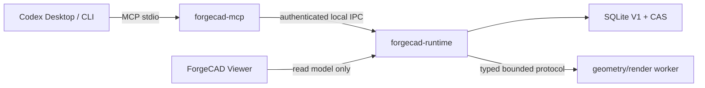

# ForgeCAD 单用户 MVP 交付计划

2026-08-17 Reference Visual Structure 增量后，当前 Stage 0 为 139 Schema、41 read + 33 opt-in write = 74 tools；新增合同只扩展参考证据，不改变 candidate/version/confirm 边界。

版本：2026-08-13
状态：权威执行合同；MCP005–MCP009 单用户 MVP host golden path 已完成；FGC-MCP010A done
当前 Stage 0 覆盖（2026-08-17）：138 Schema、41 read + 33 opt-in write = 74 tools；新增 `repair_intent_run_prepare` 的 CAS-bound bounded run source slice已通过，但只产 staged candidate，`repair_apply_prepare`/confirm 仍未完成。
当前起点：`FGC-MCP005`–`FGC-MCP009` focused Gate 和真实 Codex CLI 十二调用 reference→CAS GLB receipt 已通过；MCP010B structural source Gate 已通过但 Darwin 512 MiB OS 总内存硬门仍未运行；MCP010C source Gate 已实现固定 renderer、九 AOV、reference comparison、MCP image block 和 typed/human review，真实 Codex CLI C 已完成六 turn/32-call transport，轮廓优先 attempt28 又完成 source-built 12-turn transport，但 likeness target 仍未通过（IoU 0.6623、boundary F1 0.2418）；MCP010D/E source Gate 已实现真实硬表面 Operator、离线 AssetPack、512px UV atlas、fixed mikktspace、embedded PBR 和九 AOV raw path；MCP010F source Gate 已实现只读 Viewer 的 AOV/对比/Part/MaterialZone/explosion/heatmap surface，并加入 hash-bound contour target、兼容 camera fit、Rig/SDF、Part proposal 和 candidate compare。真人视觉门、Viewer/package/live C/D/E/F、xatlas/Validator、真实 PBR likeness 和 360 仍为 `目标设计/NOT_RUN/BLOCKED`

Stage 0 当前交付口径：138 Schema、41 read + 33 opt-in write = 74 tools，唯一 `in_progress` 为 `FGC-MCP010F`；机器证据入口为 `docs/evidence/mcp010f/current-benchmark-truth.json`。Agentic observe/plan/critic/evidence projection 证据为 `docs/evidence/mcp010f/agentic-runtime-observe-plan-20260813.json`，真实 Runtime 嵌套只读 projection conformance 证据为 `docs/evidence/mcp010f/agentic-runtime-projection-conformance-20260813.json`，由 `scripts/check_agentic_projection_receipt.py` 校验；durable session/checkpoint/RepairIntent prepare/readback 与 CAS-bound RepairIntentRun 证据分别由各自 receipt 记录；Primary Form 单动作 prepare/evaluate 与异步 Job 另由 Runtime focused/source/real-Codex contract 覆盖，只产生 staged candidate。后者证明 Runtime/MCP 重启后的 durable readback 和 CAS-only restore intent，不代表 durable/reference/DesignSpec 完整 producer conformance、通用单动作 orchestrator 或 Repair 应用。attempt35 仅是 provisional retained observation，不具备 benchmark 资格：它是 `QUALITY_TARGET_NOT_MET + INCOMPLETE_TRUTH_BINDING`，eligibility 为 `BLOCKED_INCOMPLETE_BINDING`，camera-fit `354caf27…f95788` 与 reference-compare `8cd20605…a535` 为 `MISMATCH`；packaged Viewer 当前只证明 separate current-cohort read-model binding，尚未绑定 attempt35。source/raw/transport/build/AX smoke 不能替代视觉、人评或 packaged E2E Gate。

<!-- forgecad-stage0: schemas=139 schema_set_sha256=c66615a0edf6bfcfa13c333b43f1b1756d6db678be7dd9e5249738381e41448b read_tools=41 write_tools=33 total_tools=74 task=FGC-MCP010F observation=QUALITY_TARGET_NOT_MET eligibility=BLOCKED_INCOMPLETE_BINDING evidence=INCOMPLETE_TRUTH_BINDING camera=MISMATCH packaged=PASS_CURRENT_COHORT_BOUND_READ_MODEL latest_attempt=real-codex-cli-current-20260815-b37-complete-auto-v3.json latest_completed=real-codex-cli-current-20260815-b37-complete-auto-v3.json -->

当前高质量 authoring/readback 路径使用 `GeometryProgram@2` 与 `ArtifactReadback@2`；下文 `GeometryProgram@1` 只保留为 `[transition-v1]` 的 MCP007 历史 MVP 证据，不能作为 MCP010F 当前执行入口。

ADR-0026 与本轮架构重规划补充：后续高质量交付必须先建立清晰模块边界和废弃隔离，再把 projection 和 durable prepare/readback 推进为有完整 producer conformance 的 ReferenceCanvas、DesignSpec、SemanticSceneGraph、DesignSession、Visual Evidence 和 Critic/Repair loop。当前 Runtime 的嵌套只读 projection conformance 已通过独立 checker，但该结果不扩展到 durable/reference/DesignSpec producer；该目标不改变当前 MVP done 状态，durable slice 仍不等于单动作 orchestrator 或 Repair producer。

## 1. MVP 要交付什么

ForgeCAD MVP 是一个由 Codex Desktop/CLI 控制的本地 3D 工作台，不是多用户平台、后台 Agent 服务或第三方插件市场。MVP 只承诺完成一条真实、可演示、可回退的硬表面视觉资产链路：

```text
用户在 Codex 上传一张已授权参考图
  → forgecad-mcp 导入真实图片字节
  → Runtime 写入 CAS 和 ReferenceEvidence
  → Codex 根据图片生成 typed SubjectProfile / GeometryProgram
  → Runtime/Worker 编译真实 mesh、GLB、材质和固定视图
  → Viewer 显示同一 candidate hash
  → Codex 通过 `change_prepare` 做一次稳定 Part ID 局部修改
  → 用户在 Codex 拒绝一次、批准一次
  → Runtime 创建不可变版本
  → restore 创建新版本
  → `export_prepare(format=glb, profile=mvp-glb)` / `export_confirm` 返回同一版本的 CAS GLB hash 和 manifest receipt
```

首个设计基准是用户提供的白色硬表面人形机器人参考。原图片不得复制进 Git、Markdown 或日志；开始 `MCP005` 时经授权 attachment root 导入 CAS，文档和 evidence 只记录 opaque reference ID、SHA-256、MIME、尺寸和授权声明。

MVP 不宣称：任意类别的一键高质量重建、多视图摄影测量、可制造 CAD、骨骼动画、后台 Job 永久在线、多客户端协同、插件市场、远程模型 Provider、签名公证后的公开发行。

## 2. 极简运行架构



- `forgecad-mcp` 负责协议、工具清单、启动或连接 Runtime；initialize 不等待 Runtime。
- `forgecad-runtime` 是唯一状态写者，通过 OS 文件锁保证单实例。MVP 无 TTL lease、heartbeat、broker 或复杂服务治理。
- Worker 只执行产品预注册、带预算的 typed Operator；不接受 Python、JavaScript、shell、URL 或任意文件路径。
- Viewer 是可选只读界面。关闭 Viewer 不损坏已确认数据；MVP 不保证 Codex/MCP 退出后未完成 Job 继续。
- 测试、签名、SBOM、evidence 是交付流程，不是额外常驻运行组件。

模块清晰度要求见 `ARCHITECTURE_MODULE_BOUNDARY.md`：每个模块必须说明唯一写者、Schema、持久化边界、网络/脚本/路径权限、Gate 和 evidence。废弃文档、代码与模块的处理见 `DEPRECATED_ISOLATION_PLAN.md`；active 目录不得混入 superseded 模块。

## 3. MVP 与正式发布分界

| 范围 | MVP 必须 | 正式发布再做 |
|---|---|---|
| 宿主 | 开发构建上的真实 Codex CLI；可行时补 Desktop | 签名安装包上的 Desktop + CLI 全量 E2E |
| 参考 | 单张 PNG/JPEG 真实字节入 CAS | 多图、更多格式、IDE 附件 |
| 建模 | 硬表面机器人 vertical slice、typed 可编辑部件 | 跨类别通用表示、角色/有机/场景 |
| Skill | first-party 声明式核心包、开发 trust root | 第三方安装、撤销服务、透明日志、市场 |
| 材质 | glTF metallic-roughness、有限材质区 | MaterialX 全量、UDIM、资产市场 |
| 渲染 | 一个确定性 renderer、固定相机和最小 AOV | 跨 GPU renderer parity、生产离线渲染 |
| Job | 同一会话内排队、取消、明确失败 | checkpoint 续跑、复杂并发与 watchdog |
| 分发 | 本地可构建、可运行、无 secret/绝对路径 | Developer ID、notarization、升级/回滚 |
| 质量声明 | “单用户 MVP 功能核心可供开发评估” | “首个硬表面参考基准通过”需真实 Codex + 真人门；绝不宣称通用高质量 |

签名、公证和 packaged Desktop 不再阻塞 3D vertical slice；它们仍是任何外部分发或“正式可安装”声明的硬门。

## 4. 固定任务链

同一时刻只允许一个任务 `in_progress`。Luna 不能跨任务提前打开后续能力。

### FGC-MCP005：真实参考图导入（已完成）

目标：把 Codex 提供的真实附件字节安全写入 CAS，形成可回读的 `ReferenceEvidence@1`。

Owned paths：reference/attachment Schema、`forgecad-mcp` 工具适配、Runtime import service、CAS image admission、Codex CLI/Desktop probes、MCP005 evidence 与相关文档。

实现：

1. 新增 `reference_import`，来源只允许 `inline_content` 或启动时授权的 `codex_local_file`；
2. 使用 Rust 图片解码器，P0 只启用 PNG/JPEG；设置总字节、像素、宽高、帧数和解码内存上限；
3. canonicalize 后拒绝目录、设备文件、symlink、越过授权 root 和 MIME/魔数不一致；
4. 原始字节写 CAS，生成规范化预览可作为派生对象；持久状态丢弃本机绝对路径；
5. `reference_get` 返回 ID/hash/MIME/尺寸/授权/派生对象，不返回原路径；
6. capabilities 明确报告当前宿主附件模式和限制。

退出 Gate（当前 evidence）：

- PNG/JPEG success；错误 MIME、截断文件、超限尺寸、解压炸弹、symlink、目录、设备文件、越权路径、hash mismatch 全部 fail closed；
- 日志、DB、MCP response、evidence 不含用户名和绝对路径；
- 真实 Codex CLI 将首个机器人参考的原始字节送入 CAS，并与源字节 SHA-256 一致；
- Desktop 若宿主不能把附件路径/字节提供给 MCP，诚实记录 `REFERENCE_TRANSFER_UNAVAILABLE`，不伪造 PASS；
- `release:mcp004` 回归和新的 MCP005 focused Gate 通过。

当前证据：`docs/evidence/mcp005/manifest.json`、`docs/evidence/mcp005/codex-cli-reference-e2e.json`。Codex CLI 的用户授权 PNG 已完成 `project_create → reference_import → reference_get`，源字节和 CAS hash 相同；Desktop attachment bridge 为 `NOT_RUN / unavailable`。MCP005 不包含视觉理解、Geometry、Appearance、Render、Quality 或 GLB。

### FGC-MCP006：MVP typed 建模合同与 first-party Skills（已完成）

目标：让 Codex 能把视觉判断转为受限、可验证的建模程序，不在 ForgeCAD 内再放一个模型。

MVP 核心对象：

- `SubjectProfile@1`：类别、构图、比例、可见/遮挡区、材质线索、不确定项；
- `RepresentationPlan@1`：单位、坐标、部件策略、预算、目标视图；
- `AssemblyGraph@1`：稳定 Part/MaterialZone ID、父子和对称关系；
- `GeometryProgram@1`：只含预注册 Operator；
- `AppearanceProgram@1`：glTF metallic-roughness 子集；
- `RecipePlan@1`：声明式 DAG、输入/输出 hash 和预算。

MCP006 首批 10 个历史 first-party Skill，MCP010B 追加当前 `primitive-blockout@0.2.0` active overlay：

| Skill ID | MVP 责任 |
|---|---|
| `reference-intake` | 引用已导入 ReferenceEvidence，生成视图/可见性约束 |
| `subject-profile` | 形成 typed 主题、比例、材质线索和未知项 |
| `semantic-assembly` | 建立稳定部件树和对称关系 |
| `silhouette-blockout` | 以 primitives/profile/sweep 构建轮廓块面 |
| `hard-surface-detail` | 受限 bevel、panel、vent、joint、inset 细节 |
| `mesh-integrity` | finite/index/normal/manifold/budget/readback 硬门 |
| `uv-pbr` | UV、tangent、金属粗糙度材质区和 emissive |
| `render-evidence` | 固定参考相机、beauty/silhouette/normal/part-ID |
| `reference-compare` | 轮廓、占框、关键比例和区域差异 |
| `local-edit-and-export` | stable-ID change、GLB validator、manifest |

MVP Bundle 可以由仓库 first-party 开发 trust root 校验 canonical hash；必须有 Schema、Recipe、operator lock、validator、benchmark fixture、LICENSE/NOTICE 和 SPDX SBOM。分发级签名、撤销网络和第三方 publisher 延后，但不能省略 hash、许可证和预算。

退出 Gate：Schema/生成类型/validator 无漂移；未知 Operator、DAG cycle、错误单位、非有限值、预算溢出、缺许可证、Bundle hash 漂移 fail closed；所有 Skill 均无可执行脚本和网络权限；canonical plan 在重复运行中 hash 一致。

当前完成证据：`packages/forgecad-skills/registry.json` 保留历史 `0.1.0` Skills，并新增 `primitive-blockout@0.2.0`、`hard-surface-detail@0.2.0` 和 `uv-pbr@0.2.0`；Bundle metadata、Runtime Skill integrity 和 source Gate保持既有范围。当前源码共 136 contracts；MCP010C fixed renderer/九 AOV/reference compare/review raw Gate、MCP010D/E Operator/AssetPack/UV/PBR/MikkTSpace raw Gate、MCP010F Viewer source/轮廓目标/`CameraCalibrationRef@1`/相机拟合/边界误差 Gate，以及 Agentic durable session/checkpoint/RepairIntent prepare/readback 与 CAS-bound RepairIntentRun staged transport 分别记录在对应 evidence 目录。正式 distribution signature/revocation、xatlas/Validator、Viewer package 和真实几何/视觉 benchmark不属于 MCP006，分别留给 MCP012–013、MCP010F；不得用 Skill metadata代替 producer。

### FGC-MCP007：真实几何 vertical slice（已完成）

目标：由 Codex 调用 typed 工具构建一个真实、可编辑、带语义部件的机器人 mesh，不是图片平面、占位盒或手工放入的成品模型。

MVP 当前真正可执行的 Operator 集（以 Runtime `capabilities_get` 和
`apps/geometry-worker/src/lib.rs` 的 allowlist 为准）只有：

- `forgecad.geometry.primitive@1`：`box`、`cylinder`、`sphere`；
- `forgecad.geometry.transform@1`：有界平移/旋转/缩放；
- product-owned UV/tangent/material lowering 与固定 render pass；
- strict finite/index/triangle/byte/lineage/readback validators。

这组能力足够支撑首个机器人硬表面 blockout 和 PBR/GLB vertical slice。下面这些
Operator 仍是 Skill metadata 中的声明式目标，不是当前 Runtime 能力；Codex 或
Luna 传入时必须 fail closed，不能靠 fallback 或手工 GLB 假装实现：

- `profile`/`extrude`/`revolve`、curve/`sweep`、`loft`；
- `mirror`/array、`bevel`/`chamfer`、panel/vent/joint macro；
- bounded union/difference/intersection、solid/B-rep、LOD 优化。

只有在新增对应 Schema、worker 实现、预算/恶意输入/确定性/readback evidence 后，
才能把单项从“声明式目标”移到 Runtime allowlist；这不是本轮 MVP 的前置条件。

首个机器人至少形成 head shell、neck、torso/chest、pelvis、左右 upper/lower arm、hands、左右 thigh/shin 等稳定语义 Part；具体数量由 `SubjectProfile` 决定，测试不得用“只有一个整体 mesh”规避 Part lineage。

退出 Gate：

- Geometry worker 从 canonical program 生成非空真实 mesh/GLB；重复输入产生相同 topology/artifact hash（明确记录允许的平台浮点边界）；
- 所有 index/position/normal 有效，无 NaN/Inf/越界/退化三角；需要闭合的部件通过 manifold 门；
- Part ID、source Operator ID、MaterialZone 在 GLB/readback 中可追踪；
- 超时、三角/内存预算、恶意参数和 Worker crash 不写版本；
- Viewer 可读取并显示同一 candidate 的真实 GLB；
- evidence 保存 GLB、strict readback、wireframe、part-ID 和程序 hash，不用单张截图代替。

当前实现和 evidence：`apps/geometry-worker/src/lib.rs` 是 product-owned bounded compiler，接受 canonical `GeometryProgram@1`，允许 box/cylinder/sphere primitive，拒绝未知 operator、non-finite、超预算和 hash 漂移；Runtime 写入 geometry GLB CAS，生成 reviewable candidate/`GeometryQualityReport@1`，MCP 通过 authenticated IPC 暴露 `geometry_prepare` 与 `artifact_readback_get`；Viewer read model 读取候选和 artifact metadata。14-part robot fixture、3-part worker fixture、deterministic repeat、GLB header/JSON/lineage readback、negative/no-version-on-failure 和 focused Runtime/MCP/Viewer tests 均 PASS，见 `docs/evidence/mcp007/manifest.json`。真实 Codex CLI 的 MCP007 receipt 完成 `project_create → reference_import → geometry_prepare → artifact_readback_get`，14 parts/516 triangles/validator passed；MCP009 receipt 进一步证明同一类 geometry 可进入 Appearance/Render/Quality/Confirm/Export。当前没有把未实现的 profile/extrude/revolve/sweep/loft/boolean/bevel、像素 reference similarity 或通用质量写成已完成。

### FGC-MCP008：外观、Viewer 与固定渲染证据

目标：为同一机器人 candidate 生成可交付的 glTF PBR 外观和可比较的固定视图。

MVP 外观：白色涂层金属外壳、深色机械内构、有限暖橙 emissive；每项仍由 typed MaterialZone 绑定，不能把参考图直接投影为不可编辑贴图来假装完成建模。

实现：产品自有 bounded UV mapping、tangent、BaseColor/Metallic/Roughness/Normal/AO/Emissive 受限通道、glTF lowering、严格 readback；Viewer 使用现有 Three.js `GLTFLoader` 显示 Runtime artifact、候选/版本 ID；headless renderer 输出 beauty、silhouette、normal、part-ID，其他 AOV 可延后到发布。MCP008 必须先消费 MCP007 artifact/readback，不复制第二份模型或状态。xatlas、mikktspace 和 glTF Validator 仅为 approved-for-evaluation 候选，当前没有安装为产品依赖。

退出 Gate：UV 越界/零面积、tangent/normal 方向、颜色空间、PBR 范围、MaterialZone 漂移 fail closed；当前由 product-owned strict readback 与固定 `mikktspace@0.3.0` 覆盖，外部 glTF Validator 仍为 NOT_RUN；Viewer 不生成第二份材质或模型状态；关闭 Viewer 后 headless render 仍成功；固定相机/灯光/分辨率/renderer version/hash 进入 receipt。

### FGC-MCP009：参考比较、局部修改与 MVP 闭环

目标：把真实 3D 结果与参考绑定，完成一次用户可见的迭代、审批、版本、回退和 GLB 导出。

实现：

1. Runtime `quality_get` 输出结构/PBR/fixed-render hard checks，并在有参考元数据时返回明确 `limited` 的 aspect-ratio evidence；像素 silhouette/landmark/region compare 不是当前工具；
2. Codex 在自己的对话中进行视觉判断，不能把自然语言判断写成 Runtime quality PASS；
3. 对一个稳定 Part ID 执行 `change_prepare`，使用 allowlisted operation 重新编译候选；当前不承诺通用 mesh-delta 或 DAG reuse；
4. 用户拒绝一次：head/version 数量不变；用户批准一次：只创建一个不可变子版本；
5. `restore_prepare/confirm` 从旧内容创建当前 head 的新子版本；
6. `export_prepare/confirm` 输出 CAS-backed GLB + path-free manifest，绑定 version/artifact/Skill/license/quality hash。

MVP 验收不使用一个未经校准的分数冒充“高质量”。必须同时满足：几何/GLB/PBR 硬门；参考相机下轮廓和比例指标有基线与实际值；Codex typed review 引用具体 pass/region；用户人工确认“像目标、部件可编辑、修改有效”；失败项和遮挡导致的不确定性仍展示。

当前 Gate：真实 Codex CLI 已完成 reference → geometry/appearance prepare → strict readback → quality → candidate confirm → version list → CAS-only GLB export 的十二调用 receipt；证据包含 reference hash、GLB artifact、validator/readback、fixed-render/quality、approval 和导出 hash。Viewer 同 hash、重启 readback、change/restore、像素相似度和用户评分仍需独立补证；只有这些视觉/回退证据通过，才可写“首个硬表面参考图质量基准闭环”。

## 5. MCP010 质量升级与正式发布任务

- `FGC-MCP010A`：权威重排、同 revision 用户级开发 App 激活、真实 Codex capability/build-hash Gate；
- `FGC-MCP010B`：V2 几何合同与真实 GLB/拓扑 readback；
- `FGC-MCP010C`：perspective/z-buffer 固定 renderer、九 AOV、参考指标和 typed review；
- `FGC-MCP010D`：受限高细节 Operator、Manifold 有条件采用和 geometry Skill `0.2.0`；
- `FGC-MCP010E`：first-party 离线 AssetPack、512px UV atlas、固定 mikktspace、embedded PBR/纹理和 provenance；
- `FGC-MCP010F`：Viewer compare/selection/explosion、AOV/heatmap 辅助、undo/redo、真实机器人和人工闭环；当前 source slice 已通过，packaged/human/360 子门仍未运行；
- `FGC-MCP011`：checkpoint、并发 Job、崩溃恢复、配额、GC、全局性能；
- `FGC-MCP012`：通用第三方 Skill/AssetPack 生命周期、publisher、分发签名/撤销；
- `FGC-MCP013`：Developer ID、notarization、clean install、升级/回滚、Desktop/CLI packaged E2E、filesystem export、跨类别真人质量门。

ADR-0026 后续重构 backlog 不插队改变当前任务链。当前 durable session/checkpoint/RepairIntent prepare/readback slice 已完成，但不改变 F 的唯一 `in_progress`；后续仍应拆分为：完整 producer/consumer conformance、单动作 orchestrator、Repair 应用、Parametric Design Kit、完整 Visual Evidence、Critic/Repair loop 和真实 stage-gated robot loop。

详细 A–F 合同见 `MCP010_HIGH_QUALITY_HARD_SURFACE_PLAN.md`。当前单图最多是 `PARTIAL_VISIBLE_VIEW_PASS`；五张补充全身视图前 `HQ_360_PASS=BLOCKED_REFERENCE_COVERAGE`。这些任务不能反向改写 MVP host receipt，任何公开分发或通用质量声明仍依赖 MCP013。

### MCP010B 当前 V2 结构 authoring 边界（source Gate PASS；OS memory hard cap deferred）

当前源码以 manifest/目录计数为 136 个 JSON Schema；历史 B/C/E/F subtotal 不能再相加作为当前总量。`operator_catalog_get`、`geometry_program_hash`、`material_pack_get`、`render_pass_get`、`silhouette_target_get`、`camera_fit_prepare`、`silhouette_fit_prepare`、`part_contour_fit_prepare`、`silhouette_part_error_get`、`silhouette_candidate_compare`、`boundary_error_get`、`session_get`、`checkpoint_get` 以及 Agentic observe/plan/critic/evidence projection tools 是默认只读工具。B source Gate 已通过 contracts、Skill integrity、Worker isolation、V2 restore hardening 和 closed GLB profile；E source Gate 已通过 AssetPack manifest/provenance、512px UV atlas、fixed mikktspace、embedded PBR and nine AOV；F source Gate 已通过 hash-bound contour target、Runtime-owned camera ref、bounded 64-render coarse-to-local camera search、Rig/SDF/Part/candidate compare 和 directional boundary error；Agentic projection 与 durable prepare/readback 已通过隔离 probe，单动作 orchestrator/Repair 应用仍未完成；Darwin OS memory hard cap deferred/NOT_RUN。Codex 先读取 catalog，再提交严格、无 `canonical_sha256` 的 V2 draft 到 hash 工具；Runtime 返回唯一 canonical hash，且不编译、不创建 candidate/Job、不写 SQLite/CAS。

历史 source-built real Codex CLI 曾使用授权参考完成 `project_create → reference_import → capabilities_get → operator_catalog_get → geometry_program_hash → geometry_prepare → artifact_readback_get`，生成 pre-semantic-Part-sink 的未确认 12 Part/884 triangle primitive structural blockout。attempt 1 的 `BLOCKED` receipt 保留，attempt 2 的 structural PASS 不代表 reference likeness、texture/PBR V2、用户评分、export/restore、Viewer comparison 或 360°。MCP010A/010B 的 Dev.app receipts均为历史 cohort receipt；当前 `d9c23b…ac0bd` 的结构证据也不记录视觉质量。MCP010B structural source Gate已通过并转为 deferred（Darwin 512 MiB OS total-memory hard cap保持 `NOT_RUN`），不得由 isolation/peak-RSS 结果推断为总内存预防证明。

### MCP010C 当前固定渲染与参考比较边界

当前源码 manifest/目录共有 136 个合同，默认工具面为 41 read + 33 opt-in write = 74。`script/test_mcp010c.sh` 已通过固定 512×512 perspective/z-buffer、scene transform、确定性九 AOV、CAS RenderSet@2、local reference mask/metrics、`render_pass_get` MCP image block、Codex typed review、human receipt schema 和 deterministic raw stdio；`script/test_mcp010e.sh` 已通过 AssetPack/provenance、512px atlas、fixed mikktspace、embedded PBR textures、strict readback 和九 AOV image block；`script/test_mcp010f.sh` 还通过哈希绑定 silhouette target、`CameraCalibrationRef@1`、64-render coarse-to-local camera fit（37 个粗候选 + top-3×9 局部探针；候选排序在 64px 内部二值栅格/128px 合同输出完成，最终指标回到 512px）、bounded Rig/SDF/Part/candidate compare、directional boundary error、只读 Viewer source checker、TypeScript/Vite/Tauri 构建和 IPC write-boundary negative；Agentic projection 与 durable session/checkpoint/RepairIntent prepare/readback、CAS-bound `repair_intent_run_prepare` staged transport 另通过合同 checker、preflight 顺序、空 reference fail closed、Runtime/MCP 重启和隔离持久化 probe。上述仅为 source/raw/build/readback 范围。真实机器人 attempt35 虽完成 11-turn transport，但为 `QUALITY_TARGET_NOT_MET + INCOMPLETE_TRUTH_BINDING`；fit/compare camera `MISMATCH`，最新 `real-codex-cli-current-20260814-viewer-bound.json` 已补齐 current-cohort packaged Viewer exact project/candidate/artifact/reference/render-set/comparison lineage read-model binding，但不改写 attempt35 的视觉结果，详见 `docs/evidence/mcp010f/current-benchmark-truth.json`。这些 receipt 不创建 confirmed version，也不构成 `PARTIAL_VISIBLE_VIEW_PASS`；packaged Viewer UI/accessibility、人评阈值、真实 PBR likeness、xatlas/Validator、export/restart hash 和 HQ_360 仍 `NOT_RUN/BLOCKED`。单张三分之四图最多只能产生 `PARTIAL_VISIBLE_VIEW_PASS`，且必须先通过阈值。

当前 Dev.app packaged C 更新：安装/包验证/隔离探针、九 AOV raw renderer 和 packaged Codex CLI compare/review transport 已通过；其结果仍为 `QUALITY_TARGET_NOT_MET`，不构成 likeness PASS。packaged Viewer UI、真人评分、真实 PBR likeness/纹理审美、export/restart hash 和 HQ_360 继续 `NOT_RUN/BLOCKED`。

## 6. GitHub 工具采用决策

出现于清单不等于已安装。每项必须在对应任务固定精确 tag/commit、LICENSE hash、依赖 SBOM、恶意输入/资源/确定性 Benchmark 和移除方案；Luna 不得运行仓库安装脚本或整仓复制。用户已授权 build123d、BlenderMCP、CadQuery、Manifold、MaterialX 的选择性源文件研究，但该授权只能依照 `LUNA_GITHUB_REPLICATION_PLAYBOOK.md` 进入隔离缓存和 `research-authorized` receipt，不能修改 lockfile、安装包、Runtime allowlist 或 active Skill。

### MVP `approved-for-evaluation`

| 项目 | 身份 | 用途 | 集成任务 | 限制 |
|---|---|---|---|---|
| [image-rs/image](https://github.com/image-rs/image) | Rust library | PNG/JPEG decode/admission | MCP005 | `default-features=false`，仅开 PNG/JPEG，设置 limits |
| [gltf-rs/gltf](https://github.com/gltf-rs/gltf) | Rust library | GLB strict readback | MCP007/008 | 禁止未受限外部 URI |
| [Manifold](https://github.com/elalish/manifold) | isolated library/worker | robust mesh boolean/manifold | MCP010D | 当前已受限采用产品自有 C API/FFI Worker，限制面数/时间/source IDs；仅 bounded same-Part union/difference/intersection active，任意 mesh Boolean 仍 unavailable |
| [xatlas](https://github.com/jpcy/xatlas) | isolated library | UV unwrap/pack | MCP010E | 固定版本，验证 seam/overlap/determinism |
| [mikktspace](https://github.com/gltf-rs/mikktspace) | Rust library | glTF tangent | MCP010E | 与 Viewer/GLB golden 对齐 |
| [glTF-Validator](https://github.com/KhronosGroup/glTF-Validator) | validation tool | GLB 交付硬门 | MCP010E/F | 工具不成为产品真值，报告归一入 CAS |
| [glTF-Transform](https://github.com/donmccurdy/glTF-Transform) | dev/export tool | inspection/optimization | MCP009 | Node 仅构建/测试，不写 Runtime 状态 |
| [img2threejs](https://github.com/img2threejs/img2threejs) | workflow reference | staged passes、detail inventory、per-region confidence、side-by-side compare | MCP006 | Apache-2.0；只做 first-party typed reimplementation，不安装其脚本/Three.js/JS |
| [img2css](https://github.com/javierbyte/img2css) | reference-only visualizer idea | bounded pixel/color/region preview | MCP006/009 | BSD-3-Clause；CSS/base64 只可离线预览，不能进入 GeometryProgram 或执行任意 JS/HTML |

### `deferred / benchmark-first`

- [meshoptimizer](https://github.com/zeux/meshoptimizer)：LOD/压缩，MVP 后优化；
- [MaterialX](https://github.com/AcademySoftwareFoundation/MaterialX)：MVP 只参考语义并实现 glTF PBR 子集；
- [OpenColorIO](https://github.com/AcademySoftwareFoundation/OpenColorIO)：跨 renderer 色彩管理，先用固定 sRGB/linear 基线；
- [truck](https://github.com/ricosjp/truck)：Rust B-rep/NURBS 内核，作为后续 CAD 表示 benchmark，不进入首个 mesh vertical slice；
- [Parry](https://github.com/dimforge/parry)：后续爆炸图/碰撞；
- Blender：只考虑未来产品固定、签名、无网络的 headless worker；`.blend` 永远不是状态真值。

### `reference-only / MVP 禁止安装`

- [Blender MCP](https://github.com/ahujasid/blender-mcp)：允许执行任意 Blender Python、使用 socket/网络资产，不满足 Worker 权限边界；
- FreeCAD MCP、CadQuery/build123d MCP：常把任意 Python、文件系统或 OS 能力直接暴露给模型；仅学习工具粒度；
- TripoSR、Hunyuan3D 和远程 image-to-3D API：涉及权重/GPU/远程 Provider/许可证与隐私，不属于 Codex 控制的确定性本地 MVP；
- 任意 GitHub “Skill prompt pack”：知识可以人工重写进 first-party Skill，但 prompt、脚本和仓库不能直接安装为产品能力。

MCP010E 的唯一下载例外是：Codex 可把计划中点名的 CC0 素材一次性下载到本机 adoption cache，逐项完成 source/hash/license/SBOM/provenance 后编入 first-party 离线 AssetPack。Runtime、安装器和 Viewer 不联网、不调用素材 API；原 ZIP 不进入 Git。该例外不开放通用 pack 安装生命周期。

## 7. Luna 每任务执行循环

```text
read authority → record dirty baseline → claim one ready task
→ Schema + negative tests → Core/Runtime → MCP/Worker/Viewer
→ focused → aggregate → real Codex/evidence
→ update status/capability/handoff/user docs → mark done or remain in_progress
```

任务开始必须记录：Task ID、依赖状态、base/worktree、owned/forbidden paths、基线命令、退出 Gate、外部依赖 decision receipt。任务结束必须区分 `PASS / FAIL / BLOCKED / NOT_RUN`，不得用 mock、fixture、旧 Provider、图片平面、手工 GLB 或 Codex 自评替代真实链路。

## 8. 每阶段共同 Gate

```bash
npm run release:docs-walkthrough
npm run repository:integrity
npm run release:safety-scope
npm run release:secrets-files
npm run release:license-sbom
npm run contracts:check
npm run mvp:functional-core
npm run desktop:typecheck
npm run desktop:build
npm run desktop:tauri-check
git diff --check
```

再运行任务专属 Rust/Worker/Viewer/MCP probe。外部依赖加入 lockfile 后必须离线重跑、生成 SBOM/license receipt，并检查最终 binary/package，不只检查源码许可证。

## 9. MVP 完成语句

### 9.1 当前可用声明：functional core

MCP005–MCP009 的 focused Gate 和真实 Codex CLI host receipt 已通过时，允许写：

```text
ForgeCAD 单用户 MVP host golden path 已完成（MCP005–MCP009 focused evidence PASS，真实 Codex CLI 已完成授权图片→CAS GLB 十二调用链）；可在开发构建中进行本地 3D 工作流评估。像素级参考相似度、真人视觉评分和正式分发仍未验收。
```

### 9.2 参考基准声明：视觉质量仍需独立验收

只有 MCP005–MCP009 的实现退出 Gate、固定参考指标、独立真人评分和对应 hash-bound evidence 全部通过，才允许写：

```text
ForgeCAD MVP completed for the first hard-surface reference benchmark on <commit/worktree>; universal high-quality image-to-3D and production distribution remain out of scope.
```

在 9.2 的证据完成前一律写：

```text
ForgeCAD MVP host path complete; visual benchmark remains open: <PASS/FAIL/BLOCKED/NOT_RUN evidence>; next safe task is <FGC-MCPxxx>.
```
