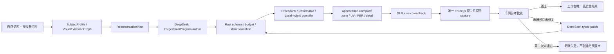

# FGC-U004 第一阶段：高质量通用 3D 工作台实施总图

版本：2026-08-01

状态：`目标设计 / 可执行任务分解`；本文不证明通用高质量 3D 已实现

父任务：`FGC-U004`

阶段目标：先在唯一工作台中稳定展示高质量、参考图条件化、表面细节清楚、材质可信且可继续修改的单一 3D 结果；导出不是本阶段验收项

## 1. 决策摘要

ForgeCAD 的核心方向固定为：**面向非专业用户、类别开放、参考图条件化、外观优先、可编辑的通用 3D Agent**。用户只需要用自然语言和授权参考图描述对象，不需要理解 DCC、拓扑、UV、PBR 或模型 Provider。

第一阶段不再以“有一个可加载的 GLB”或“机械硬表面 fixture 通过”为成功，而以工作台中的可见结果为中心：

1. 中央唯一 3D 视口始终是最大视觉区域；
2. 首次进入是可开始的 `idle`，不能无请求就显示“生成失败”；
3. 参考图中的轮廓、主体结构、表面层级、材质分区和微表面形成可追溯的设计源；
4. DeepSeek 负责受限设计程序的 author/最多一次 typed patch，千问负责授权参考图理解和候选视觉比较；
5. Rust 负责会话上下文、Schema、预算、状态机、程序校验、lowering、readback、缓存回执和最终产品真值；
6. Python 只执行 Rust 已验证的受限几何 IR；
7. 工作台只展示一个最终候选，不让用户在多个失败候选中筛选；
8. 导出、发布和更多文件格式保留现有兼容能力，但从第一阶段主路径和主要 CTA 中降级，不作为退出条件。

用户要求“暂时不考虑安全问题”在本文中的执行含义是：**不新增安全专项，不让安全工作抢占 U004 质量主线**。它不授权删除现有 Provider allowlist、secret 文件权限、受限执行、路径/网络隔离、preview→confirm 或 fail-closed Gate；这些边界是当前架构成立的前提，不是本阶段功能范围。

## 2. 当前真实程度

### 2.1 已有底座

- 类别开放入口、`SubjectProfile → RepresentationPlan → UniversalAssetSource` 已建立；
- DeepSeek/千问已经是唯一允许运行时 AI Provider；
- `ForgeVisualProgram@2`、程序化硬表面、固定 lattice deform、通用轻量外观代理和 Surface Layer/PBR lowering 已有合同与局部 Gate；
- 工作台已有单 renderer、候选 GLB readback、八视图 capture、一次授权比较和最多一次 typed patch 的闭环骨架；
- Snapshot、选择、预览、版本、质量和历史导出已经有 Rust-owned 真值链。

### 2.2 尚未达到的产品能力

- 通用类别结果尚未通过真人视觉门；角色、生物、植物、布料和复杂软体没有成熟的本地高质量表示；
- 当前 `procedural.generic_visual_exterior_v1` 是轻量外观代理，不是照片级或目标图等级重建；
- 正式 UV 展开、按区域纹理合成、参考图材质恢复、细节烘焙和跨类别 Appearance Compiler 仍不完整；
- DeepSeek adapter 已支持工具调用、thinking 和缓存 token 统计，但会话上下文仍以最近消息数量截断，线程摘要没有形成稳定可验证的更新链；
- 工作台视觉层级、首屏状态和 CSS 责任边界未收敛，现有结构会遮挡和挤压核心视口；
- 当前本机测试和 fixture 不能证明真实 DeepSeek→GLB→同屏高质量结果，也不能证明达到用户提供的目标图。

因此，现阶段正确结论是：**ForgeCAD 能生成并展示受限的可编辑 3D 工件，但还不能稳定生成目标图等级的通用高质量模型。**

## 3. 第一阶段产品链



本阶段主链到 `K` 即完成。现有导出链不得删除，但不进入首屏主操作、视觉验收或四 Luna 并行任务的完成定义。

## 4. DeepSeek 多轮会话与缓存架构

### 4.1 已确认的官方行为

截至 2026-08-01，DeepSeek Chat Completion 是无服务端会话状态的接口：每轮由客户端发送需要保留的消息。上下文缓存默认工作在相同请求前缀上，命中是 best-effort，回执通过 `prompt_cache_hit_tokens` 和 `prompt_cache_miss_tokens` 观察。Thinking + Tool Calls 的后续工具轮需要原样回传当前轮 `reasoning_content`，普通下一轮不应把隐藏推理持久化进产品历史。

因此不能把“使用了同一个 thread_id”当作多轮上下文，也不能把 Provider 缓存当作产品状态或正确性保证。

### 4.2 目标消息分层

新增 Rust-owned `ProviderConversationEnvelope@2`：

```text
stable_prefix
├── system policy version
├── ForgeVisualProgram schema version
├── canonical tool definitions
├── capability manifest hash
└── provider/model behavior flags

project_memory
├── subject identity and intent
├── confirmed visual decisions
├── current asset/snapshot digest
├── unresolved questions
└── rejected choices and limitations

recent_turns
├── last 4 completed user/assistant turn pairs
└── active turn tool messages only

current_turn
├── current user request
├── current authorized evidence projection
├── exact snapshot delta
└── current failure facts for at most one patch
```

规则：

- `stable_prefix` 必须字节稳定；工具顺序、JSON key 顺序、空白和能力清单都必须 canonicalize；
- 项目变化不能插入到 stable prefix 中间，只进入后缀；
- `project_memory` 是结构化状态，不是模型自由生成的长摘要；
- 最近历史按 token 预算裁剪，不再只按 8 条消息裁剪；
- 只有活动工具轮临时保留 `reasoning_content`，terminal 后立即剥离；
- reference 原始二进制不进入 DeepSeek 文本历史，只进入对象库并以 sealed projection/hash 引用；
- 每轮完成后原子更新 memory 与 receipt，失败轮不能污染已确认 memory。

### 4.3 三类缓存必须分开

| 缓存 | 键 | 内容 | 命中语义 | 不能做什么 |
| --- | --- | --- | --- | --- |
| DeepSeek 前缀缓存 | Provider 内部相同前缀 | token KV | 只降低前缀计算成本 | 不能证明回答正确或重复 |
| Author 语义缓存 | request/evidence/profile/manifest/model config hash | 已验证的 typed author result | 可跳过等价 author 请求 | 不能绕过当前 Schema/readback |
| 编译/工件缓存 | program/operation/material/compiler profile hash | 几何片段、纹理、GLB/readback | 可复用确定性本地工件 | 不能跨 hash 或跨版本冒用 |

新增 `PromptPrefixReceipt@1`，至少记录：

```text
prefix_hash
system_policy_version
tool_schema_hash
capability_manifest_hash
provider_model_config_hash
project_memory_hash
input_token_budget
prompt_cache_hit_tokens
prompt_cache_miss_tokens
compaction_reason
```

工作台默认只显示“已复用上下文 / 已重新构建上下文”，技术详情才显示 token 数和 hash；不显示隐藏推理。

### 4.4 会话状态机

```text
idle
→ composing
→ queued
→ authoring
→ validating
→ compiling_geometry
→ compiling_appearance
→ loading_viewport
→ capturing
→ evaluating
→ patching（最多一次）
→ ready | failed | cancelled
```

每个状态拥有明确的可用动作和退出事件。`idle` 不能显示失败；`failed` 只能由本次真实请求的 terminal event 进入；刷新或切换项目必须按 Rust thread/turn record 恢复，而不是从按钮文本推断。

### 4.5 借鉴边界

- Open WebUI：借鉴持久会话、运行中排队消息、可观察步骤；不引入其多 Provider/插件市场平台；
- Cherry Studio：借鉴桌面会话、模型状态和附件交互；不引入多模型路由和助手市场；
- Claude Code：借鉴“一个任务、连续事件、工具动作可检查、用户随时纠偏”的交互；不复制其终端产品形态，也不把开发 Agent 当运行时 Provider；
- DeepSeek 官方文档：是请求、thinking、Tool Calls、JSON 和缓存行为的唯一外部合同来源；GUI 项目只能作为界面参考。

## 5. 通用高质量表示与 Appearance Compiler

### 5.1 表示路线

`RepresentationPlan` 不按类别白名单路由，而按可执行能力组合：

| 能力 | 适用形态 | 第一阶段工作 |
| --- | --- | --- |
| procedural | 硬表面、家具、建筑、产品、规则植物主干 | 扩充 typed primitive、sweep/loft/CSG、重复件与连接细节 |
| deformable | 有明确主体壳和有限形变的物体 | 从固定 lattice 扩展为受限 cage/profile deformation，保留 readback |
| local-hybrid | 程序化主体 + 局部复杂表面 | 以可验证局部补片/height/normal/displacement 进入同一 Part/Zone 链 |
| neural research adapter | 只读研究与离线评测 | 不进入本阶段产品 Provider，不成为第二真值 |

### 5.2 Appearance Compiler 的最低质量层

1. `Macro`: 主体完整、轮廓/比例/姿态与负空间；
2. `Meso`: Part 层级、接缝、面板、连接、厚薄和重复结构；
3. `Micro`: 倒角、刻线、铆钉、贴花、磨损、织物/皮肤/叶面等类别相关微表面；
4. `Material`: Material Zone、UV0、tangent、base color、normal、roughness、metallic、AO/emissive 的真实消费；
5. `Presentation`: 中性环境、接触阴影、色彩管理、清楚取景，不用背景/Bloom 掩盖模型；
6. `Editability`: 每个可编辑部件、材质区和表面层都能追到 typed source 与 readback。

第一阶段默认预览可采用 1K 纹理；只有质量对比证明 2K 带来可见收益且设备预算允许时才晋级。不能用统一噪声、单色材质、只增加 triangle 或英雄角度替代真实细节。

### 5.3 外部 3D 项目只作研究基线

| 项目 | 可借鉴 | 不直接套用原因 |
| --- | --- | --- |
| Hunyuan3D-2 | shape→texture 两阶段、纹理生成拆分 | 重 GPU、第三方 AI Provider，违反当前运行时主权 |
| TripoSR | 单图快速粗几何、MIT 代码参考 | 结果与纹理能力不足以直接成为高质量产品真值 |
| Stable Fast 3D | UV、纹理、材质参数和 delight 思路 | 模型 gated、许可证与设备约束，不作为默认依赖 |
| TRELLIS | 结构化 latent 与多种 3D 表示的研究思路 | 大模型/GPU 路线，只能作为离线评测候选 |

任何借鉴都必须重新通过 ForgeCAD 的授权、许可证、资源预算、typed adapter、GLB readback 和相同视口 Gate。第一阶段不安装这些模型，不上传用户资产到其远程服务。

## 6. 当前工作台视觉审查

审查条件：2026-08-01，本地 Vite 开发壳，1280×720；目标参考为用户提供的 `ChatGPT Image 2026年7月31日 13_38_51.png`。

| P | 当前错误 | 可见后果 | 根因 | 第一阶段修复 |
| --- | --- | --- | --- | --- |
| P0 | 首次进入即显示“需要重试/生成失败” | 用户还没操作就认为产品坏了 | 初始 presentation 被错误映射为 failure | 初始态固定 `idle`，仅 terminal failure 可进入 `failed` |
| P0 | CSS 7,106 行且同一 F026 选择器多次后置覆盖 | 遮挡、响应式断点互相打架 | 历史 skin/补丁层未清理 | 拆为 tokens/shell/viewport/assistant/history/drawers，删除覆盖链 |
| P0 | `CadWorkbenchPanel.tsx` 2,632 行、`ModuleGraphViewport.tsx` 2,744 行 | 状态、布局、网络和 renderer 生命周期难以独立验证 | 页面组合层继续拥有过多副作用 | 拆成 machine adapter + shell + viewport stage + assistant rail |
| P1 | 右栏内部滚动且底部历史被裁切 | 关键状态和输入不能同时看到 | 固定高度、bottom offset 与多层 overflow 叠加 | 页面只有一个垂直滚动主语；桌面三栏固定，历史按结果出现 |
| P1 | 中央视口被左右栏和底栏持续压缩 | 高质量模型不是主角 | 旧 Codex 三列信息结构仍占主导 | 改为左项目 264px / 中央弹性视口 / 右助手 360px |
| P1 | “快速修改”在视口和右助手重复 | 操作来源不清、按钮拥挤 | 两套 presentation 同时挂载 | 只保留右助手一套；选中部件的上下文动作贴近视口 |
| P1 | 空项目仍突出导出和历史流程 | 第一阶段任务焦点错误 | 旧完整产品流程常驻 | 导出移到更多菜单；历史只在有结果/版本时出现 |
| P1 | Logo 图标与 ForgeCAD 文本碰撞 | 顶栏品牌不成熟 | icon/text 固定偏移不一致 | 使用同一 flex brand slot，固定 20px gap 和最小宽度 |
| P2 | 右栏同时堆叠需求、分析、候选、结果、输入 | 阅读负担重、滚动过长 | 缺少阶段折叠与唯一当前任务 | 已完成步骤折叠为摘要，当前步骤展开，输入固定在栏底 |

### 6.1 目标桌面布局

```text
72px header
┌──────────────┬─────────────────────────────────┬──────────────────┐
│ 左侧 264px   │ 中央唯一 3D 视口 min 640px      │ 右侧 360px       │
│ 项目/最近作品 │ 顶部视角与展示模式               │ AI 助手           │
│ 新建设计      │ 中央完整高质量模型               │ 当前步骤展开       │
│ 模板降级      │ 选中部件时显示局部上下文动作     │ 已完成步骤折叠     │
│               │                                 │ 固定输入框         │
├──────────────┴─────────────────────────────────┴──────────────────┤
│ 结果存在后才出现的 112px 版本/修改历史；空项目不占位             │
└──────────────────────────────────────────────────────────────────┘
```

- `>= 1280px`：三栏常驻；
- `1024–1279px`：左栏压缩到 220px，右栏 320px，历史横向滚动；
- `<1024px`：左栏和助手变为互斥 drawer，中央视口常驻，不能同时遮住 3D；
- 任意宽度 renderer/context/canvas 始终为 1；
- `focus` 模式只隐藏两侧栏并扩大同一 canvas，不 remount renderer；
- 抽屉使用 portal 和统一 layer token，禁止散落 `z-index` 数字。

### 6.2 视觉 token

目标图不是让前端画出假模型；3D 资产必须来自真实 GLB。界面 token 采用：

```text
background: #07101c / #0b1523 / #101c2c
border: rgba(151, 171, 205, 0.16)
text-primary: #f4f7ff
text-secondary: #94a3ba
accent: #4b57ff → #6a46f5
success: #55c990
warning: #e9b96e
radius: 12 / 16 / 20
header: 72px
left-rail: 264px
assistant-rail: 360px
history: 112px when present
```

Lucide 图标继续作为唯一 UI 图标源；不使用 emoji、CSS 绘图或占位方块替代真实资产。

## 7. 清理边界

### 7.1 本轮可以删除

- 无任何运行时 import 的三方向概念预览 hook/state/smoke；F026 已移除该 UI；
- 无任何运行时 import 的组件库偏好 hook/state/smoke；
- 上述两个孤立 smoke 的 package scripts；
- 未被 npm/CI/文档采用的 `pnpm-lock.yaml`，仓库只保留 `package-lock.json`。

### 7.2 本轮不得删除

- `AgentBlockoutConceptPreview@1` 后端/schema/fixture：仍是 legacy 回归证据；
- legacy migration、数据库迁移、兼容 read adapter：仓库规则要求可读兼容；
- Weapon/C111/E005 fixture：它们是硬表面回归分布，不是废弃代码；
- Export/Quality/Snapshot 代码：第一阶段只是产品降级，不是删除已实现真值链；
- 旧 visual/neural adapter 的 test-only fixture：只有在对应 migration Gate 被新 fixture 替代后才能另立清理任务。

后续清理必须同时满足：`rg` 无运行时引用、任务/ADR 已明确 superseded、无 migration/schema/fixture 读取、focused test 可删除或有替代 Gate、`repository:integrity` 通过。文件大、名字旧或 UI 暂时隐藏都不是删除理由。

## 8. 四个 Luna 的并行分工

用户明确要求四个 Luna 执行。它们共同服务一个父任务 `FGC-U004`，不创建四套产品真值。每个 Luna 必须从同一基线 commit 建立独立 worktree/branch；只有 Luna 4 可以修改共享任务状态、总计划、`package.json`/lockfile 和最终 handoff。Luna 1–3 禁止顺手改其他轨道的文件。

### 8.1 Luna 1 — Provider 会话、上下文与缓存

任务 ID：`FGC-U004-W1`

分支：`codex/u004-provider-context`

文件所有权：

```text
apps/desktop/src-tauri/crates/forgecad-app-server/src/context.rs
apps/desktop/src-tauri/crates/forgecad-app-server/src/native_runtime.rs
apps/desktop/src-tauri/crates/forgecad-app-server/src/action_loop.rs
apps/desktop/src-tauri/crates/forgecad-app-server/src/deepseek_provider.rs
apps/desktop/src-tauri/crates/forgecad-app-server/src/provider.rs
相关 app-server focused tests/fixtures
```

插件/Skill：

- `GitHub` plugin + `github:github`：只读 Open WebUI、Cherry Studio、Claude Code 的会话/事件设计；禁止复制整套客户端；
- `browser:control-in-app-browser`：读取 DeepSeek 官方文档并核验真实请求字段；
- 不使用 Hugging Face，不修改前端 CSS/组件或几何执行器。

交付：`ProviderConversationEnvelope@2`、`ProjectConversationMemory@1`、token-budget compaction、稳定 prefix canonicalization、`PromptPrefixReceipt@1`、正确 reasoning replay、cache hit/miss evidence、取消/超时/重启测试。

Gate：

```bash
script/with_rust_toolchain.sh cargo test --manifest-path apps/desktop/src-tauri/Cargo.toml -p forgecad-app-server context_ --offline -- --nocapture
script/with_rust_toolchain.sh cargo test --manifest-path apps/desktop/src-tauri/Cargo.toml -p forgecad-app-server deepseek_ --offline -- --nocapture
npm run contracts:types:check
git diff --check
```

退出条件：相同 stable prefix 的两轮测试拥有相同 prefix hash；memory 可重启恢复；超预算确定性压缩；tool thinking replay 不触发 400 fixture；terminal receipt 记录真实 hit/miss；不持久化隐藏推理。

### 8.2 Luna 2 — 通用表示与 Appearance Compiler

任务 ID：`FGC-U004-W2`

分支：`codex/u004-appearance-quality`

文件所有权：

```text
apps/desktop/src-tauri/crates/forgecad-core/src/*visual_program*
apps/desktop/src-tauri/crates/forgecad-core/src/*universal_asset*
apps/desktop/src-tauri/crates/forgecad-core/src/*appearance*
apps/desktop/src-tauri/crates/forgecad-app-server/src/visual_program_runtime_v2.rs
apps/desktop/src-tauri/crates/forgecad-app-server/src/product_tools/native_executor.rs
apps/agent/geometry_worker.py 及其 focused tests
contracts/schemas 中仅与本轨道新版本直接相关的文件
```

插件/Skill：

- `GitHub` plugin + `github:github`：只读 Hunyuan3D-2、TripoSR、Stable Fast 3D、TRELLIS 的表示/材质思想与许可证；
- `Hugging Face` plugin + `hugging-face:hf-cli`：读取官方 model card、license、参数量、设备/推理约束；若 CLI 不可用，记录 `NOT RUN` 并用官方 model card 只读替代，不能静默安装大权重；
- 不修改工作台布局、对话状态或 Provider 会话代码。

交付：跨类别 typed representation capability、局部 hybrid surface、Material Zone/UV/tangent/五通道 PBR、macro/meso/micro detail claims、确定性 compile/readback/cache、猫/车辆/建筑/家具/植物/角色代理的正负 fixture。第一轮以三种结构差异明显的资产达到可见提升，不要求一次覆盖所有类别照片级质量。

Gate：

```bash
npm run agent:vp203-high-level-geometry-gate
npm run agent:u003-universal-asset-source-gate
npm run agent:u004-candidate-pbr-capture-contract-gate
npm run contracts:types:check
git diff --check
```

退出条件：至少三类非同构输入走真实不同表示/外观路径；GLB readback 有完整 Part/Zone/UV/tangent/PBR hash；缓存命中不改变字节；非法/超预算输入零部分工件；没有第三方远程 Mesh Provider。

### 8.3 Luna 3 — 工作台信息架构与前端重构

任务 ID：`FGC-U004-W3`

分支：`codex/u004-workbench-shell`

文件所有权：

```text
apps/desktop/src/features/cad-workbench/CadWorkbenchPanel.tsx
apps/desktop/src/features/cad-workbench/AgentConversation.tsx
apps/desktop/src/features/cad-workbench/ModuleGraphViewport.tsx
apps/desktop/src/features/cad-workbench/WorkbenchSidebar.tsx
apps/desktop/src/features/cad-workbench/WorkbenchComposer.tsx
apps/desktop/src/features/cad-workbench/cad-workbench.css
新增 workbench shell/machine/presentation 组件与前端 focused smoke
```

插件/Skill：

- Product Design plugin：`user-context` 先读取目标图/现有产品；`audit` 输出问题清单；`image-to-code` 只提取布局和视觉 token，不把目标图中的机器人当资产；
- `build-web-apps:react-best-practices`：拆分组合层、稳定 props、避免错误 effect 和重复 renderer；
- `browser:control-in-app-browser`：在用户当前 in-app Browser 进行 1280×720、1024×768 和窄屏实机验证；
- 不修改 Rust Provider、几何执行器、Schema 或版本真值。

交付：三栏 shell、中央最大单视口、右侧阶段式助手、条件式历史、正确 idle/error 状态、唯一快速修改入口、统一 layer/overflow token、拆分 CSS。`CadWorkbenchPanel` 目标 `<1200` 行，页面组合层不得直接实现业务协议；`ModuleGraphViewport` 渲染生命周期与 UI overlay 分离。

Gate：

```bash
npm run desktop:typecheck
npm run desktop:build
npm run desktop:f026-codex-workbench-smoke
npm run desktop:f006-accessibility-smoke
npm run desktop:t002-workbench-e2e-scenarios
npm run desktop:r3-concept-workbench-smoke
git diff --check
```

视觉验收：以相同 1280×720 状态把目标图与当前实现并排比较；首屏无失败、Logo 不重叠、3D 视口宽度最大、右栏输入可见、历史不裁切、抽屉不同时遮住两栏、任意时刻 canvas/context=1。

### 8.4 Luna 4 — 集成、证据和发布前总 Gate

任务 ID：`FGC-U004-W4`

分支：`codex/u004-integration-gates`

依赖：W1/W2/W3 各自 focused Gate 通过并提交；W4 不在三轨仍大幅改动时抢改共享文件。

文件所有权：

```text
docs/CODEX_*.md
docs/DOCUMENTATION_*.md
docs/FRONTEND.md
docs/TEST_STRATEGY.md
docs/evidence/*
package.json / package-lock.json
跨轨集成脚本、Playwright 场景和 evidence manifest
```

插件/Skill：

- `github:github`：核对引用 commit/license，不引入运行时依赖；
- `browser:control-in-app-browser`：真实工作台集成 QA、目标图对比和状态恢复；
- `build-web-apps:react-best-practices`：只用于审查合并后的边界与回归，不重写 Luna 3；
- 不替 Luna 1/2 修大功能；发现失败退回相应分支。

合并顺序：

```text
baseline main
→ W1 provider/context
→ W2 representation/appearance
→ W3 workbench shell
→ W4 integration/evidence/docs
```

W4 必须处理真实冲突，禁止 `ours/theirs` 整文件覆盖。每次合并后先运行对应 focused Gate，再运行总 Gate。

总 Gate：

```bash
npm run release:docs-walkthrough
npm run repository:integrity
npm run release:safety-scope
npm run release:secrets-files
npm run agent:check
npm run contracts:types:check
npm run desktop:typecheck
npm run desktop:build
npm run desktop:f026-codex-workbench-smoke
npm run desktop:r3-concept-workbench-smoke
git diff --check
```

W4 交付一份 evidence manifest，分别写 `PASS / FAIL / KNOWN FAIL / NOT RUN`，并单列：真实 DeepSeek、真实千问、真实未见输入、packaged app、真人评分。没有真实证据时不能写“通用高质量完成”。

## 9. Luna 启动提示词模板

每个 Luna 开始时必须粘贴对应任务卡，并附加：

```text
先完整阅读 AGENTS.md、DOCUMENTATION_MAP、DOCUMENTATION_STATUS、CODEX_HANDOFF、
CODEX_EXECUTION_PLAN、CODEX_TASK_INDEX、AUTHORITATIVE_STATE、USER_GUIDE、DESIGN、
U004_STAGE1_HIGH_QUALITY_WORKBENCH_PLAN 和你的 Wn 任务卡。

你只拥有 Wn 列出的文件。先运行 git status -sb、git diff --check、git rev-parse --short HEAD。
不要 reset/checkout 用户修改；不要修改其他 Luna 的文件；不要把 fixture、本地 build 或截图写成真实 Provider/通用质量成功。
每完成一个退出条件就运行 focused Gate。结束时提交独立 commit，并报告修改文件、Gate、失败和未运行证据。
```

## 10. 第一阶段里程碑

| 里程碑 | 退出条件 | 依赖 |
| --- | --- | --- |
| M1 会话可持续 | 稳定 prefix、结构化 memory、token compaction、cache receipt、重启恢复 | W1 |
| M2 工件可看 | 三类结构差异明显对象有真实 Part/Zone/PBR/detail readback | W2 |
| M3 工作台可用 | 首屏 idle、中央大视口、无遮挡、单 renderer、响应式通过 | W3 |
| M4 完整单结果 | DeepSeek author→本地编译→同屏 capture→千问比较→最多一次 patch→唯一结果 | W1+W2+W3 |
| M5 证据可信 | 本地 Gate、真实 Provider、packaged、真人门分开报告 | W4 |

第一阶段可以在 M4 工作台结果稳定后结束；导出、安装、签名、更多格式和生产发布进入后续阶段。U005 只有在真实跨类别输入、时间/成本和独立真人盲评完成后才能解除 `blocked`。

## 11. 外部资料

- DeepSeek Chat Completion：<https://api-docs.deepseek.com/zh-cn/api/create-chat-completion>
- DeepSeek 上下文缓存：<https://api-docs.deepseek.com/zh-cn/guides/kv_cache>
- DeepSeek Thinking Mode：<https://api-docs.deepseek.com/zh-cn/guides/thinking_mode>
- DeepSeek Tool Calls：<https://api-docs.deepseek.com/zh-cn/guides/tool_calls>
- Open WebUI：<https://github.com/open-webui/open-webui>
- Cherry Studio：<https://github.com/CherryHQ/cherry-studio>
- Claude Code：<https://github.com/anthropics/claude-code>
- Hunyuan3D-2：<https://github.com/Tencent-Hunyuan/Hunyuan3D-2>
- TripoSR：<https://github.com/VAST-AI-Research/TripoSR>
- Stable Fast 3D：<https://github.com/Stability-AI/stable-fast-3d>
- TRELLIS：<https://github.com/microsoft/TRELLIS>
