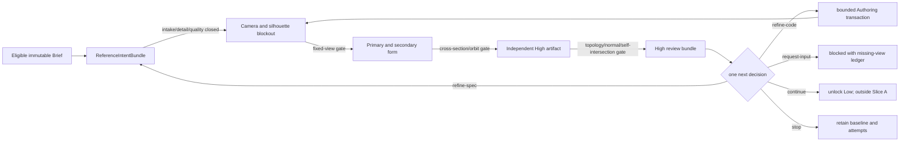

# Weaponry 刀类参考收敛与 High 形体设计

任务：`WPN-KNIFE-HIGH-001 / Slice A`
状态：`DESIGN_LOCKED / IMPLEMENTATION_PENDING / NO_HIGH_MESH`
上游研究快照：`img2threejs@9fbd0ca5bbcc3b13bebe712745d6784d33db0b85`

## 1. 直接结论

当前 Dragonfang Brief 已解决授权、预算、引擎目标和不可变 successor，但它只回答
“允许做什么”，没有回答 Codex 下一步如何从参考图稳定收敛到商业级刀形。现有 Curve、
AuthoringMesh、ModifierGraph、EvaluatedMesh、High、AOV 和 comparison 是分散能力；缺少一个把
`参考观察 → 细节绑定 → 阶段门 → 单一纠偏 → 重放` 串起来的产品级控制层。

`img2threejs` 的价值不在 Three.js primitive 或 Python 脚本，而在以下职责分离：

1. 观察先于推断，单图隐藏区域显式为 `unknown/inferred`；
2. 质量合同和 detail inventory 先于几何；
3. 每个细节必须映射到真实组件局部特征或材质局部覆盖；
4. 几何硬门先于渲染，确定性检查先于 Codex 视觉判断；
5. 每阶段只允许一个纠偏范围，失败候选不覆盖基线；
6. 固定相机主视图与非退化 orbit 分开证明 2D 匹配和 3D 体积；
7. 状态、证据、纠偏次数和停止原因可恢复，不能靠聊天上下文续跑。

Weaponry 必须把这些机制重写为 closed Contract、Rust Runtime/Worker、Store/CAS 和 11 façade
中的内部 operation；不安装或运行上游 Skill，不接 Three.js/Python 作为产品真值。

## 2. 产品状态机



每条箭头都绑定 exact parent hash、reference hash、camera hash、Worker cohort 和 evidence hash。
`continue` 只解锁下一阶段；它不 confirm candidate，不创建版本，不代表人审或商业通过。

## 3. 最小 typed 真值，不扩大公共 Action Space

不新增 façade，也不暴露上游八阶段为八个公共工具。新增三类聚合真值，并通过现有 façade
内部 operation 使用：

### 3.1 `KnifeReferenceIntentBundle@1`

由 `reference_intake` 的 prepare/get 持久化，包含三个独立 canonical 子记录：

- `KnifeIntakeManifest@1`：每张参考的 CAS/hash、role、分辨率、重复/解码/准入状态、可见覆盖；
- `KnifeDetailInventory@1`：macro/meso/micro 细节、证据区域、置信度和真实映射目标；
- `KnifeQualityContract@1`：本刀的阶段顺序、关键特征、固定视图、阻塞失败和阈值 fixture hash。

它必须绑定 eligible Brief successor；不接收路径、URL、脚本、环境变量、secret 或原图字节。
`route` 与 `exactness` 分开保存：

- `route = reference-projection | authored-texture | procedural-finish`；
- `exactness = image-only | metadata-assisted | exact-texture`。

改变表面路线不能伪造证据等级，投影像素不能成为几何或拓扑真值。

### 3.2 `KnifePassState@1`

由 Runtime 唯一写入，Store/CAS 持久化每个 pass 的不可变状态：

```text
pass_id / parent_pass_sha256 / brief_sha256 / intent_bundle_sha256
baseline_candidate_sha256 / attempt_candidate_sha256
authoring_mesh_sha256 / modifier_graph_sha256 / evaluated_mesh_sha256
high_artifact_sha256 / camera_set_sha256 / evidence_bundle_sha256
hard_gate_status / visual_gate_status / unknowns[] / unlocked_successor
```

允许的 High 前置 pass 固定为：

`camera-lock → silhouette-blockout → structural-form → secondary-form → high-geometry`

Primary Form 未通过时，dragon relief、磨损、涂层和灯光只能留在 inventory，不能进入几何或材质
来掩盖轮廓缺陷。High 通过前不能进入 Low、UV 或 Bake。

### 3.3 `KnifeCorrectionLedger@1`

由 `quality_review` 产生评估，由现有 `authoring_transaction` 或 `recovery` 执行后续动作：

```text
pass_id / iteration_index / baseline / attempt / failed_gate_ids
defect_tags / metrics_before / metrics_after / changed_scope
decision = continue | refine-spec | refine-code | request-input | stop
evidence_hashes / reverted / stop_reason / canonical_sha256
```

一次 iteration 只允许一个 `changed_scope`。未校准的初始安全上限为每 pass 最多 3 次、全 Slice
最多 6 次，与冻结研究基线一致；达到
上限、同一 defect 连续两次无改善、发生振荡，或缺少决定性视图时转为 `request-input`，不能无限
消耗 Codex。次数是安全上限，不是质量目标；只能由基于实测的 policy successor 调整。

## 4. Dragonfang 首个 detail inventory

Dragonfang 按 ultra-complex 刀类处理。以下是进入 High 前必须结构化绑定的最低集合，不是对
参考图的版权复刻许可：

| 细节族 | 目标映射 | High 前要求 |
| --- | --- | --- |
| kukri spine、belly、tip、cutting edge | blade Curve/Profile + stable edge roles | 真实轮廓和厚度渐变 |
| grind、bevel、plunge/ricasso | High local feature / modifier | 三分之四高光可读，不能只画亮线 |
| blade-to-guard junction | stable Part attachment | 无悬空、穿插或非预期缝隙 |
| dragon-head guard、jaw/choil negative space | guard Part + bounded relief/void | silhouette 与 orbit 都不塌缩 |
| dragon eye/gem seats | stable left/right Parts or declared asymmetry | 孔座/嵌入关系是真几何 |
| blade dragon relief ridge/groove | High geometry or later normal-bake target | 不允许平面投影冒充体积 |
| grip body、scale/panel breaks | grip Part + local features | 握柄截面、palm swell、边缘连续 |
| fasteners/gems | named/repeated Part system | 数量、间距、嵌入关系可回读 |
| pommel/end cap | pommel Part | 轮廓、连接和 FPS 安全区可读 |
| sharpening marks、controlled wear、cavity darkening、grip-contact wear | Material local overrides | 只登记；High 形体通过后执行 |

每条 detail 必须含 `observed | inferred | unknown`。top、bottom、front-three-quarter 和
FPS-inspect 仍缺失，因此可推进可见视图 High，但 `HQ_360_PASS` 与 commercial 始终阻断。

## 5. High 阶段的门

### 5.1 几何硬门

在渲染前执行，任何一项失败都不能调用视觉通过：

- source AuthoringMesh、ModifierGraph、EvaluatedMesh 和 High lineage 唯一且 hash 闭合；
- stable Part/MaterialZone/edge role 不丢失，无 caller 注入 derived ID；
- 无 non-finite、degenerate、非法 non-manifold、自交、翻转法线或预算越界；
- 刀刃不是常厚平板：spine、belly、grind、edge bevel 和 tip 具备可回读截面；
- guard/grip/pommel attachment、孔洞、负空间和嵌件关系成立；
- fixed-view 轮廓通过时，两个有效 orbit 不出现 collapse 或纸片体积。

### 5.2 视觉门

- 主比较只使用 exact reference/candidate/camera/render-scene/cohort 绑定；
- beauty 不能单独判定，至少读取 silhouette、depth、normal、AO、Part-ID、material-ID 和 wireframe；
- 主参考视图验证 silhouette/proportion/identity region；非参考 orbit 只验证体积自洽，不伪装成
  reference likeness；
- global score 不能覆盖关键 feature、painted region、negative space 或 attachment 失败；
- Codex 每轮最多审查五个关键语义系统，并明确“改变了什么、仍不匹配什么、为什么”。

上游 CS2 fixture 的 `IoU 0.85`、projection `0.85`、region/material `0.80` 等仅作为研究种子。
上游自身把校准标为 pending；Weaponry 必须用 Dragonfang 正/负标注集冻结 D1 阈值和 scene hash，
在此之前不得把这些数字写成商业门。

### 5.3 纠偏优先级

`camera → silhouette → proportion/primary form → secondary form/negative space → cross-section/
topology/shading → identity detail → material → lighting`

只要前项失败，后项不得用于补偿。`refine-spec` 修复观察、部件、surface class、质量合同或证据
绑定；`refine-code` 修复已明确 spec 的 Curve、AuthoringMesh、Modifier 或 Worker 输出。

## 6. 与现有 11 façade 的映射

| Façade | 本设计职责 |
| --- | --- |
| `weapon_preflight` | 检查 profile、cohort、worker、reference/quality capability |
| `reference_intake` | Brief + ReferenceIntentBundle prepare/get |
| `observe` | 返回 current pass、baseline、attempt、stable IDs 和缺失证据 |
| `authoring_transaction` | 执行单一 bounded scope 的 Curve/mesh/modifier 改动 |
| `surface_pipeline` | 物化独立 High；Slice A 不解锁 Low/UV/Bake |
| `quality_review` | 生成 fixed-view/orbit/AOV review 与 CorrectionLedger |
| `recovery` | 回退 attempt、保留 baseline、恢复 pass state |
| `job` | 有界编译/渲染/评估状态与取消 |

`fps_presentation`、`delivery`、`approval` 在 High Slice A 保持 locked；不能因 API 已存在而越级调用。

## 7. `WPN-KNIFE-HIGH-001 / Slice A` 实施退出门

1. 三类聚合真值拥有 closed schema、canonical hash、负向 fixture 和 exact parent/reference binding；
2. Runtime 是唯一写者，Store/CAS 具备 same-key replay/conflict、restart readback、GC reachability；
3. MCP 只把内部 operation 挂到现有 façade，不增加第 12 个 façade或暴露上游脚本参数；
4. Dragonfang live Brief successor 生成一份 durable ReferenceIntentBundle，保留四个缺失视图；
5. 至少一个 blockout→review→single correction→replay 的 same-cohort live loop 闭合；
6. 失败 attempt 不 confirm、不覆盖 baseline，恢复后 hash 精确；
7. 阈值 fixture 未校准时状态为 `CALIBRATION_PENDING`，不得写 `HIGH_PASS`；
8. 完成 Slice A 仍只允许领取实际 `WPN-KNIFE-HIGH-001 / Slice B: FORM`，不等于已有 High mesh。

## 8. 明确不采用

- 不安装/执行 `img2threejs` Skill、Python 脚本、Three.js factory 或 showcase；
- 不把截图、投影纹理、global score、GLB 可打开或 Codex 自评当作 High/商业真值；
- 不从单图推断隐藏面、制造尺寸、真实材料配方或功能性武器信息；
- 不为每个 pass 增加公共 façade，不恢复 226-tool compatibility 为默认 Action Space；
- 不改写历史 evidence；所有新状态通过 parent-linked successor 和独立 receipt 增量记录。
